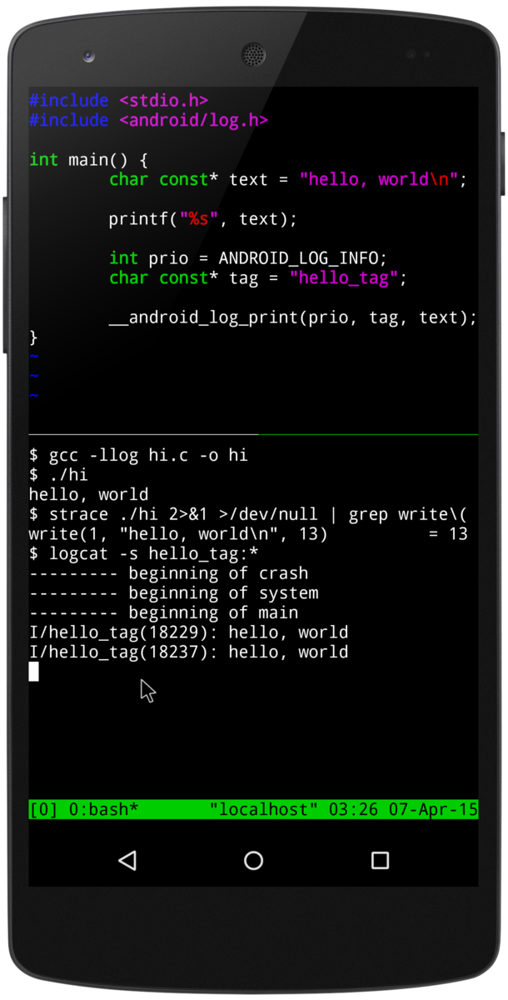

.. _termux:

=====================
Termux - Andorid终端
=====================

`Termux - Andorid终端 <https://termux.com/>`_ 是一个Android终端模拟器，也是Linux环境应用，可以在无需rooted的Android中运行。自动安装最小化基础系统，并且可以通过 ``apt`` 包管理器安装软件。

Termux特点
============

- 安全: 使用OpenSSH的ssh客户端访问远程服务器。Termux将标准包结合到一个精巧的终端模拟器来实现开放源码的解决方案
- 按需安装: 可以自行选择喜欢的SHELL，如 :ref:`bash` , fish 或 zsh，也可以选择心仪的编辑器，如Emacs或Vim。通过使用curl访问API并使用rsync把联系人列表保存到远程服务器
- 可定制: 通过 :ref:`apt` 来管理系统
- 包含开发工具: 提供持续更新的开发软件工具，如Perl, :ref:`python` , :ref:`ruby` 和 :ref:`nodejs`
- 可扩展: 通过蓝牙键盘可以连接Android设备并扩展显示，Termux支持键盘快捷键和完全的鼠标功能
- 可折腾(Tinkerable): 可以编译Go, Rust, Swift, 或C 来开发自己的项目，并且提供了 lldb/GDB 工具来调试开发

.. note::

   简直就是一个随身的开发平台，如果android手机能够外接显示器扩展，几乎就是一个全功能的Linux开发平台

一些有用资料
===============

- `Hax4Us <https://hax4us.github.io>`_ 提供了很多使用Termux定制Android的文章，可以参考配置。
- `Termux 高级终端安装使用配置教程 <https://www.sqlsec.com/2018/05/termux.html>`_ 是国内网友写的非常详尽的Termux指南，非常完备，值得学习参考
- `Hello，Termux <https://tonybai.com/2017/11/09/hello-termux/>`_ Tony Bai老师的一篇非常详尽的Termux使用指南，为移动开发提供了极大帮助，比我撰写的文档更为生动详尽，推荐阅读

参考
========

- `强大的终端模拟器:Termux <https://blog.csdn.net/yshhuang/article/details/83545288>`_
