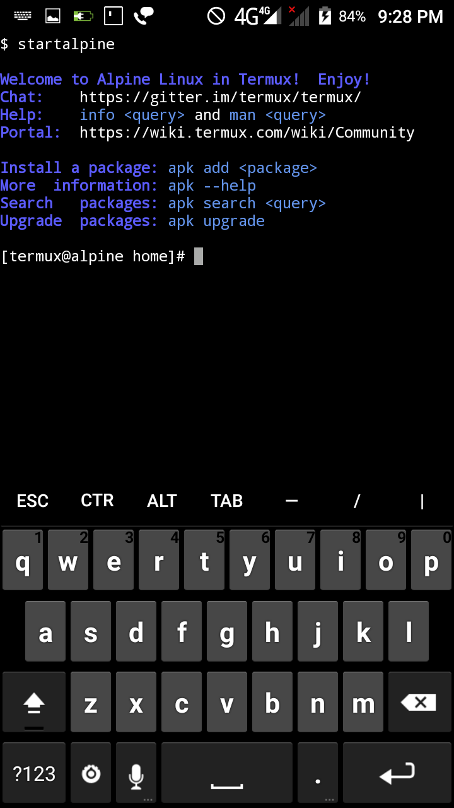

.. _termux_alpine:

=================================
Termux终端环境运行alpine linux
=================================

Use TermuxAlpine.sh calling to install Alpine Linux in Termux on Android. This setup script will attempt to set Alpine Linux up in your Termux environment.

`Hax4us/TermuxAlpine <https://github.com/Hax4us/TermuxAlpine>`_ 开源项目提供在 :ref:`termux` 中使用 ``TermuxAlpine.sh`` 脚本在Android的Termux中安装Alpine Linux。借助这种方式，可以在Android中构建一个微型开发环境，甚至可以采用扩展屏幕和外接蓝牙键盘，实现一个移动开发工作环境。

参考
======

- `Hax4us/TermuxAlpine <https://github.com/Hax4us/TermuxAlpine>`_
