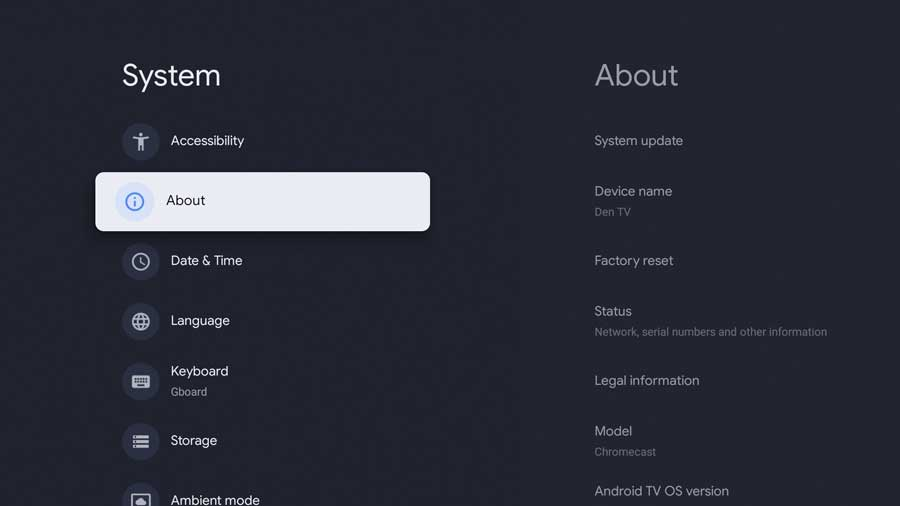
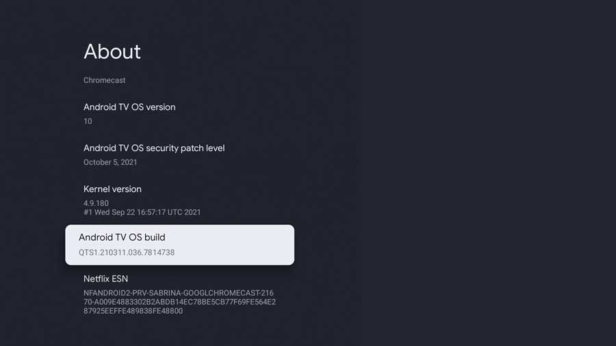
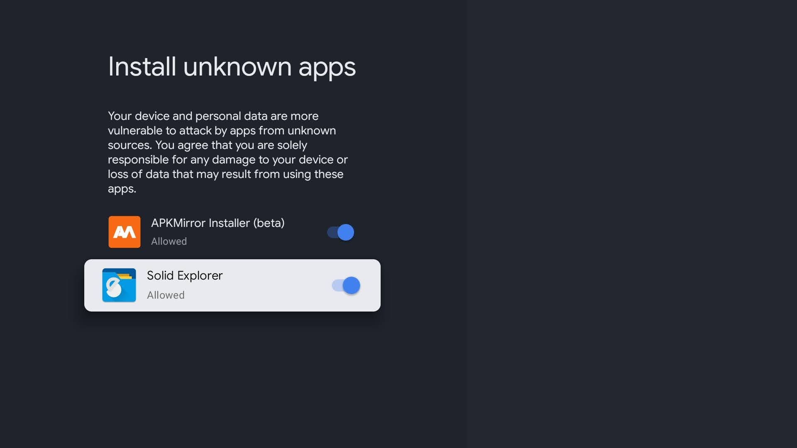

.. _chromecast_work:

======================
使用chromecast工作
======================

你可能以为我是异想天开，不过，这确实是我的 :ref:`mobile_work` 的一个尝试: 使用 :ref:`chromecast_tv` 来完成日常工作:

- 浏览器
- :ref:`linux` 终端: :ref:`termux`

结合远程服务器来实现日常的运维和开发工作

配置允许安装第三方应用
=========================

默认chromecast不允许安装unknown的app，这会导致我们后续想要安装 chrome 和 :ref:`termux` 失败。解决方法是:

激活Developer选项
--------------------

- ``System`` 菜单中选择 ``About`` ，找到 ``Android TV OS Build`` 项:

- 在 ``Android TV OS build`` 选项上连续点击 ``7`` 下，就会打开 ``Developer`` 模式:

- 此时在文件管理器中选择安装 ``chrome.apk`` 这样的应用程序，chromecast操作系统就会自动引导去配置 ``Install unknown apps`` 页面，允许文件管理器安装app就能够实现安装任何程序:

浏览器
=======

Google TV需要一个浏览器，但是Google Play Store屏蔽了Google TV的Chrome浏览器应用程序。这是因为整个Google TV就是建立在Chrome之上的，Google为了将Chromecast打造成家庭影院，定制这个特殊的浏览器入口，反而将所标准浏览器屏蔽了。解决方法是采用文件管理器，从第三方下载 ``chrome`` 的apk应用程序: 我在 `uptodown: Google Chrome <https://chrome.en.uptodown.com/android/download>`_ 下载，在文件管理器中进行安装。

终端
=======

:ref:`chromecast_tv` 可以如同android一样安装各种软件，但是大都被Google Play Store屏蔽了，所以需要自己下载或使用第三方源。比较折腾

- Google Play Store提供的 :ref:`termux` 版本过于陈旧，所以需要从 `F-Droid <http://127.0.0.1/cloud-atlas/android/apps/f-droid.html#f-droid>`_ 下载进行 :ref:`termux_install`
- 安装好 :ref:`termux` 后，完成 :ref:`termux_dev` 中工具包(选择)安装:

.. literalinclude:: ../apps/termux_dev/termux_apt_tool
   :language: bash
   :linenos:
   :caption: termux中安装软件包(apt)

参考
========

- `Best Browsers For Google TV <https://rigorousthemes.com/blog/best-browsers-for-google-tv/>`_
- `How to Enable Unknown Sources on Chromecast with Google TV <https://androidtvnews.com/unknown-sources-chromecast-google-tv/>`_
- `How to sideload any APK on the Chromecast with Google TV <https://www.androidpolice.com/2021/02/07/how-to-sideload-any-apk-on-the-chromecast-with-android-tv/>`_
