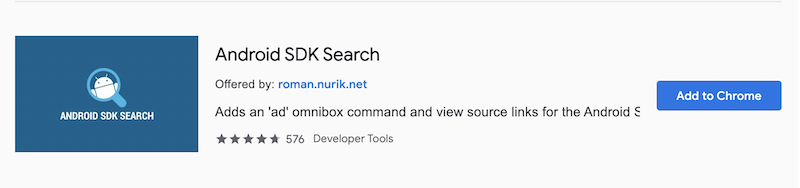

.. _diving_android_code:

===================
探索Android源代码
===================

源代码阅读工具
===============

chrome的安装插件可以用来阅读代码：使用chrome访问 https://chrome.google.com/webstore ，然后搜索 ``sdk reference search`` 可以看到 ``Android SDK Search`` :

安装以后chrome浏览器看上去没有变化，但是只要在地址栏输入 ``ad`` 然后加一个空格，就会立即看到地址栏扩展显示 ``Android SDK Search`` 。此时表示激活了Android参考的搜索功能，可以搜索任何 framework class 的文档。

参考
=====

- `Tutorial: Diving into Android Source Code <https://www.youtube.com/watch?v=NsqFOSzoYE8>`_
