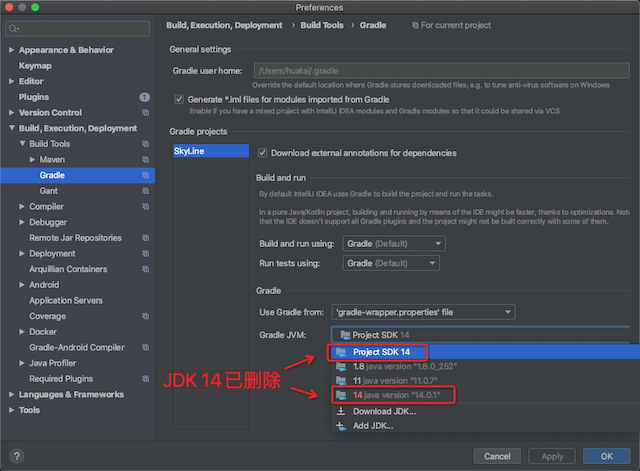
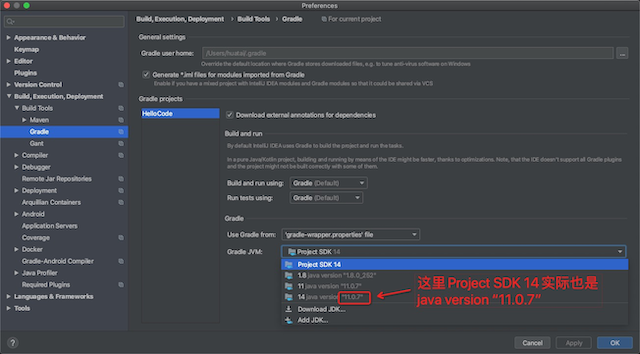

.. _gradle_sync_failed:

==========================
"Gradle sync failed"处理
==========================

在使用IntelliJ IDEA + Android plugin环境中初始化一个Android项目，遇到一个初始化报错::

   FAILURE: Build failed with an exception.
   
   * What went wrong:
   Could not open cp_init remapped class cache for 5j6gk0a497qd1rl4pbgqvwa2a (/Users/huatai/.gradle/caches/5.6.4/scripts-remapped/sync_studio_tooling2_6hzufyhbkntfcy3pk6dumbeip/5j6gk0a497qd1rl4pbgqvwa2a/cp_initb88fbed980d87867994e661e74c75e1f).
   > Could not open cp_init generic class cache for initialization script '/private/var/folders/3_/__vl9dcn6dq__wmr4pg52ksr0000gp/T/sync.studio.tooling2.gradle' (/Users/huatai/.gradle/caches/5.6.4/scripts/5j6gk0a497qd1rl4pbgqvwa2a/cp_init/cp_initb88fbed980d87867994e661e74c75e1f).
      > Could not initialize class org.codehaus.groovy.classgen.Verifier
   
   * Try:
   Run with --debug option to get more log output. Run with --scan to get full insights.
   
   * Exception is:
   org.gradle.cache.CacheOpenException: Could not open cp_init remapped class cache for 5j6gk0a497qd1rl4pbgqvwa2a (/Users/huatai/.gradle/caches/5.6.4/scripts-remapped/sync_studio_tooling2_6hzufyhbkntfcy3pk6dumbeip/5j6gk0a497qd1rl4pbgqvwa2a/cp_initb88fbed980d87867994e661e74c75e1f).
   	at org.gradle.cache.internal.DefaultPersistentDirectoryStore.open(DefaultPersistentDirectoryStore.java:80)
   ...
   Caused by: org.gradle.cache.CacheOpenException: Could not open cp_init generic class cache for initialization script '/private/var/folders/3_/__vl9dcn6dq__wmr4pg52ksr0000gp/T/sync.studio.tooling2.gradle' (/Users/huatai/.gradle/caches/5.6.4/scripts/5j6gk0a497qd1rl4pbgqvwa2a/cp_init/cp_initb88fbed980d87867994e661e74c75e1f).
   ...
   Caused by: java.lang.NoClassDefFoundError: Could not initialize class org.codehaus.groovy.classgen.Verifier
   ...

.. note::

   Gradle是一个用于自动化构建程序的工具，支持多种语言程序，也是Android的标准构建工具。

- 检查gradle进程::

   % ps aux | grep java
   huatai           20988   0.0  0.7  7613264 113784   ??  Ss   10:13AM   0:13.33 /Library/Java/JavaVirtualMachines/adoptopenjdk-14.jdk/Contents/Home/bin/java --add-opens java.base/java.util=ALL-UNNAMED --add-opens java.base/java.lang=ALL-UNNAMED --add-opens java.base/java.lang.invoke=ALL-UNNAMED --add-opens java.prefs/java.util.prefs=ALL-UNNAMED -Xmx1536m -Dfile.encoding=UTF-8 -Duser.country=CN -Duser.language=en -Duser.variant -cp
   /Users/huatai/.gradle/wrapper/dists/gradle-5.6.4-all/ankdp27end7byghfw1q2sw75f/gradle-5.6.4/lib/gradle-launcher-5.6.4.jar org.gradle.launcher.daemon.bootstrap.GradleDaemon 5.6.4

- 杀掉这个进程::

   kill 20988

- 然后删除 ``/Users/huatai/.gradle/caches`` 目录

- 再次打开IDEA，发现初始化时候报VirtualManager错误::

   java.lang.NullPointerException
    at com.android.tools.idea.uibuilder.visual.VisualizationManager.lambda$initToolWindow((VisualizationManager.java:164)
    at com.intellij.ui.content.impl.ContentManagerImpl$MyNonOpaquePanel.getData(ContentManagerImpl.java:137)
    at com.intellij.ide.impl.DataManagerImpl.getDataFromProvider(DataManagerImpl.java:90)
    at com.intellij.ide.impl.DataManagerImpl.getDataFromProvider(DataManagerImpl.java:77)
    at com.intellij.ide.impl.DataManagerImpl.lambda$getDataFromProvider$0(DataManagerImpl.java:96)
    at com.intellij.openapi.actionSystem.DataKey.getData(DataKey.java:66))
    ...

这个问题在 `IDE, Gradle, Java 13: "Could not open cp_init remapped class cache" <https://youtrack.jetbrains.com/issue/KT-34134>`_ 有用户报告这样的错误，有用户提示 ``Using IJ 2019.3.1 with OpenJDK 13.0.1 the issue is gone.``

我使用的组合是 ``IJ 2020.1 + OpenJDK 14.0.1 + Gradle 5.6.4`` ::

   % ./gradlew -v      
   
   ------------------------------------------------------------
   Gradle 5.6.4
   ------------------------------------------------------------
   
   Build time:   2019-11-01 20:42:00 UTC
   Revision:     dd870424f9bd8e195d614dc14bb140f43c22da98
   
   Kotlin:       1.3.41
   Groovy:       2.5.4
   Ant:          Apache Ant(TM) version 1.9.14 compiled on March 12 2019
   JVM:          14.0.1 (AdoptOpenJDK 14.0.1+7)
   OS:           Mac OS X 10.15.5 x86_64

通过Google可以看到，很多信息都提示Gradle对JDK版本有一定限制，最新的版本可能支持存在问题，华为开发者论坛提到使用JDK 8，Gradle官方要求是JDK 8以上版本，而上述IJ论坛的issue提到使用JDK 11是工作正常的。参考 `AdoptOpenJDK官网 <https://adoptopenjdk.net/>`_ 提示JDK 11是LTS版本，所以参考 :ref:`multi_jdk_on_macos` 改为使用JDK 11::

   brew cask install adoptopenjdk11
   jenv add /Library/Java/JavaVirtualMachines/adoptopenjdk-11.jdk/Contents/Home
   jenv global 11

- 不过我发现IDEA默认会使用最高版本的JDK，可能需要删除掉JDK 14.0。我采用的方法是修改 ``Perferences`` 中 ``Build,Executions,Deployment > Build Tools > Gradle`` 中的 ``Gradle JVM`` 配置，强制修改成 11 ，然后在项目目录下通过终端命令执行::

   gradlew clean

这样手工解决依赖错误，就可以完成编译。

.. note::

   非常不幸，gradle编译依赖需要从Google官方下载Android工具，如果没有搭建梯子会导致安装失败。请参考 :ref:`openconnect_vpn` 自建梯子或购买VPN。

.. note::

   为了方便使用，我还是删除了JDK 14，只保留JDK 11和JDK 8::

      jenv remove 14.0
      jenv remove 14.0.1
      jenv remove openjdk64-14.0.1

   然后检查 ``jenv versions`` 显示输出::

        system
        1.8
        1.8.0.252
      * 11 (set by /Users/huatai/.jenv/version)
        11.0
        11.0.7
        openjdk64-1.8.0.252
        openjdk64-11.0.

   然后卸载JDK 14::

      brew cask uninstall adoptopenjdk14

但是，实际发现 IntelliJ IDEA的Gradle配置，依然使用SDK 14（即使这个JDK版本已经删除）:

而且每次新生成的Android项目，Gradle都会默认使用已经删除JDK 14。这个设置在关闭了项目窗口就可以看到，默认的Gradle配置都是从用户目录下的 ``.gradle`` 子目录复制出来的，所以需要修订自己的用户目录下的 ``.gradle`` 子目录配置。所以再次杀掉gradle的daemon服务(java进程)，然后清理掉 ``~/.gradle`` 目录，再重新启动IntellJ IDEA就可以正常使用了。不过，我检查发现实际上SDK 14的配置依然存在，只是对应JDK版本被替换成了正确的 ``11.0.7`` ，这样Gradle就工作正常了:

