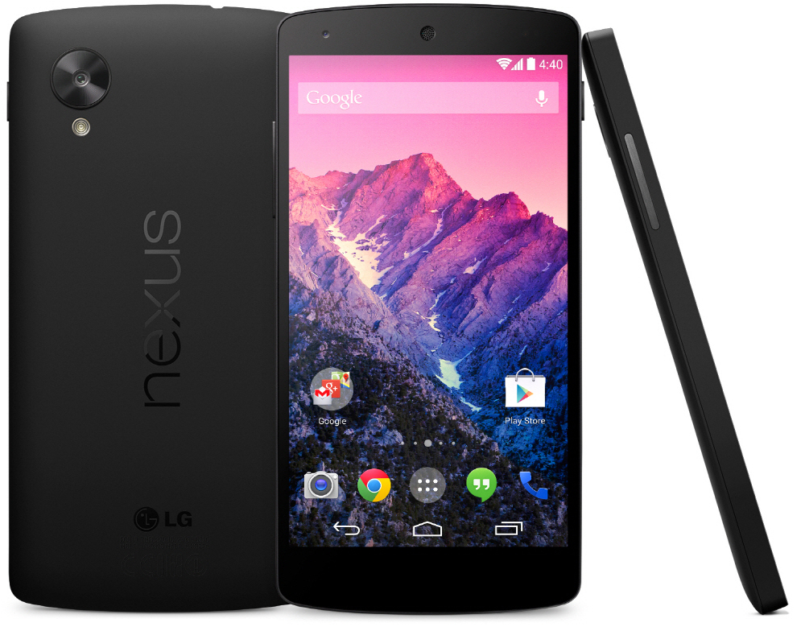

.. _nexus_5:

==============
Nexus 5
==============

Nexus 5是Google于2013年10月31日发布的第5待Gphone，距今已经有有6年半历史，已经难以顺畅运行当前的大型软件。不过，这款经典手机具有独特的魅力：由于其硬件较为开放，很多开源手机操作系统，如sailfish, Ubuntu Touch都有在这台手机上的移植版本，并且得到第三方Andorid发行版如lineageOS的良好支持。

.. note::

   我先后买过两台Nexus 5手机，需要注意的是，请尽量购买国际版(Model LG-D821)，可以较为完善支持中国移动的LTE 4G数据网络。

硬件配置摘要
=============

* 处理器: Qualcomm Snapdragon 800

  * CPU: 2.26 GHz quad-core Krait 400
  * GPU: Adreno 330, 450 MHz

* 内存: 2 GB LPDDR3-1600 RAM
* 存储: 16 GB 或 32 GB
* 电池: 3.8 V 2300 mAh
* 屏幕: 4.95英寸 1080x1920 px (445 ppi) IPS LCD

Nexus 5硬件配置一般，但是显示屏非常细腻清晰，加上这一代Nexus采用了塑料机身，大小正好单手操作，带来了极为轻便的使用体验(130g)。不过，后置摄像头只有800万像素，拍照效果较弱。

软件支持
============

2015年12月，Nexus 5获得了最后一次Google官方支持的版本升级，最终能够升级到官方最高版本是 Android 6.0.1 Marshmallow。之后，只有通过社区才能获得最新的Android升级：

- 

参考
========

- `Wikipedia - Nexus 5 <https://en.wikipedia.org/wiki/Nexus_5>`_
- `Info about hammerhead <https://wiki.lineageos.org/devices/hammerhead>`_
