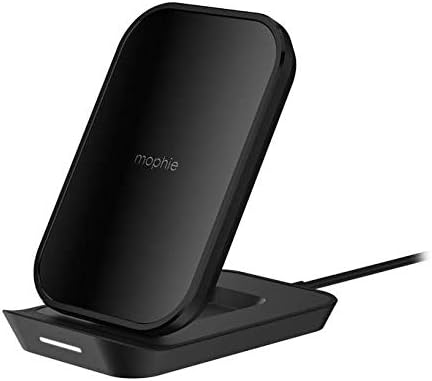
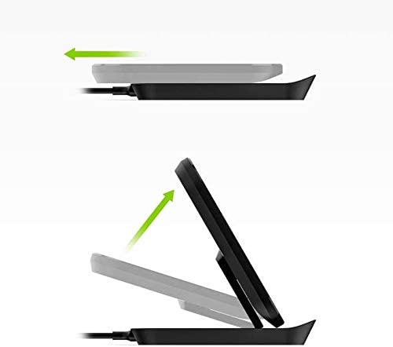
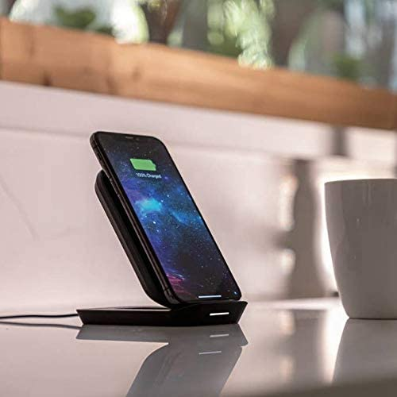
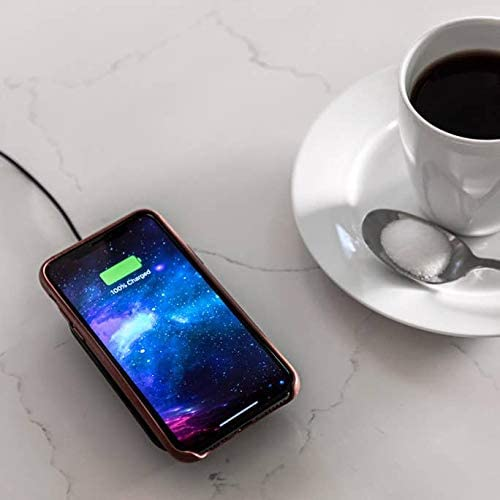

.. _pixel_4_wireless_charger:

=======================
Pixel 4 无线充电器
=======================

Google官方推出的Pixel Stand 2 无线充电器非常昂贵，在淘宝上需要大约700元；即使Pixel Stand (一代)也要300元。当然，官方Pixel Stand是Qi认证，对自家的Pixel系列支持完美，通过 `使用 Pixel Stand 为手机无线充电 <https://support.google.com/pixelphone/answer/9137565?hl=zh-Hans>`_ ，二代可以在Pixel 7/6 Pro上实现23W高速充电。

当然，好马配好鞍，对于我的 :ref:`pixel_4` 参考官方Pixel Stand说明，也就是只能达到 10W 充电功率，所以说Pixel Stand 2毫无用武之地，比较匹配的倒是Pixel Stand。可惜，我手机也只有区区千元，配一个300元的充电器未免太浪费了。所以，考虑找寻Qi标准的无线充电器。

参考 `谷歌Pixel 4首次支持EPP无线充电：功率高达11W <https://www.chongdiantou.com/archives/39656.html>`_ 可以看到Pixel 4已经修复了不兼容Qi 10W的Bug: **在任何支持高功率输出的 Qi 无线充电板上，都能够以最高 11W 的功率为 Pixel 4 无线充电 —— 无需购买 Pixel Stand 或其它经过 Pixel 认证的昂贵配件，即可享受到这一益处。**

我在淘宝上找到一款 ``Mophie`` Qi兼容, Iphone兼容的立式(也可以折叠平卧)无线充电器:

- ``Mophie`` 是美国品牌，深圳自格代工
- 在苹果官方商店中，有很多这个品牌的充电配件，侧面验证这个品牌的产品质量是达到苹果认证要求的
- 在 ``充电头`` 网站有两篇mophie无线充电设备评测，可以看出这个品牌的做工质量:

  - `mophie二合一无线充电底座评测：和苹果一样的格调 <https://www.chongdiantou.com/archives/63988.html>`_
  - `磁吸无线充电器的最好使用形态，mophie 立式磁吸无线充电器体验评测 <https://www.chongdiantou.com/archives/91705.html>`_ (如果使用iPhone 12以上，可以考虑这款磁吸无线充电)

美亚上有我所购买的这款 `mophie Universal Wireless Multi Coil Charge Stand for Apple iPhone Xs Max, iPhone Xs, iPhone XR, iPhone X, iPhone 8 Plus, iPhone 8, Qi-Enabled Devices - Black <https://www.amazon.com/mophie-Universal-Wireless-Qi-Enabled-Devices/dp/B08CLSMCTC>`_ 售价16美金(但是通过亚马逊海外购累加税收和运费超过300元)。淘宝上二手价格60元，比较匹配我购买的 :ref:`pixel_4` (毕竟我也只花了1k购买这款手机)

从美亚和淘宝卖家提供的参数来看，这款 ``Mophie`` 无线充电器能够达到 Qi 10W充电效率(淘宝卖家还有这个系列平卧圆盘版本，价格低几块钱)，已经能够匹配我的 :ref:`pixel_4` (因为Pixel 4最多也就支持Qi 10W充电功率)

此外，这款立式无线充电器还支持折叠，也就是平卧充电:

立式充电:

卧式充电:

.. note::

   淘宝销售的二手 ``Mopie`` 无线充电器插头是澳规19V1.3A，在国内使用需要转换或者需要将塑料片插入三眼插座安全门(如果是标准三眼)

待续，等到手之后在补充充电效率验证，目测是支持10W快充的...

参考
========

- `使用 Pixel Stand 为手机无线充电 <https://support.google.com/pixelphone/answer/9137565?hl=zh-Hans>`_
