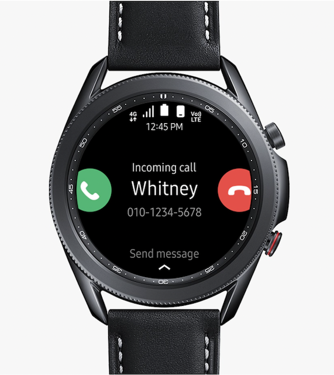

.. _samsung_galaxy_watch_3:

========================
三星Galaxy Watch 3
========================

2023年双十一我订购二手 :ref:`samsung_galaxy_watch_4` ，急切等待了3天，拿到的却是 ``Galaxy Watch 3`` LTE 版本:

   三星Galaxy Watch 3 LTE

``Galaxy Watch 3`` 其实造型很man，非常像经典的机械手表。不锈钢材质，比之后的 Watch 4/5/6 (非classic) 要耐看很多。由于是LTE版本，当时我犹豫了一下，不过最终还是放弃找店家退换:

- 早于 ``Galaxy Watch`` **4** 的三星只能手表都是采用 `Tizen <https://www.tizen.org/zh-hans>`_  操作系统，由于生态做不起来，已经被三星放弃用于智能手表
- 很不幸，中国移动从2023年中开始暂停eSim卡(一号多机)业务，也就是说LTE手表的新用户目前完全无法使用这个杀手级功能

使用体验
==========

在三星官方能够找到 `SM-R8450 用户手册 <https://downloadcenter2.samsung.com/content/UM/202103/20210302165055252/SM-R8450_UM_Open_China_Tizen_Chi_Rev.1.2_210302.pdf>`_ 介绍如何使用 ``Galaxy Watch 3`` 我参考把玩了几个小时，劝退:

- ``Galaxy Watch 3`` 就是目前三星智能手表的 ``classic`` 外观设计，不锈钢外壳，非常有质感。特有的机械转盘交互也非常有逼格

- ``Galaxy Watch 3`` 是目前最后一代同时支持Android和iOS的三星智能手表(从Watch 4开始,4/5/6都支持Android) - `當 Galaxy Watch 3 遇上 iPhone 時 <https://m.eprice.com.tw/mobile/talk/4523/5593416/1>`_

- 安装软件只能访问Samsung Store: 需要从三星自己的下载网站下载 ``Galaxy Wear`` 安装包(下载地址在 `SM-R8450 用户手册 <https://downloadcenter2.samsung.com/content/UM/202103/20210302165055252/SM-R8450_UM_Open_China_Tizen_Chi_Rev.1.2_210302.pdf>`_ 中，非常不直观)，只有安装了这个软件之后，才能初始化 ``Galaxy Watch 3`` (也就是说手表不能自己激活使用，Android系统中也没有默认的Watch应用)

- 生态非常差，Samsung Store中除了三星自己开发的软件，几乎找不到可用的第三方软件；三星从 Watch 4 开始放弃Tizen转而和Google合作开发Wear OS，也是明智的选择

  - 三星自家开发的软件总体质量尚可，Tizen血统源自Meego(诺基亚当年放弃的手机系统，非常可惜)和LiMo(早期的Linux手机系统)，硬件虽然已经是好几年前的，但依然非常流畅
  - 部分软件有bug，例如天气软件，在我的 :ref:`build_lineageos_20_pixel_4` (也就是Android 13)无法正确定位当前位置，导致天气无法在表盘显示。由于Tizen(手机)系统已经被三星放弃，估计这样的bug后续也不会修复了(无奈)

- 无法使用现代化软件: 毕竟现在Android系列的所有开发资源，如果可用于智能穿戴设备，必然是Wear OS，所以几乎可以判定，早于 :ref:`samsung_galaxy_watch_4` 的智能手表，从购买当日起就不可能有发展和改进了

  - 没有日常所需的微信和支付宝，也就是说，所有我们日常衣食住行所用的Android应用都没有
  - 只有基本智能手表功能: 计时、手机通知、健康监测

非常可惜的一款智能手表，类似于我当年购买的 诺基亚 N9 : 虽然经典，但已经被时代淘汰...

参考
=======

- `三星 Galaxy Watch3 评测：出色的交互体验，实用的健康功能，优秀的设计做工 <https://zhuanlan.zhihu.com/p/189774464>`_ 这篇评测可以了解一下Galaxy Watch 3
