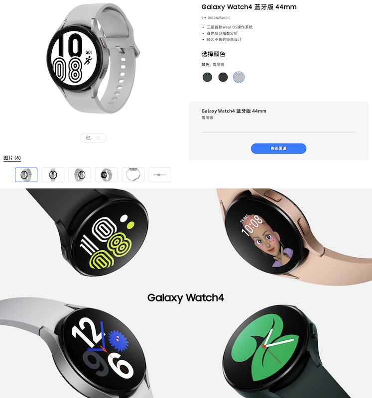
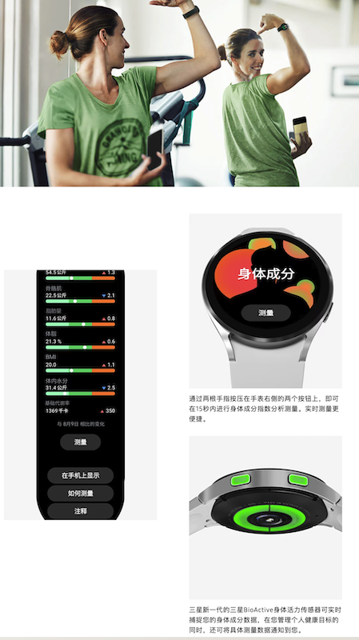

.. _samsung_galaxy_watch_4:

=======================
三星Galaxy Watch 4
=======================

选择
======

Pixel Watch一代(放弃)
----------------------

2023年双十一，因为之前使用的 :ref:`apple_watch` 3 和 :ref:`iphone_se1` 暂时不再使用，主力手机改为 :ref:`pixel_4` 。之前曾经心动过的Android手表再次引起了我的关注:

- 最初我想购买 Google Pixel Watch，毕竟谷歌全家桶，既然已经入坑了Google原生Pixel系列手机，何不配套使用狗家的手表呢? 然而初略调研一下，感觉有些不足:

  - Pixel系列手表太贵了: 淘宝上的第一代Pixel Watch(全新美国直邮)售价高达1700元，而且二手98新也要 1060元，二手售价甚至和我购买的 :ref:`pixel_4` (全新)一样，实在劝退
  - Pixel一代推出时间是2022年，和Pixel 7同时发布，采用了时尚的曲面外观(有点像玩具?)，但是明显落后于三星Galaxy Watch一代:

    - 处理器使用的是三星用于Galaxy Watch 1~3代的Exynos 9110(对比之下，2021年月11日发布的三星Galaxy Watch 4已经升级到Exynos W920)，唯一超过三星Galaxy Watch 4(1.5G内存)的是Pixel Watch一代升级内存到2G
    - Pixel Watch是谷歌收购了FitBit之后推出的产品，集成了Fitbit的运动健康(心电图功能)，而且没有Apple Watch区域限制，只需要更新系统就可以使用(三星Galaxy Watch 4国行版本阉割了心电图功能，用美版配合软件可以实现)

  - Pixel Watch二代在2023年10月4日和Pixel 8一同推出，但是知乎居然没有讨论话题，似乎完全被忽视了

    - 外观和一代相同，不过外壳由上一代不锈钢换成了再生铝(外观造型偏向于女性使用的圆形饰品)
    - 高通骁龙 W5+ Gen 1 芯片

.. note::

   不论是Pixel Watch还是三星Galaxy Watch，都不要购买美版LTE，在国内无法使用eSIM卡(也不支持NFC门禁)

Galaxy Watch 4(我的选择)
--------------------------

.. note::

   对比之后，当下最经济实惠的Wear OS智能手表， :strike:`二手9新只需要328元。还要什么🚴?`

.. warning::

   乌龙了: 双十一下单过于匆忙，没有仔细看清买家的商品说明，对三星智能手表的铲皮系列还是了解不充分:

   - 三星有一款早期的产品 ``Gear S4`` ，硬件和外观几乎和 Galaxy Watch 3完全一致，也就是后来 Watch 4/6 的Classic款外观
   - 由于是早期产品，使用的是Tizen系统，虽然功能基本就绪，但是无法使用Wear OS注定无法进一步升级，也不能适应最新的系统
   - ``Gear S4`` 命名中也有一个 ``4`` ，所以我搞混淆了 Galaxy Watch 4，错误下单，这款手表才是最低 328元；而 ``Galary Watch 4`` 实际售价达到了 549元(9新) / 599元(98新)

   由于实际上 ``Galary Watch 4`` 和 ``Galary Watch 4 Classic`` 售价只相差130元，所以我最后换购了 :ref:`samsung_galaxy_watch_4_classic_lte`

2021年8月11日三星发布Galaxy Watch 4

- 由于Google实际上刚刚试水Watch，并且是在三星放弃自研Tizen系统合作开发Wear OS 3.0之后，仅仅推出过两代产品(2023年刚刚推出二代)，以Google的鲁莽试行和相对较差的品控，可能需要迭代很多轮才能真正掌握智能手表的研发。所以我尝试寻找经济实惠的二手Wear OS手表: 马上就发现了三星，已经深耕智能手表多年，现在已经迭代到Galaxy Watch 6。本着经济实惠且能够体验Wear OS的思路，我很快选择Galaxy Watch 4:

  - Galaxy Watch 4和5这两代完全使用相同的Soc: Exynos W920(三星5nm自研芯片) ，也就是说买早一代和下一代实际差别不大，但是在二手市场，Watch 4售价要低很多。既然我们都是垃圾佬，何不用最经济的方式来体验最有趣的技术
  - Galaxy Watch 4已经具备了三合一感应器: PPG, ECG 和 BIA:

    - PPG 心率检测
    - ECG 心电图检测(国行阉割，到Watch 5国行才提供ECG；不过美版实际可以激活使用)
    - BIA 身体成分指标检测(体脂率，骨骼肌，体内水分，脂肪含量等，据说国外有数码博主使用专业设备对比测试，准确率可以达到98%)

  - Galaxy Watch 4是三星第一代Wear OS智能手表: 实际上三星和谷歌的合作才促成了Wear OS的爆发，原因是三星的自研芯片加上电源管理特性，才使得谷歌能够推出自己的Wear OS系统

.. note::

   国行Galaxy Watch 4阉割了ECG和血压检测功能，请参考 `三星galaxy watch4 classic使用技巧 <https://zhuanlan.zhihu.com/p/411079427>`_ 激活。我购买的是美版，不确定情况，待入手后验证...

Watch 4 vs. Watch 4 Classic vs. Watch 5 vs. Watch 6
-----------------------------------------------------

三星Galaxy Watch 4系列分为普通版本和Classic版本，差别是外观: 

- Classic 是不锈钢外壳(普通版是铝合金)，并且配备了物理转盘(普通版是虚拟触摸转盘)。
- 但是代价是两倍的价格: 二手9新的Watch 4是 ``328元`` ，而 Watch 4 Classic是 ``679元`` 。(作为目标是体验Wear OS的电子垃圾佬，我显然会选择尽可能低的版本来提高性价比。) **注意:这是双十一价格，之后价格我发现上涨了，允悲**

Galaxy Watch 4 和 Galaxy Watch 5 主要差异(核心SoC其实是一样的): (但在淘宝二手上，Watch 5价格达到 ``639元`` ，几乎是 Watch 4 两倍)

- Watch 4 屏幕是康宁大猩猩玻璃DX+ , Watch 5 是蓝宝石玻璃(C Plane）24GPa
- Watch 4 采用蓝牙5.0 , Watch 5 采用蓝牙5.2

.. note::

   未来的选择 -- 我非常看好 Google Pixel 8 以及 三星 Galaxy Watch 6 :strike:`Classic` :

   - Google Pixel 8将支持原本三星独有的 Samsung DeX功能: 终于可以通过手机获得桌面Android体验了，这也是 :ref:`mobile_work_think` 的实现方案
   - 如果没有意外，我购买的二手三星Galaxy Watch 4和 :ref:`pixel_4` 可以使用3年(预计电池老化或硬件损坏)，此时二手的Galaxy Watch 6预计会降低到300元左右，Google Pixel 8预计会降低到1000元以下，就是非常好入手升级的时机。

Galaxy Watch 4 Classic
-------------------------

我短暂把玩过 :ref:`samsung_galaxy_watch_3` ，发现经典款式的不锈钢材质运动腕表造型却是非常美观，这激起我对 ``Galaxy Watch 4 Classic`` 的兴趣:

- 根据三星官方资料，大陆行货Watch 4之后LTE版本是支持国内运营商的，而且NFC功能也支持部分城市(北京、上海)交通卡
- 从网上资料来看，三星Galaxy Watch 3的LTE功能就已经适配过国内运营商，并且应该是拿到资质(网上有很多宣传资料)

美亚上 ``Samsung 三星 Galaxy Watch4 Classic 智能手表（不锈钢，LTE，46 毫米）银色`` 大约是1920元(含进口税)，淘宝上略微便宜些

.. note::
      需要注意2023年中，中国移动暂停了eSim一号多机业务，何时恢复未知，所以理论上支持LTE的智能手表独立上网功能实际上暂时无法使用

技术规格
===========

   Galaxy Watch4 蓝牙版 44mm

- Exynos W920(三星5nm自研芯片)

  - 拥有两个Cortex-A55架构核心，主频1.18GHz
  - 处理速度比上一代(Exynos 9110)快20%, GPU速度比上一代快10倍
  - Cortex-M55 协处理器: 用于常亮显示，进一步降低功耗

- 高分辨率屏幕: 450x450像素 44mm 1.4英寸AMOLED屏(另一个规格是40mm)，支持AOD息屏显示
- RAM: 1.5GB
- 存储: 15GB

.. note::

   到2023年发布的Galaxy Watch 6则升级:  

   - Exynos W930 芯片(双核1.4GHz): 比Exynos W920性能提升了18%
   - RAM: 2 GB (提升了33%)
   - Super AMOLED 屏幕(由于边框变细，实际显示比上一代大20%)，表壳为蓝宝石，峰值亮度可达 2000 尼特，支持 AOD息屏显示(亮度和apple watch ultra相当，适合户外阳光下使用)

- 蓝牙5.0、Wi-Fi、NFC (只有Classic版本有LTE，但是实际在 NFC (国内没有三星pay) 和 LTE(运营商不支持) 在国内都用途有限 :strike:`无用` `有没有人能说说三星watch4在使用中的缺点? - 骑士不死于徒手的回答 - 知乎 <https://www.zhihu.com/question/486166840/answer/2178992291>`_ )

.. note::

   2023年11月根据三星中文官网信息 `Galaxy Watch4 蓝牙版 44mm <https://www.samsung.com/cn/watches/galaxy-watch/galaxy-watch4-silver-bluetooth-sm-r870nzsachc/>`_ 可以看到通过 "三星智能卡" 应用可以添加公交卡，支持 ``京津冀互联互通卡`` , ``上海公共交通卡`` 和 ``岭南通`` 三种公交联合卡；此外支持复制门禁卡，可以绑定一张交通卡和一张门禁卡，开启自动选卡功能后，可以自动识别和切换到所刷卡片，无需手动选卡。 (官方说明交通卡添加仅限Android 12以上三星Galaxy手机使用，门禁卡复制仅支持部分种类)

   待验证...

- 厚度9.8mm

- 续航: 全天候的智能模式下，支持40小时续航 (但是使用多种功能和不同表盘基本上需要一天一充)
- 快充: 

  - 30分钟充电可运行10小时，充满大约2小时(横向比较同期的 :ref:`apple_watch` 和其他智能手表，充电速度相对较慢)
  - 三星10W无线充电器可以对手表充电 (不知道我购买的二手 :ref:`pixel_4_wireless_charger` 是否支持，待验证)

- 单个芯片集成了3大健康传感器: 光学心率传感器、心电传感器和和生物电阻抗分析 **可检测** :

  - **心电图** ECG (类似Apple Watch)
  - **血氧** 水平
  - **血压** (为确保准确性，每四星期应使用传统的血压袖带校准设备)
  - **身体成分测试** : 骨骼肌、基础代谢率、体内水分和体脂百分比（BMI）等关键测量值

   Galaxy Watch4 身体成分测试

- 9大传感器：加速度、气压计、陀螺仪传感器、地磁传感器、光传感器、光学心率传感器、心电传感器、电生物阻抗测量传感器、霍尔传感

.. note::

   Galaxy Watch 6增加了温度传感器，可测量体温，所以支持女性经期检测

- **睡眠监测** : Galaxy Watch4 可以监测并提供比以往更加详细的睡眠数据图表; 与之兼容的智能手机还会检测 ``鼾声`` (手机需要充满电放在床头，麦克风对着自己，手机会自动把打呼噜的情况录下来进行分析) ; 结合睡眠时的 ``血氧`` 水平，Galaxy Watch4 将会提供睡眠评分，这与 Garmin Venu 2/2S 的新功能类似。

- 运动检测: 支持90+运动模式

- 只支持IP68防水，在海水，热水中中要谨慎，最多泳池用(二手就放弃吧)

- Wear OS特性:

  - 无缝对接 Google 的应用生态: Adidas Running、Calm、Strava、Spotify
  - One UI Watch 用户界面: 配合兼容手机可以实现手机安装软件同步安装，手机设置同步手表
  - Auto Switch 功能，可以在聆听音频（如电话或音乐）时，让耳塞根据使用情况，在手机和手表之间切换音频
  - 人机交互: 增加了上下摇晃手腕两次接听电话、转动手腕两次拒绝接听电话（或关闭通知和闹钟）的交互方式(Apple Watch最新一代提供的双指互扣也有类似效果)

.. note::

   目前我还没有体验过Wear OS，支持的软件列表或许可以参考一下 `Samsung Galaxy Watch4 港版上手 <https://post.smzdm.com/p/ar6m3prg/>`_ 这篇文章，看起来微信、百度地图是有支持的，据说支付宝提供了静态扫码支付功能

软件生态
=========

- 不支持 :ref:`ios` 和鸿蒙
- 支持微信回复功能 `有没有人能说说三星watch4在使用中的缺点? - 超哥的回答 - 知乎 <https://www.zhihu.com/question/486166840/answer/2280382303>`_
- 支持支付宝离线支付，但是要通过支付宝搜索智能设备管理，先充钱后消费，相当于离线钱包(小天才手表模式)
- 手表上方按键长按可以调出bixby，但语音识别效率很低(废柴)
- 内嵌三星自己的运动软件(底层自带软件)支持超过90+运动模式
- 提供了气压、高度和指南针经纬，在户外会非常有用
- Buds控制器: 可以支持三星Galaxy Buds+以后的三星Buds系列真无线耳机进行控制，可以自行调节环境声、降噪模式（仅支持有主动降噪功能的耳机）、触摸阻止等功能
- 相机控制器: 配对三星Galaxy手机后(不确定其他手机是否支持)，可以通过手表进行实时取景预览以及拍照，对于合影自拍比较适合

参考
======

- `三星watch4和5哪个值得买？三星watch4和5的区别对比 <https://zhuanlan.zhihu.com/p/576420643>`_
- `Pixel Watch 上手体验：三家混血、二流产物、一等颜值 <https://www.36kr.com/p/2002361952268800>`_
- `最近想买个新智能手表，三星Galaxy Watch4可以不？能给一些建议吗？ <https://www.zhihu.com/question/483664087/answer/2106793333>`_
- `如何评价三星 8 月 11 日发布的 Galaxy Watch 4?有什么亮点与特征？ <https://www.zhihu.com/question/479085586/answer/2061846895>`_
- `有没有人能说说三星watch4在使用中的缺点? <https://www.zhihu.com/question/486166840>`_
- `2021年8月11日三星发布会｜如何评价三星Galaxy Watch4｜三星Galaxy Watch4值得买吗 <https://zhuanlan.zhihu.com/p/398805886>`_
- `配置&系统焕新，三星Galaxy Watch4 Classic <https://zhongce.sina.com.cn/article/view/121721/>`_ 详细的评测介绍，感兴趣可以参考
- `Galaxy Watch4：难道只是星粉的自我狂欢？ <https://sspai.com/post/70741>`_ 这篇评测可以了解Galaxy Watch 4的优缺点
