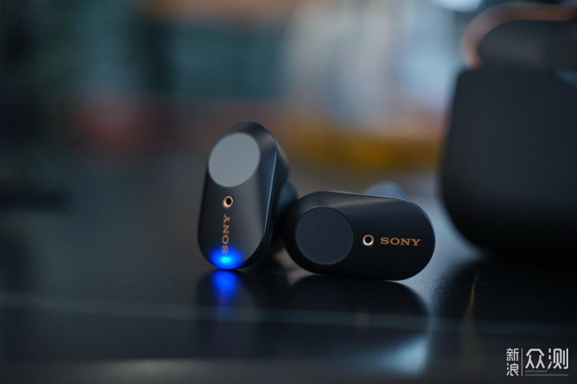
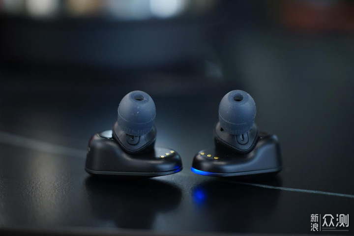

.. _sony_wf-1000xm3:

===================
SONY WF-1000XM3
===================

我最初想配合 :ref:`samsung_galaxy_watch_4_classic_lte` ，购买三星的Galaxy Buds Pro 2。不过，三星并不以音乐耳机见长，原装Galaxy Buds Pro 2价格也并不低，将近700元售价。我没有三星手机，所以并不局限于一定要用三星系列。

降噪耳机的两大家是SONY和BOSS，但是品牌溢价很高，同样品质，这两家的售价往往要比同行搞一大截，甚至比苹果AirPod Pro 2也要高出一大截。当然，这两家在降噪和调音上有很好的口碑，各自有各自的铁粉。

我囊中羞涩，考虑在三，还是决定购买二手的入耳蓝牙降噪耳机，根据价格承受能力，选择了 ``SONY WF-1000XM3`` 。这款2019年的产品中规中矩，降噪和音色都相对均衡。(被吐糟的是外观和佩戴性)淘宝二手9新，大约300出头一点，如果要配套的耳塞，国产耳塞只需要10元，所以我就没有购买95新(包括外包装和全套耳塞)。

WF-1000XM系列
===============

索尼TWS真无线蓝牙系列
------------------------

- 2017年，SONY索尼发布了旗下首款TWS真无线蓝牙耳机WF-1000X，索粉亲切的称之为“降噪豆”
- 2019年，索尼发布WF-1000XM3

WF-1000XM3外观
==================

- 整体

.. figure:: ../../_static/android/device/sony_wf-1000xm3_1.jpg

- 耳机单体重量为8.5克一只，采用高摩擦力橡胶表面的三点支撑人体工学设计来分布佩戴压力

WF-1000XM3技术规格
=====================

- QN1E的HD高清降噪芯片: 

  - 集成了数字降噪、24bit声音信号处理器、数字模拟转换器和放大器
  - 内置的芯片主控支持智能化的场景自动检测降噪

.. note::

   降噪耳机的降噪数据由Bass（低频）、Mid（中频）及Treble（高频）3部分组成 - 主要关注的是overall attenuation（综合降噪水平）也就是高、中、低三个数据的平均值:

   - **低频降噪** ：可以消除:公交车、飞机、高铁等等的引擎声音
   - **中频降噪** ：可以消除:人们说话的交谈声
   - **高频降噪** ：可以消除:高铁与轨道摩擦的刺耳声、大人和小孩的尖叫声等

- 在Headphones APP上可根据不同大小的环境噪声选择多达20种降噪方案，开启“自适应声音控制”功能后，耳机将自动检测使用者的活动状态，并切换至预设的环境声和降噪方案，实现智能降噪
- 音质:

  - 采用6mm驱动单元，在消除噪音的同时可以获得较好的音质表现
  - 支持SBC和AAC两种编解码器，DSEE HX数字声音增强引擎+6mm驱动单元 可以获得较好的音质(但不支持Hi-Res高解析音频)

- NFC: 支持近场通信(快速配对)
- USB Type-C充电
- 耳塞(我购买二手没有，淘宝有第三方很便宜): 2个材质和不同大小组合，加长型混合硅胶耳塞 (SS, S, M, L x 2)，三重舒适耳塞 (S, M, Lx 2)

内部电池(拆机解析):

- 耳机充电盒14500锂电池(惠州市豪鹏科技有限公司,电芯喷码编号为C54837305571)
- 耳机采用的是VARTA瓦尔塔CP1254锂电池，3.7V 0.2Wh，产地德国

音频特性:

- DSEE HX: SONY数字声音增强引擎，可补偿高频信号和数字音频压缩丢失的尾音，带来接近Hi-Res的高品质音效

续航特性:

- 充电约10分钟可播放90分钟
- 耳机开启降噪功能可使用6小时，搭配充电盒可使用24小时
- 关闭降噪功能，电池续航达到8小时，加上充电盒的电量补充，续航则高达32小时。

优缺点(整理汇总)
===================

- 优点:

  - 音质表现出色，能够很好的处理高中低三频
  - 索尼开发的HD降噪处理器QN1e，降噪效果表现优异
  - 智能降噪功能: 提供不同场景降噪模式

    - 音乐模式(高铁，飞机): 屏蔽背景噪声聆听音乐
    - 音乐+环境声模式(通勤路上): 享受音乐的同时，保留周围的环境声，出行更安全
    - 音乐+人声模式(其他): 屏蔽背景噪音的同时，保留重要语音提醒，不错过重要信息

- 缺点:

  - 耳外体积略大
  - 不防水防汗(非运动型的旗舰音乐耳机)
  - 不能通过耳机控制音量
  - 充电盒不支持在手机端 ``Headphones`` 上直接显示电量，必须每次耳机取出时读取同步一次电量(不方便，说明充电盒没有自己独立的通讯芯片)

我的使用体验
=============

SONY的蓝牙降噪耳机的控制微调功能都是在手机端应用 ``Headphones`` 上实现，最大的特设是 ``环境自动模式`` ，对于在通勤路上自动切换非常便利: 

- 当行走时自动降低降噪级别(12级)，这样能够听到周围交通设施和人声，避免出现安全意外
- 当坐在地铁里面，很快会切换到静止 "乘坐交通" ，此时降噪会调整到最高20级，压制外部噪音

我最初没有意识到这种自动切换的优势，但是在地铁里走动和坐下来时，就感觉这种自动模式确实非常实用。相比较Apple AirPod Pro完全由手柄控制降噪，往往会在路上忘记关闭降噪，多少有些安全隐患。

降噪的效果没有我想象的那么厉害，在地铁中依然能够听到广播报站，周围某些人说话的声音频率似乎比较容易进入(虽然也听不清)。

.. note::

   对比 :ref:`airpods` 我感觉 SONY WF-1000MX3 降噪效果相对弱不少，对于外部人声隔离不足。不过，低频和高频过滤还行，所以在地铁中开启降噪还是有一定效果的。

音质应该算不错吧，至少我听人声歌曲没有什么明显失真(对比我的索尼7506 `索尼 7506 耳机真的那么棒吗？ <https://www.zhihu.com/question/324908475>`_ )。不过，我拿到的二手WF-1000MX3左耳有一点点底噪，在安静的晚上能够感觉到，右耳则非常安静。当然在路途中是无法区别的...

我之所以购买真无线蓝牙降噪耳机，是希望能够配合 :ref:`samsung_galaxy_watch_4_classic_lte` 实现完全摆脱手机的自由活动:

- 电话(使用蓝牙直接接听电话，这样就避免手表电话的尴尬)
- 听歌(我只循环听自己喜欢的歌)
- 健身(通过GPS实现独立运动)
- 购物(只有支付宝离线刷码)
- 公交( :ref:`samsung_pay_card` )

参考
======

- `2021年入手索尼WF-1000XM3亏不亏？全方位评测帮你把把关！ <https://post.smzdm.com/p/aennowpq/>`_
- `索尼WF1000XM3真无线耳机测评 <https://www.zhihu.com/tardis/zm/art/84589422?source_id=1003>`_
- `千元级降噪,续航音质更平衡索尼wf1000xm3评测 <https://zhongce.sina.com.cn/article/view/92289/>`_
- `索尼wf-1000xm3评测、音质水平、价格、购买建议 <https://www.zhihu.com/tardis/zm/art/258619910?source_id=1003>`_
- `全网首拆：SONY索尼WF-1000XM3真无线降噪耳机 <https://www.52audio.com/archives/24818.html>`_ 这篇文章非常详尽，提供了细节图片(包括拆解，可以了解内部电池)
