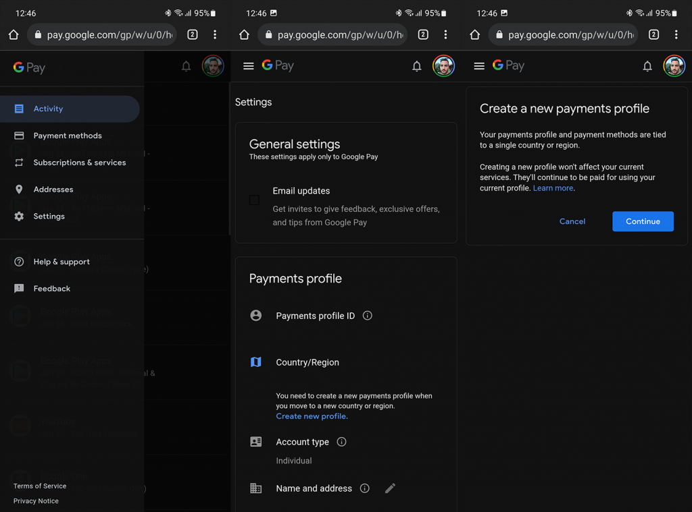

.. _google_play_book:

==================
Google Play Book
==================

当我开始使用 :ref:`pixel` 作为日常主力手机，遇到第一个问题就是如何在macOS, iOS，Android，Linux之间同步数据。其中最需要同步对内容就是电子书，因为我希望电子书是开放的，能够在不同平台阅读，并且电子书能够自己保存积累，能够本地阅读(不依赖云)也能够在通过云随时同步到不同设备进行阅读。

虽然Kindel是非常好的阅读软件和设备，但是在墙内有很多限制:

* 很多书籍没有中文版或者中文版"天残地缺"
* 美亚和中亚是完全隔离的不同体系，完全无法打通
* Kindle是封闭的系统，电子书无法直接导出到Linux上阅读

然而，epub有着开放的格式，能够跨平台使用，是最方便保存和阅读的格式。并且，epub在任何平台都能使用，有着大量阅读软件支持。

.. note::

   epub得到了Apple Books和Google Books支持，实际上只要在这两个平台上上传电子书，就可以随时同步进行阅读。尤其是Google Books，能够跨Apple的iOS和Google的Android，所以我首选采用Google Books进行日常阅读。收集的电子书也会在Google Play Books中保存一份以便后续阅读。

Google Play Books书籍同步是值得记录一下方法的，因为你找不到App Store中的Play Books客户端。实际上，Google的理念是一切以网络为基础，所以才会有 :ref:`chromium_os` 这样非常激进的完全依网络而生的操作系统。同样，你要管理Play Books电子书，你需要的仅仅是chrome浏览器。

通过Web浏览器阅读Google Books
===============================

Google Play Books最基本的跨平台阅读和管理电子书方法就是使用浏览器，只要你使用浏览器登陆了Google账号，就可以在应用栏找到 ``My Books`` ，这个入口就能够找到自己购买的书籍，也能够管理自己的电子书上传下载。

Fix "Books on Google Play is not available in your country yet"
=================================================================

非常吊诡的是， `谷歌退出中国大陆事件 <https://zh.wikipedia.org/wiki/谷歌退出中国大陆事件>`_ 之后，Google其实还是保留了部分中国业务，并一定程度上保持和中国政府合作。所以，Google Play Store上移除了部分中国政府不允许的应用和服务，其中就包括了Google Books。

当你默认安装Google Android系统并注册好Google账号(翻墙)，根据GPS定位，Google会默认注册你的账号是 Chinese(CN)。此时即使你翻墙访问Google Play Store，你也找不到一些应用，包括Google Books。

并且当你尝试访问 `Google Play Books <https://play.google.com/books/>`_ 网站，也会看到如下提示::

   Sorry! Books on Google Play is not available in your country yet.
   
   We're working to bring the content you love to more countries as quickly as possible.
   
   Please check back again soon.

这个问题并不能通过VPN翻墙解决，而是需要修订你账号的Country配置。

.. warning::

   Google修订Country设置每年只允许一次，所以一旦修改国家注册地，再次修改只有等下一年!!!

修改Google账号国家注册地
---------------------------

- 打开浏览器(电脑或Android手机)，访问 `Google Pay <https://pay.google.com/>`_ 网站
- 点击 ``Settings`` ，此时可以看到 ``Country/Region`` 项显示 ``Chinese(CN)``
- 在 ``Country/Region`` 项点击 ``Edit``
- 选择 ``Create new profile`` ，此时在 ``Create a new payments profile`` 

- 按照提示导引选择国家，例如选择 Unite State (US)

- 需要填写一个美国地址，可以在 `BestRandoms网站: Random address in United States <https://www.bestrandoms.com/random-address-in-us>`_ 找到一个随机生成的美国地址，填写并提交

- 等待48小时，Google Play会修改你的 ``country/region``

参考
========

- `How to Read Google Books on Mac <https://www.epubor.com/how-to-read-google-books-on-mac.html>`_
- `This item isn’t available in your country on Play Store (FIX) <https://mobileinternist.com/this-item-isnt-available-in-your-country>`_
