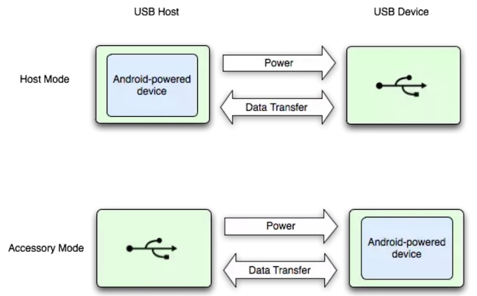

.. _android_otg:

======================
Android OTG
======================

USB概念
===========

USB 是一个用于数据交换的总线(Bus)：发起(initiate)数据交换的一方称为主机 (host)，另一方称为外设(peripheral)，两者通过总线实现通信，由主机负责供电。一个 USB 系 统里只有一个主机，但可以有多个外设，外设的主要信息记录在描述符(descriptor)里。一个 外设就是一个单独的物理实体，但它却可能有多个逻辑上的设备功能(device function)，比如 一个网络摄像头，除了有照相机，还可能有内置的麦克风，这种外接设备也被称为复合设备 (composite device)。

USB OTG概念
============

USB On-The-Go 通常缩写为 USB OTG，是 USB2.0 规格的补充标准。它可使 USB 设备，例如播放器或手机，从 USB 周边设备变为 USB 主机，与其他 USB 设备连接通信。在 正常情况下，这些支持 OTG 的 USB 设备和 USB 主机(如台式机或者手提电脑)，仍然作为 USB 周边设备使用。

Android 平台下 USB 开发有以下两种模式：

* USB Host Mode:

Android 设备作为主机，需要安卓设备支持 OTG 接头。常见应用场景诸如连接数 码相机、键盘、鼠标、游戏手柄等硬件。

* USB Accessory Mode:

Android 设备承担外设的角色。应用场景诸如连接机器人控制器、音响、医疗器 材等，当然前提是这些设备支持与Android设备连接并且遵守Android accessory communication protocol。这种模式可以让不具有 host 能力的 Android 设备与其他硬件交互。

参考
=======

- `Android USB OTG通信 <https://www.jianshu.com/p/673176b7362d>`_
