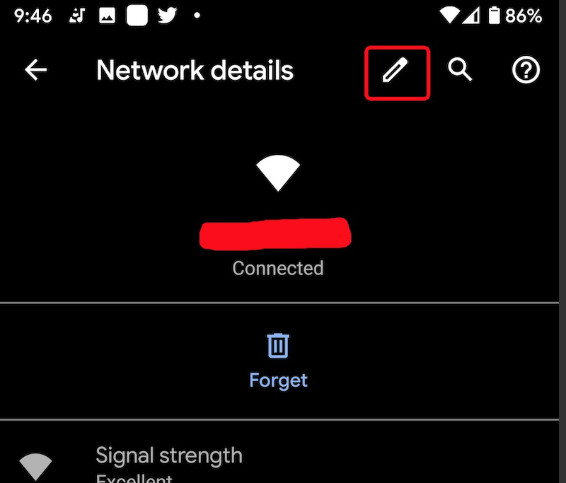
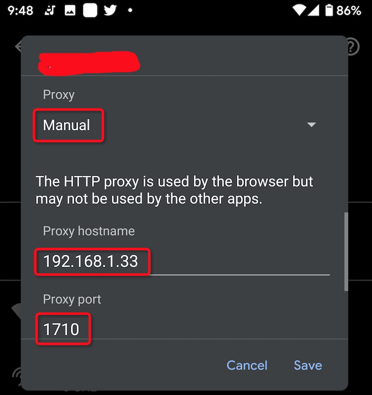
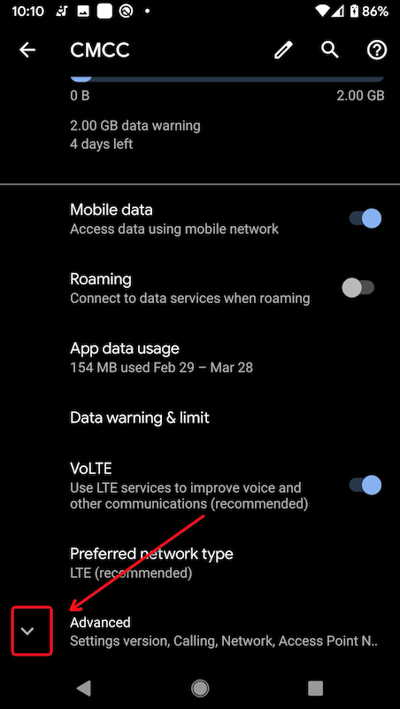
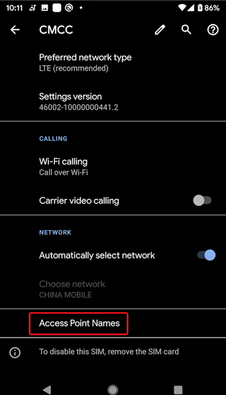
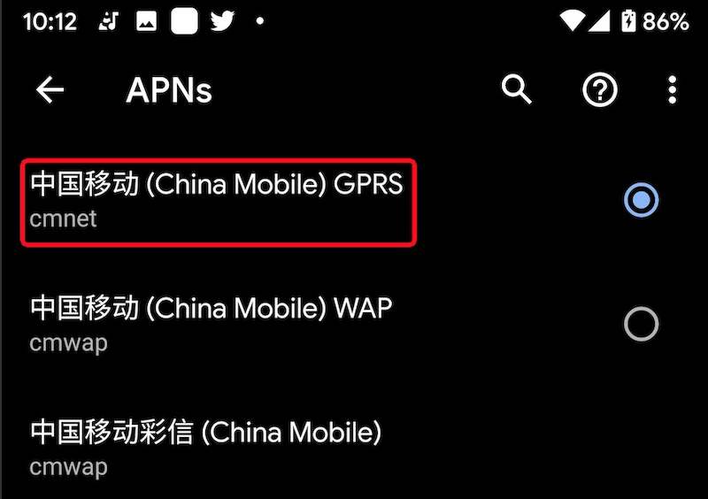

.. _android_proxy:

==================
设置Android Proxy
==================

在瓷器国，需要获取充分的信息，你需要翻墙。然而，"伟大的墙"对于加密数据采用了深度包检查以及随机丢弃数据包导致SSL加密时断时续，几乎难以打开一个正常的HTTPS网页。

不过，有些环境下，譬如恰好有 :ref:`squid` 通过专线连接外网，则你可以设置代理方式来加速网络。

.. note::

   通常桌面操作系统都提供了OS级别的Proxy设置，例如macOS: ``System Preferences => Network => Advanced... => Proxies``

   .. figure:: ../../_static/android/hack/macos_proxy.png
      :scale: 50

在Android系统中设置Proxy最初有点让我迷惑，实际上代理设置的位置并不像我想象那样清晰直白，而是隐藏在不同的设置位置，特别是Wi-Fi和移动数据网络代理设置的方法差别较大。

Wi-Fi设置Proxy
===============

Wi-Fi设置Proxy是在每个Wi-Fi热点连接以后，在连接热点旁的"齿轮⚙️""点击配置网络详情:

.. figure:: ../../_static/android/hack/wifi_setup_proxy_1.png
   :scale: 50

在网络详情中，点击 "编辑" 按钮：

这里有一个很不直观的地方，就是你必须点击一下 ``Advanced options`` 下拉菜单，然后再滚动屏幕向下才能看到 ``Proxy`` 设置:

.. figure:: ../../_static/android/hack/wifi_setup_proxy_3.png
   :scale: 50

然后在 ``Proxy`` 设置下拉选择 ``Manual`` 并填写相应的Proxy服务器设置:

Mobile Data Proxy
====================

移动数据网络的Proxy设置更为隐晦，实际上这个移动数据网络的代理设置隐藏在运营商的 ``Access Point Names`` 中：

* 依然访问 ``Settings => Network & internet`` ，或者在设置快捷栏中长按 ``Mobile Data`` 图标，进入移动运营商设置页面。例如，我的设置是中国移动CMCC

* 向下滚动菜单页面，在最下方有一个 ``Advanced`` 设置，点击：

* ``Advanced`` 设置展开以后，继续向下滚动，直到看到最后的 ``Access Point Name`` 选项，并点击:

* 此时会看到 APNs 这之中 ``中国移动(China Mobile) GPRS`` 选项，点击：

* 向下滚动可以看到 ``Proxy`` 和 ``Port`` 设置，请填写对应选项:

.. figure:: ../../_static/android/hack/mobile_setup_proxy_4.png
   :scale: 50

* 还有一步非常反直觉的设置：需要点击一下右上角的 ``...`` ，并选择菜单中的 ``save`` 保存一下配置才能生效：

.. figure:: ../../_static/android/hack/mobile_setup_proxy_5.png
   :scale: 50

.. note::

   如果在配置Mobile Data的Proxy之前已经建立了VPN连接，则Android App的数据不会使用这个新配置的Proxy。我验证发现，需要断开VPN，并重新连接VPN。则新连接VPN后的Android App才会使用Proxy。

参考
======

- `How to Configure a Proxy Server on Android <https://www.howtogeek.com/295048/how-to-configure-a-proxy-server-on-android/>`_
- `How to see mobile operator proxy settings <https://android.stackexchange.com/questions/47040/how-to-see-mobile-operator-proxy-settings>`_
- `How to Configure Proxy Settings on Your Android Device <https://oxylabs.io/resources/integrations/android>`_
