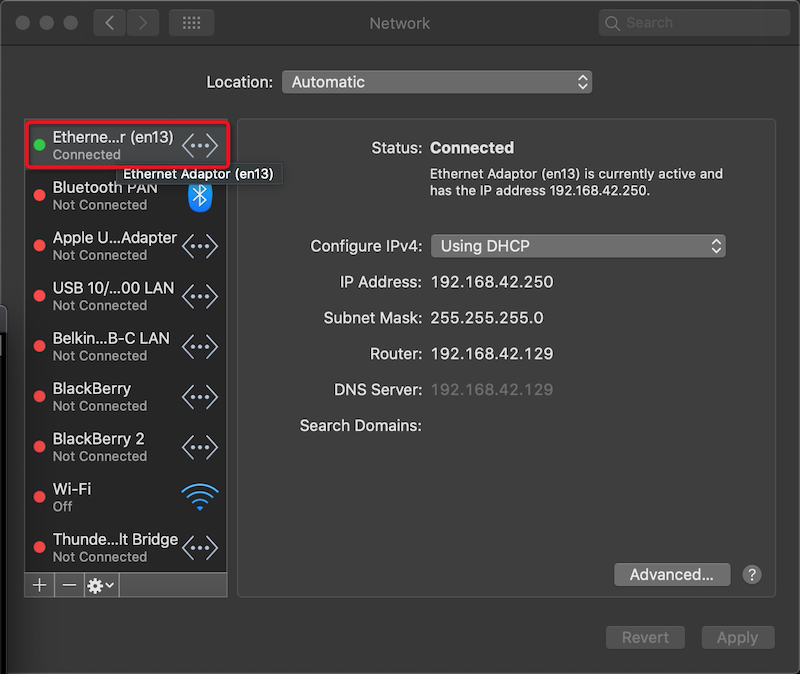

.. _android_usb_tethering:

================================================
通过USB Tethering方式共享Android的Internet连接
================================================

现代的手机都支持Wi-Fi tethering，也就是通过Wi-Fi让手机的数据网络连接共享给电脑使用，也称为"无线热点"(HotSpot)。此外，你在使用iPhone的时候，会发现一个非常有用的功能，就是通过USB连线来共享数据网络的Internet连接，而且对于苹果手机和苹果电脑是即插即用的。

实际上，Android也支持通过USB连接共享网络，这种技术称为 ``USB Tethering`` ，设置方法： ``Settings => Network & internet => Hotspot & tethering => USB tethering`` 。

但是，很不幸，此时  :strike:`将Android手机通过USB数据线连接到Mac电脑上没有任何反应，完全不像iPhone开启"个人热点"的USB共享后连接到Mac电脑上即插即用` 。这是因为macOS没有内置 `HoRNDIS(the USB tethering driver for Mac OS X) <https://github.com/jwise/horndis>`_ 。

早期的Android系统，开启USB共享时， :ref:`usb_gadget` 对应的Linux Gadget框架会加载 ``usb_f_rndis`` 驱动。 ``RNDIS`` 协议是微软主导，所以在Windows主机能够立即"免驱"识别出一个以太网卡。但是该协议较为陈旧且安全缺陷多，所以macOS没有内置 ``RNDIS`` 驱动，Linux虽然支持但不推荐使用。

从Pixel 6开始，Google彻底抛弃了老旧的RNDIS，转而全面使用标准的 ``CDC-NCM`` 协议，内核 :ref:`usb_gadget` 会虚拟出一个更先进的 ``NCM虚拟以太网卡`` 。并且由于 Windows 11, Linux 和 macOS都原生内置了 NCM 驱动，所以该方法是跨平台全免驱的"即插即用以太网卡"。同时，它的CPU占用率比以前更低，手机发热更小、网速也更快。

.. note::

   `Lineage OS > Google Pixel 4 <https://wiki.lineageos.org/devices/flame/>`_ 已经原生提供了 ``23.2 (Android 16)`` 理论上应该完全采用了最新的 ``NCM虚拟以太网卡`` ，应该能够免驱在 Windows11，Linux和 macOS上顺畅使用。 

.. note::

   HoRNDIS is a kernel extension ("kext") that makes it possible to use your Android phone's built-in USB tethering support on your Mac OS X system. 

   由于HoRNDIS是内核扩展，所以在Catalina (macOS 10.15)上无法直接安装，因为kext开发需要通过Apple认证。解决方法是使用 `unable to install on macOS Catalina #102 <https://github.com/jwise/HoRNDIS/issues/102#issuecomment-541237232>`_ 中提供的下载包 `HoRNDIS-9.2-catalina_install.pkg.zip <https://github.com/jwise/HoRNDIS/files/3719733/HoRNDIS-9.2-catalina_install.pkg.zip>`_ 。

安装完 HoRNDIS 驱动以后，需要重启一次macOS，重启以后，将启用了 ``USB tethering`` 设置的Android手机通过USB数据线连接到Mac电脑上，此时在Mac的 ``Networks`` 设置中会看到一个 ``Etnernet Adaptor`` :

此时，如果你的Android能够通过Wi-Fi上网或者移动数据网络上网，则你的Mac电脑也能够通过USB数据线共享网络上网了。

.. note::

   启用了 ``USB tethering`` 之后，虽然电脑能够通过共享Internet上网，但是，对于 手机的VPN连接是无法直接共享给电脑使用的。此时，你需要使用root过的Android手机，并结合 :ref:`vpn_hotspot` 才能完美使用VPN共享。

.. note::

   Linux内核需要编译 ``USB Network Adapters`` 驱动支持，启用 ``Host for RNDIS and ActiveSync devices`` 才可以使用Android USB Tethering。请参考: `Gentoo linux - Android USB Tethering <https://wiki.gentoo.org/wiki/Android_USB_Tethering>`_

参考
======

- `How To Configure Android USB Tethering on Mac OS X <https://www.makeuseof.com/tag/configure-android-usb-tethering-mac-os-x/>`_
- `How to Tether Your Android Phone and Share Its Internet Connection with Other Devices <https://www.howtogeek.com/170302/the-htg-guide-to-tethering-your-android-phone/>`_
- `Gentoo linux - Android USB Tethering <https://wiki.gentoo.org/wiki/Android_USB_Tethering>`_
