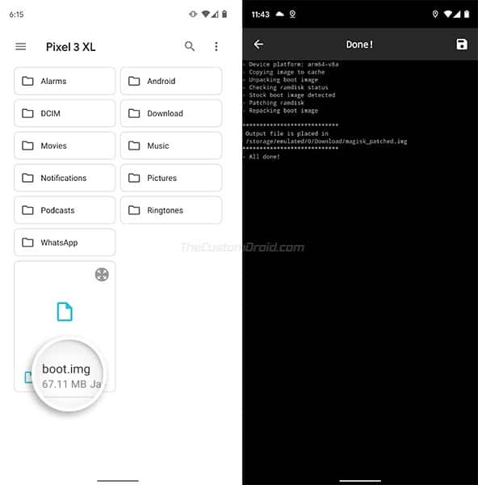

.. _magisk_root_ota:

==========================================
Magisk root Android设备并支持OTA更新
==========================================

对于已经root过的Android设备，就不能使用OTA更新。不过，对于Pixel设备，由于支持双启动分区，我们依然通过巧妙的配置，在保留root和TWRP情况下实现OTA升级。

OTA更新
=========

OTA更新即 ``Over-the-Air Update`` ，是一种接收和安装升级Android设备软件的无线方法。OTA可以由设备制造商(也称为OEM)远程推送，并且是最容易最有效升级Android设备软件到最新版本到方法。一旦OTA更新发布，就会自动安装或者提示用户手工下载和安装。

Root一个Android设备提供了用户更为强大的控制能力，并且可以任意修订系统软件。然而，root Android设备也存在缺点，最大的缺点是丧失了自动OTA更新能力。原因是从Android 5.0开始，Google引入了一个 ``block-based OTAs`` 的机制，这个机制提供了pre-OTA块校验以验证设备软件的一致性。简单来说，就是一旦安装开始，设备分区(例如system, boot, vendor, dtbo 等)就会被检查是否被修改，例如Root, :ref:`twrp` 对分区数据修改就会被发现，并阻止OTA更新。

Magisk Root, A/B分区和OTA更新
================================

通过Magisk，我们依然可以在已经root的Android设备上轻易安装OTA更新而不会丢失root。Magisk是一个Universal Systemless Interface，允许无需更改Android设备系统级分区 ``/system`` 就可以修改Android软件。更为重要的是，Magisk开发出了最为重要的现代化root解决方案 - MagiskSU (Magisk的作者2018年在Reddit介绍了 `The Magisk Story <https://www.reddit.com/r/Android/comments/7oem7o/the_magisk_story/>`_ 可以帮助我们了解这个软件)

有两种方式安装Magisk:

- 一种是传统的方法: 首先安装定制recovery( :ref:`twrp` OrangeFox等 )，然后使用recovery工具刷入Magisk installer zip(root软件包)。不过由于这种方式安装了定制的recovery，会导致非常难以获得OTA更新。这样就需要回收root然后在完成自动OTA更新，或者就需要通过旁路方式刷入OTA镜像(手工)，这种uninstall/remove root然后安装软件包的步骤繁琐。

- 2016年引入Google Pixel设备的双分区 :ref:`ab_seamless_update` 移除了设备的 recovery 分区，这就导致了第一种传统方法的失败 :ref:`twrp` 已经无法在最新的Android 10系统的Pixel设备上使用。所以我们需要采用新的使用Magisk来补丁启动镜像，然后通过Fastboot刷入补丁过的启动镜像。

在root过的Android设备上安装OTA更新
==================================

由于大多数最新的OEM Android设备都使用了A/B分区机制，所以对于root过的Android设备，OTA更新可以无缝安装到没有激活的slot中。而当使用Magisk root设备时，它智慧安装到Android设备的当前激活slot，这样就确保了没有激活的slot/partitions不会被修改。

当OTA发布时，你可以非常简单地在Magisk Manager中回复stock boot image，然后将OTA更新安装到没有激活的slot中。最后，在重启手机之前，你可以将Magisk安装到没有激活的slot来保护更新后的root。

安装Magisk和Root Android
==========================

在Android开发社区充斥这大量的修改工具，通常称为 ``mods`` ，允许定制Android设备中的软件。这些模块帮助我们挖掘出Android设备中OEM不提供给我们的功能。 ``Magisk`` 就是一个 ``systemless-ly`` 修改Android设备的超级接口。Magisk在2016年出现时是作为一个软件修改工具，就像 `Xposed Framework <https://www.thecustomdroid.com/install-xposed-framework-on-android-using-edxposed/>`_ ，但是和Xposed不同，Magisk允许用户定制软件而不会修改 ``/system``
分区，这样就能通过Goolge的SafetyNet测试。进一步，Magisk提供了新的 ``MagiskSU`` 功能，也就是root功能，可以通过Magisk来root任何Android设备，包括运行Android 10设备。此外， ``Magisk Hide`` 是另外非常有用的功能，可以解决一些应用检测到设备被root就拒绝运行的问题。

Magisk提供的主要功能:

- 无需更改系统(system)分区以及vendor分区，就可以修改软件
- 使用开源root解决方案root Android设备
- 管理root权限和使用生物统计学，类似指纹和面容解锁
- 即使手机已经root也能通过Google SafetyNet tests
- 可以在root过的设备上使用银行和安全软件
- 移除内核功能，例如DM-Verity和ForceEncrypt
- 加入第三方功能使用Magisk Modules
- 非常方便在root过的Android舍诶上安装OTA升级

.. note::

   - 在安装使用Magisk之前，请务必备份手机上的个人数据
   - Android设备的bootloader必须解锁

   在本文中，我将采用Magisk的root方法，不采用 :ref:`twrp` 旁刷(原因是TWRP对双分区支持不好)：

   需要下载符合当前设备的stock boot image，可以从 `firmware.mobi <https://firmware.mobi/>`_ 下载，或者从 `XDA-Developers forum <https://forum.xda-developers.com/>`_ 找到设备对应部分。也可以下载完整的OTA软件包来安装以获得 Payload.bin 文件。

使用Fastboot刷入Magisk Patched Boot Image
==========================================

如果设备不支持 :ref:`twrp` 或不愿意安装，则我们可以通过刷入Magisk Patched Boot image来安装Magisk:

- 下载和安装 `Firmware Mobi by Chainfire – Download Stock Boot, Recovery & Root Images <https://www.thecustomdroid.com/firmware-mobi-chainfire-stock-images/>`_

.. note::

   `firmware.mobi <https://firmware.mobi/>`_ 提供的Pixel 3修订过的boot.img当前最高只支持Android 10(其他Pixel系列也是如此)，尚未支持最新的Android 11。不过，我参考 `How to Install OTA Updates on Rooted Android Devices using Magisk [Without Losing Root] <https://www.thecustomdroid.com/install-ota-update-rooted-android-device-guide/>`_ 中网友 ``Dhananjay Bhardwaj`` 建议，直接从Google Android官方下载的factory image，解压缩获得的 ``boot.img`` 来完成整个Magisk补丁boot.img安装过程的，整个过程非常顺利。

    另外一种方法，我感觉可以采用 :ref:`lineageos_19.1_pixel_3` 先安装Lineages OS 19.1 (基于android 12，提供了定制的boot.img)，然后刷入 :ref:`twrp` (看网上文档应该能够在LineageOS上刷入TWRP，因为其boot.img是定制过的) ，最后再安装Magisk。不过，这个步骤无法使用Google原厂提供的Android 11，所以也就无法使用本文所描述的通过Magisk来实现root过Android OTA升级。

- 将修订过的boot image(请参考 :ref:`android_11_pixel_3` 下载官方factory image，然后解压缩获得本步骤所使用的 ``boot.img`` )传送到手机的存储中::

   adb push boot.img /sdcard/Download/boot.img

- 从 `github上 Mgisk release <https://github.com/topjohnwu/Magisk/releases>`_ 下载最新Magisk Manager APK，然后安装到设备中::

   adb install Magisk-v23.0.apk

- 运行 Magisk Manager ，然后点击 ``Install`` 按钮并再次选择 ``Install``

.. figure:: ../../_static/android/hack/magisk_manager.jpg
   :scale: 80

- 选择 ``Select and Patch a File`` 选贤

- 在存储中找到你刚才传输进来的 ``boot.img`` 文件:

此时Magisk Manager就会在stock boot image上补丁上最新版本的Magisk

- 一旦完成补丁，打过补丁的boot镜像(magisk_patched.img)文件就需要传输到电脑本地::

   adb pull /sdcard/magisk_patched.img ./magisk_patched.img

- 将Android设备重启到Bootlader/Fastboot模式::

   adb reboot bootloader

并检查设备状态::

   fastboot devices

可以看到::

   912X1U972  fastboot 

- 将补丁过的boot镜像刷入设备::

   fastboot flash boot magisk_patched.img

此时补丁过的boot镜像就会刷入到手机的当前激活的slot::

   Sending 'boot_b' (65536 KB)                        OKAY [  0.324s ]
   Writing 'boot_b'                                   OKAY [  0.211s ]
   Finished. Total time: 0.930s

- 完成后，重启手机::

   fastboot reboot

- 重启完成后，再次打开 Magisk Manger 查看状态，如果一切正常

更新OTA(root设备)
==================

我们已经root了设备，现在我们就要在root过的设备上通过OTA方式更新系统，步骤分解如下

步骤一:关闭自动系统更新
------------------------

在Android 8.0 Oreo以上版本，Google引入了一个自动更新机制，会在OTA发布后自动下载和安装OTA更新。但是这种自动更新方式和root过的设备冲突，所以为了能够在root过的Android设备上继续OTA更新，首先需要关闭系统的自动更新。

- 在 ``Settings`` 菜单中，进入到 ``About phone`` 菜单
- 滚动到底部，找到 ``Build number`` ，然后点击 ``Build number`` 部分5次，激活 ``Developer options``
- 一旦激活开发者模式，就可以在 ``Settings -> System -> Developer options`` 中找到 ``Automatic system updates`` 选项，请关闭这个选项

参考
=====

- `How to Install OTA Updates on Rooted Android Devices using Magisk [Without Losing Root] <https://www.thecustomdroid.com/install-ota-update-rooted-android-device-guide/>`_
- `How to Install Magisk and Root Android Devices with it [2 Methods] <https://www.thecustomdroid.com/install-magisk-root-android-devices/>`_
- `Firmware Mobi by Chainfire – Download Stock Boot, Recovery & Root Images <https://www.thecustomdroid.com/firmware-mobi-chainfire-stock-images/>`_
