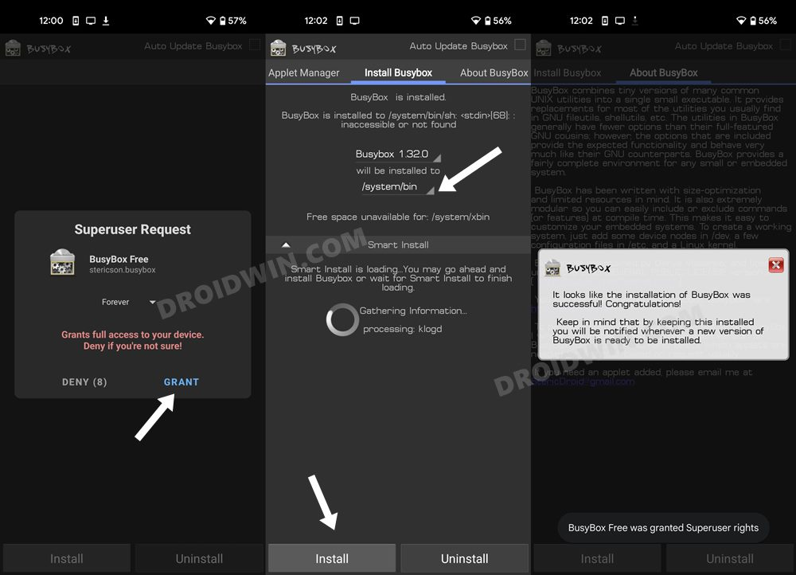
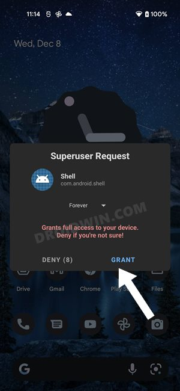

.. _pixel_6_volte:

=================================
配置Pixel 6支持VoLTE
=================================

我之前尝试过 :ref:`pixel_3_chinese_volte` 方法，成功激活过Android 11(Google 官方镜像)的VoLTE功能，并且直接升级到Android 12依然可用。

不过，最近 :ref:`lineageos_19.1_pixel_3` ，想彻底完整配置VoLTE，所以参考 `How to Enable VoLTE in Google Pixel 6/Pro <https://www.droidwin.com/how-to-enable-volte-in-google-pixel-6-pro/>`_ 来手工配置，该方法应该是通用的适合Pixel系列各个机型以及系统。

.. warning::

   本文方法根据参考资料说是Pixel 6/Pro激活VoLTE，但是我在 :ref:`pixel_3` 上尝试无效。最终我还是采用 :ref:`pixel_3_chinese_volte` 方法配置。所以本文仅作为记录参考。

   我仔细对比了 :ref:`pixel_3_chinese_volte` ，发现是增加了一个 ``/system/vendor/rfs/msm/mpss/readonly/vendor/mbn/mcfg_s/wmbn_sw.txt`` 配置文件，和本文方法完全不同。本文方法实际上是使用了 ``VoLTE Module ZIP`` 模块。或许Pixel 6已经具备了 ``wmbn_sw.txt`` ，只不过没有在配置中激活

准备工作
============

- 安装 :ref:`adb`
- 安装 :ref:`magisk` 并成功完成通过 patched boot.img 实现Root

手工激活VoLTE(失败)
==========================

- 从Google Play Store上安装 ``BusyBox App`` (实际上只使用 busybox 的 vi 工具来编辑文件而已， ``adb shell`` 的 ``su`` 和 busybox 无关)

- 启动 ``BusyBox`` ，启动时一定要选择 ``GRANT`` 授权root权限；然后在安装前，先修改安装位置改成 ``/system/bin`` ，然后再点击 ``Install`` 按钮

完成安装

- 在电脑上，连接好USB连线到手机，确保手机 USB Debugging 已经激活

- 在电脑上执行::

   adb shell

- 此时登陆进入手机，然后执行 ``su`` ::

   su

- 此时会咋手机上看到 ``Magisk`` 提示Shell请求Superuser权限，点击 ``GRANT`` 授予权限

- 此时shell具有超级用户权限，提示符从 ``$`` 转为 ``#``

- 进入以下目录::

   cd /data/user_de/0/com.android.phone

- 在这个路目录执行 ``ls -l`` 可以看到如下目录::

   drwxrws--x 2 radio radio 3488 2022-05-22 09:34 cache
   drwxrws--x 2 radio radio 3488 2022-05-22 23:33 code_cache
   drwxrwx--x 2 radio radio 3488 2022-05-22 09:35 files
   drwxrwx--x 2 radio radio 3488 2022-05-22 22:59 shared_prefs

- 在 ``files`` 子目录下有关于 carrier 配置XML文件，名字可能会不同，例如我的文件::

   carrierconfig-com.google.android.carrier-898600-1435.xml
   carrierconfig-com.google.android.carrier-nosim.xml

- 备份文件::

   cp carrierconfig-com.google.android.carrier-898600-1435.xml carrierconfig-com.google.android.carrier-898600-1435.xml.bak

然后检查文件::

   ls -lh

可以看到::

   -rw------- 1 radio radio  920 2022-05-22 09:35 carrierconfig-com.google.android.carrier-898600-1435.xml
   -rw------- 1 root  root   920 2022-05-23 00:21 carrierconfig-com.google.android.carrier-898600-1435.xml.bak

- 执行以下命令对文件进行编辑::

   busybox vi carrierconfig-com.google.android.carrier-898600-1435.xml

在 ``<bundle>`` 段落添加以下行内容::

   <boolean name="show_4g_for_lte_data_icon_bool" value="true" />
   <boolean name="enhanced_4g_lte_on_by_default_bool" value="true" />
   <boolean name="carrier_volte_available_bool" value="true" />
   <boolean name="vendor_hide_volte_settng_ui" value="false" />
   <boolean name="hide_lte_plus_data_icon_bool" value="false" />

.. note::

   上述方法似乎能够显示出 ``4G 语音功能`` ，但是我发现实际还是没有生效(电话功能时LTE网络中断)。而且重启手机后，该配置选项也无法找到了。

参考
=====

- `How to Enable VoLTE in Google Pixel 6/Pro <https://www.droidwin.com/how-to-enable-volte-in-google-pixel-6-pro/>`_
