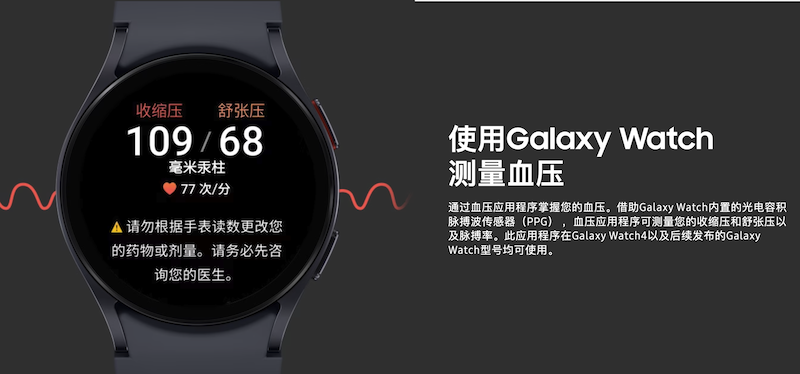
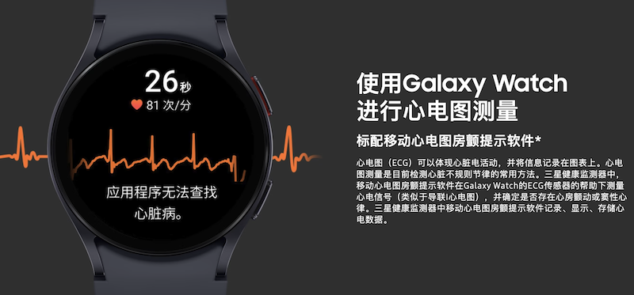

.. _samsung_health_monitor:

========================================
三星健康监测器(Samsung Health Monitor)
========================================

2023年8月3日，三星发布了Galaxy Watch 6系列国行手表，同时正式宣布国行智能手表推出标配 ECG 移动心电图房颤提示软件。在 `三星官网: 三星健康监测器 <https://www.samsung.com.cn/apps/samsung-health-monitor/>`_ 可以看到，久违大陆用户的三星健康监测器(Samsung Health Monitor)终于宣布支持Galaxy Watch4以及后续发布的Galaxy Watch型号。

这个功能实际上早已在三星国际版提供，甚至早在三星Active 2(也就是Watch 4的前两代)就已经推出。不过，所有先进技术在我国总是会受到很多阻力，特殊国情导致了很多无意义的产品技术阉割，三星和苹果也不例外。

虽然迟到了很多年，三星的国行用户终于能够"正常"使用这本该具备的功能了...

   三星国行Galaxy Watch 4及之后产品正式支持血压测量

   三星国行Galaxy Watch 4及之后产品正式支持心电图测量

三星手机
==========

当完成 :ref:`samsung_galaxy_watch_4_classic_lte` 上手表操作系统更新，并且在手表系统中的 ``应用程序`` 管理中，将所有手表软件更新到罪行。此时，再次打开手表上 ``三星健康监测器`` 应用，就会看到提示: **不支持** ``您需要一部三星手机才能使用三星健康检测器``

原来 ECG 心电图 和 血压检测 ，是作为三星手机独占的功能。

参考 `破解三星Galaxy Watch 4 ECG和血压监测限制并移除部分系统应用 <https://blog.irain.in/archives/Samsung-Galaxy-Watch-4-ECG-BP-restrictions-removed-and-optimization.html>`_ 可以知道原版 ``Samsung Health Monitor`` (SHM)限制如下:

- 设备限制: 必须使用三星Galaxy系列手机
- 国家限制: 只能在 ECG 功能被批准的国家使用
- 安全限制:

  - Root 设备无法使用
  - 强制锁屏设置

- 年龄设置: 设置了 22 岁的年龄使用限制

破解方法
===========

- 按照默认的方法安装相关的三星官方的应用并完成手机和Watch连接(已经在 :ref:`cn_samsung_galaxy_watch_4_wich_android` 完成 ):

  - Galaxy Wearable
  - Galaxy Watch 4 Plugin
  - Samsung Health

- 下载 `XDA论坛提供的SMH工具 <https://xdaforums.com/t/restrictions-removed-samsung-health-monitor-wearos-1-1-1-171-root-age-country-device-restriction-removed-22nd-november-2021.4322527/>`_ : 很不幸，这个页面在墙内无法打开，翻墙梯子被网站拒绝，所以我实际上采用了 `破解三星Galaxy Watch 4 ECG和血压监测限制并移除部分系统应用 <https://blog.irain.in/archives/Samsung-Galaxy-Watch-4-ECG-BP-restrictions-removed-and-optimization.html>`_  `共享在 Google Drive 的SHM工具包 <https://drive.google.com/drive/folders/138thPYPMbZIp2Us0Unx_h-SqJQEDxZ-0>`_

允许血压数据同步
-----------------

- 参考 ``Enable BP Sync`` 目录下的文档 ``READ ME.docx`` ，执行以下步骤:

通过以下 ``adb`` 命令在  ``Download`` 目录下创建一个 ``SamsungHealth`` 目录，然后在这个目录下 ``touch`` 一个空文件，名字是是 ``FeatureManagerOn`` :

.. literalinclude:: samsung_health_monitor/FeatureManagerOn
   :caption: 创建一个激活Feature的文件

在手机上强制关闭 ``Samsung Health`` 然后再次打开 ``Samsung Health`` (中文名是 "三星健康"): 打开设置功能，进入 ``About Samsung health`` 菜单(也就是 "关于三星健康" 菜单)

快速点击 ``版本号`` 直到在该版本号下面出现 ``两个按钮`` ，分别是 ``Set features`` 和 ``Developer mode`` 

点击 ``Set features`` ，进入 ``Feature List`` : 

  - 在 ``Health Analytics`` 分类中将 ``[HA] Server`` 设置为 ``DEV``
  - 在 ``DataPlatform`` 分类中的 ``Developer mode`` 设置为 ``on``

然后返回，按照提示关闭 ``Samsung Health`` 应用程序，然后再次强制停止一次 ``Samsung Health`` 应用

在手机上安装破解版SHM
------------------------

- 将下载包中的 ``A9.Phone.WearOS.SHM.MOD.1.2.2.005.dante63.apk`` 下载到手机上并安装

在手表上安装破解版SHM
--------------------------

- 在手表上启动WiFi调试adb:

  - 打开手表的设置菜单
  - 将手表连接至和你的电脑同一网络的 WiFi
  - 选择 ``About watch --> Software``
  - 快速连点5次 ``Software version`` ，此时悬浮提示，显示已经启用了 ``Developer mode``
  - 在开发者模式页面下，启用 ``ADB debuggin`` 和 ``Debug over Wi-Fi`` 选项，激活后会手表的IP地址端口，需要记录下来备用

- 原文使用了一个Windows脚本来完成操作，该脚本位于 ``Watch SHM MOD WearOS/READ ME - ADB Auto instructions - Updated`` 目录下 ``ADB_XDA_Dante63_UPDATED.zip`` 解压缩后获得；另外，还有一个手工操作指南文档(我按照这个文档完成):

.. literalinclude:: samsung_health_monitor/adb_connect
   :caption: 通过adb网络连接手表

我这里在执行 ``adb connect IP:PORT`` 的时候遇到报错::

   failed to connect to 192.168.7.163:46109

参考 `PSA: ADB to wear OS 3 requires extra steps <https://www.reddit.com/r/WearOS/comments/z31ny0/psa_adb_to_wear_os_3_requires_extra_steps/>`_ 原来从 WearOS 3开始(包括 WearOS 4)，需要首先配对才能连接无线进行调试:

在手表端点击 ``Pair New Device`` ，此时会看到 ``pair code, IP address, pair port`` ，则执行::

   adb pair 192.168.x.xxx:xxxxx (这里输入的是配对的IP地址和配对端口)

正确输入配对码后，终端会提示信息:: ``Successfully paired to 192.168.7.163:45825 [guid=adb-XXXXX]``

此时再次执行 ``adb connect 192.168.7.163:46109`` (注意是debug端口，不是配对端口)就会看到成功信息 ``connected to 192.168.7.163:46109``

- 对于已经安装过原生 SHM 的，建议uninstall掉:

.. literalinclude:: samsung_health_monitor/uninstall_ori_shm
   :caption: 先删除掉手表已经安装的原生SHM

- 然后安装破解过的SHM:

.. literalinclude:: samsung_health_monitor/install_mod_shm
   :caption: 安装破解版SHM

提示信息如下:

.. literalinclude:: samsung_health_monitor/install_mod_shm_output
   :caption: 安装破解版SHM的提示信息

- 完成安装后断开adb:

.. literalinclude:: samsung_health_monitor/adb_disconnect
   :caption: adb断开网络连接手表

.. note::

   切记手表上关闭 ``adb`` 调试功能，否则严重影响手表续航

使用ESG
===========

- 在手机上打开破解版的 SHM ，初次使用时会提示连接 ``Samsung Health`` 需要给予权限，按照提示完成即可

- 手表端可以直接打开破解过的SHM，按照提示开始ECG和血压检测

三星健康数据同步
=================

使用国行版本的 :ref:`samsung_galaxy_watch_4_classic_lte` ，当我尝试将自己的健康监测数据同步到三星健康服务账号， ``三星健康`` 程序会提示 ``根据BABA法律，不能同步数据到国外服务器`` ，目前不太确定该如何解决:

- 是否可以绕过限制同步到海外三星官方服务器？
- 是否可以自建服务器来做同步备份？

`三星 watch4 Classic Lte ECG 血压数据同步到三星健康的教程 <https://www.samsungmembers.cn/thread-1195492-109-147.html>`_ 有一个方法来同步ECG和血压数据到三星健康(可能是国内的三星健康官方服务)

参考
======

- `三星 Galaxy Watch 4/5 国行版手表现已支持 ECG 心电图、血压监测等功能 <https://www.ithome.com/0/711/308.htm>`_
- `三星官网: 三星健康监测器 <https://www.samsung.com.cn/apps/samsung-health-monitor/>`_
- `破解三星Galaxy Watch 4 ECG和血压监测限制并移除部分系统应用 <https://blog.irain.in/archives/Samsung-Galaxy-Watch-4-ECG-BP-restrictions-removed-and-optimization.html>`_
