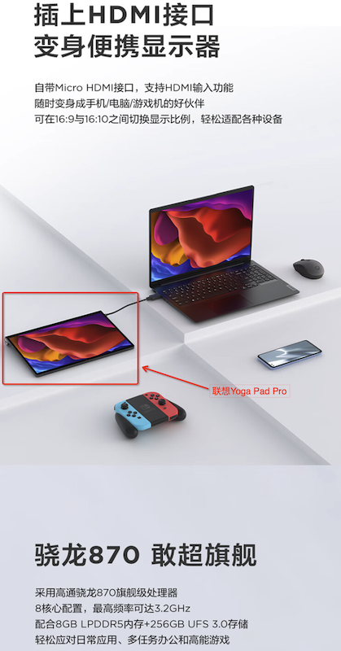

.. _android_mobile_work_solutions:

=========================
Android移动工作解决方案
=========================

我对于 :ref:`mobile_work_think` 是采用智能手机来实现绝大多数开发运维工作，这里涉及到如何使用 :ref:`android` 或 :ref:`iphone` 。Android由于相对较为开放，能够运行完整Linux系统，可以更为方便构建工作桌面，所以我重点采用 :ref:`pixel_3` 作为移动工作平台。

有线投屏
==========

:ref:`android_displayport` 有以下要求:

- 使用第三方Android镜像(内核开启 ``Alternate Mode over USB-C`` )
- 使用 usb-c to HDMI 联线
- 使用高端Pixel(如 Pixel 8 或更新)结合最新的Android 16 beta，支持类似Samsung ``DeX`` 桌面模式，未来这是一个非常值得期待的官方解决方案(演示请参考油管视频 `Samsung DEX Is Coming To Your Google Pixel? Android 16 Desktop Mode First Impressions <https://www.youtube.com/watch?v=k6ai9hv_uwM>`_ )
- 购买使用Samsung支持DeX模式的手机，当前就可以体验Android桌面

.. note::

   根据网上传言 `Your iPhone May Get a 'Desktop' Mode With iOS 19 <https://lifehacker.com/tech/iphone-desktop-mode-ios-19-rumors>`_ 苹果公司似乎也在开发将 :ref:`macos` 带到 iPad上，提供类似桌面体验。这其实是一个技术策略选择，其实对于macOS多年前就支持的扩展屏幕功能，对于 macOS 和 iPadOS 这样逐渐融合的操作系统，应该不难实现。

   也就看苹果是否会被谷歌逼到提供这样的方便功能了，毕竟苹果将产品线划分开来，卖得如此好，没有竞争对手的压力，未必会愿意提供模糊产品区分的功能。

无线投屏
===========

Android系统支持 ``chromecast`` 功能，需要找一个支持这个协议的硬件设备。

我在淘宝上购买了 :strike:`绿联无线投屏器` (已退货) ，但是实践 :ref:`airplay_ugreen` 成功，却无法在 :ref:`pixel_3` 的原生Android 12上使用: ``镜像投屏`` 功能始终找不到设备。观看绿联提供的视频 `绿联无线投屏器连接手机电视操作方法丨CM242 <https://www.lulian.cn/news/382-cn.html>`_ 似乎是以华为手机为案例，也许国产手机采用了其他魔改的投屏方式。

.. warning::

   强烈建议不要购买国产 ``正规`` 无线投屏设备(例如我购买的 ``绿联无线投屏器`` )，因为它 ``完全`` 屏蔽了在中国无法访问的视频资源，例如 Apple TV (虽然GFW没有屏蔽Apple TV)。

Termux + 电脑
================

:ref:`termux` 是Android系统上非常强大的终端模拟器，同时也是完整的Linux系统安装架构，可以通过 :ref:`apt` 安装所需的Linux工具实现 :ref:`termux_dev` 环境，可以成为一个移动的Linux工作站。

Android平板支持hdmi in
=========================

其实我一直有一个想法: 将平板电脑作为显示器来使用。注意，并不是指苹果的iPad扩展第二屏，而是真正的Android平板无缝切换成移动显示器:

- 我有一台屏幕损坏的 MacBook Pro 笔记本，实在舍不得维修屏幕(第三方屏幕也要3k)
- 虽然通过视频捕捉卡能够将任何Android平板变成屏幕，但是性能实在太差了，完全无法和原生的显示屏幕相比
- 苹果的iPad扩展第二屏虽然好用，但是其实不能没有主屏幕工作，而且电脑必须是macOS

直到2023年底，这个非常小众的需求只有一款产品能够满足 ``联想YOGA Pad Pro`` ，提供了 ``hdmi in`` 功能。也就是只要连接hdmi接口，Android平板立即切换成显示器模式，正好能够满足我的需求: 携带无头笔记本外出移动工作

   
   支持hdmi in可切换成显示屏的联想Yoga Pad Pro

参考
=====

- `如何评价联想YOGA Pad Pro？ <https://www.zhihu.com/question/453832126>`_ 希望联想能够尽快推出下一代产品
