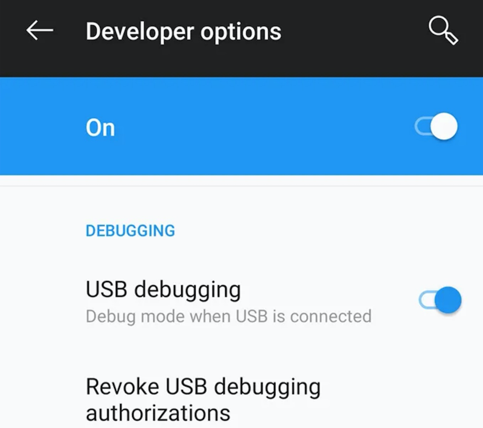
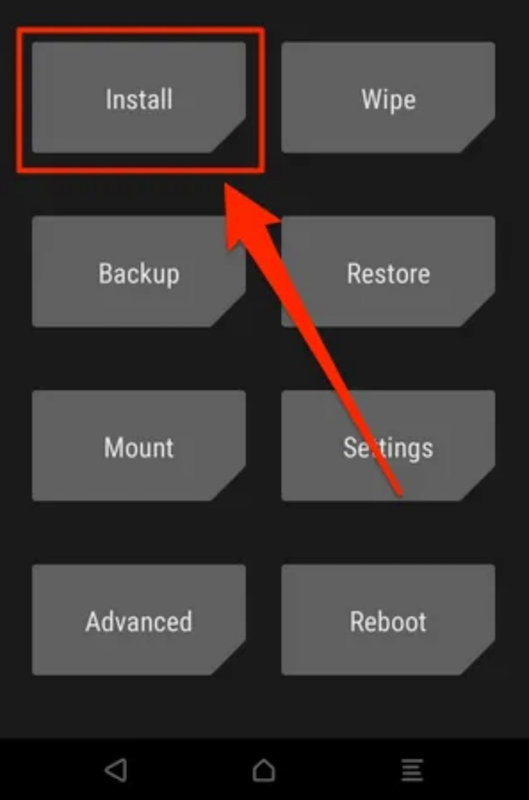

.. _root_pixel:

===============
Root Pixel设备
===============

Root自己的Android设备提供了默认情况下无法提供的很多功能。这些特殊的功能包括允许root权限的应用，定制操作系统，以及在recovery模式下刷入特殊文件。

.. warning::

   请注意root过程会删除设备上所有数据，所以务必在root之前备份数据!!!

.. note::

   手机系统已经采用 :ref:`android_10_pixel_xl` 做了全新刷机安装

Root过程
===========

* `下载Fastboot工具 <https://developer.android.com/studio/releases/platform-tools>`_ 并解压缩备用
* 在手机上访问 ``Settings > Developer options`` 并激活 OEM unlocking 和 USB debugging

如果使用 ``adb devices`` 查看设备状态是 ``unauthorized`` 则需要重新激活一次 ``USB debugging`` ，此时连接电脑会提示是否信任，选择信任以后就会授权。

* 下载 `TWRP for Pixel XL <https://twrp.me/google/googlepixelxl.html>`_ - 这里举例是Pixel XL，你需要根据设备型号来下载对应的TWRP。注意：首次安装TWRP需要同时下载zip文件和img文件，对于已经安装过TWRP，则只需要下载最新zip文件，并使用TWRP来安装zip。

  * `twrp-installer-3.3.1-3-marlin.zip <https://dl.twrp.me/marlin/twrp-installer-3.3.1-3-marlin.zip.html>`_
  * `twrp-3.3.1-3-marlin.img <https://dl.twrp.me/marlin/twrp-3.3.1-3-marlin.img.html>`_

将zip文件传输到手机::

   adb push twrp-installer-3.3.1-3-marlin.zip /sdcard/

将img文件保存在当前主机目录下。

* 下载 `Magisk ZIP Release <https://github.com/topjohnwu/Magisk/releases>`_ 然后传输到手机中::

   adb push Magisk-v20.3.zip /sdcard/

* 执行以下命令进入fastboot模式::

   adb reboot bootloader

* 输入以下命令解锁::

   fastboot flashing unlock

* 重启手机::

   fastboot reboot

* 当手机操作系统启动后，再次选择 ``Settings > Developer`` 菜单，然后激活 ``USB debuggin`` ，并将手机连接到电脑

* 在电脑上执行以下命令以便从TWRP img启动::

   fastboot boot twrp-3.3.1-3-marlin.img

.. note::

   Pixel默认是对系统加密对，挂载系统需要解密，也就是你设置手机锁定保护密码或者图案。

   TWRP提示是否修改分区，滑动按钮采用默认方式(修改分区)

不过，我也遇到了安装TWRP ZIP之后，再次尝试进入Recovery模式失败，所以我后来改为参考 LineageOS 文档，使用命令::

   fastboot flash boot twrp-3.3.1-3-marlin.img

此时提示::

   Sending 'boot_a' (30961 KB)                        OKAY [  0.842s ]
   Writing 'boot_a'                                   OKAY [  1.209s ]
   Finished. Total time: 2.261s

则可能不再需要安装TWRP ZIP

* 由于此时已经进入TWRP，点击 ``Advanced => ADB Sideload`` 进入sideload模式，就可以通过sideload方式安装 Magisk::

   adb sideload Magisk-v20.3.zip

安装完重启系统

以下步骤可能忽略
===================

* 将手机从电脑上断开USB连接

* 点击 ``Install`` 按钮，然后刷入已经传入到手机中到TWRP ZIP版本

* 刷TWRP ZIP自后重启手机

* 将手机连接到电脑，再次执行以下命令切换到fastboot状态::

   adb reboot bootloader

* 通过音量键上下滚动启动菜单，选择 ``Recovery`` 则调用TWRP recovery

* 进入 TWRP recovery之后，点击 ``Recovery`` 按钮

.. figure:: ../../_static/android/startup/recovery_install_magisk.png
   :scale: 50

* 点击 ``Install`` 并选择刷入 Magisk ZIP文件

* 最后点击 ``Reboot`` 并选择 ``System``

* 此时重启系统后，手机就已经Root了

问题排查
===========

我遇到一个问题，

参考
=======

- `How To Root a Pixel XL, 2, 2XL, 3, & 3XL <https://www.online-tech-tips.com/smartphones/how-to-root-a-pixel-xl-2-2xl-3-3xl/>`_
- `TWRP for Google Pixel XL <https://twrp.me/google/googlepixelxl.html>`_
- `Magisk - a Magic Mask to Alter System Systemless-ly <https://forum.xda-developers.com/apps/magisk/official-magisk-v7-universal-systemless-t3473445>`_
