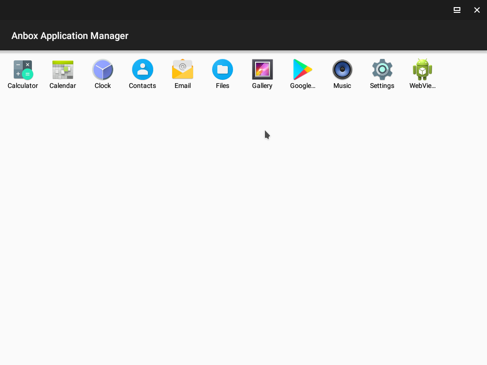

.. _ubuntu_20.04_anbox:

=============================
Ubuntu 20.04 LTS运行Anbox
=============================

我在 :ref:`kubuntu` 20.04 LTS中安装Anbox来运行Android应用

安装Anbox
===========

- 更新软件仓库::

   sudo apt update

- 强烈建议采用 :ref:`snap` 安装Anbox以避免环境依赖问题::

   sudo snap install --devmode --beta anbox

安装adb
=========

在不使用Google Play Store时，可以通过 :ref:`adb` 安装应用。所以我们首先安装Android开发工具 ``adb`` ::

   sudo apt install android-tools-adb

使用adb安装应用
===============

- 重新登录一次桌面，首次登录检查 ``ps aux | grep anbox`` 显示有一个 ``container-manager`` ::

   /snap/anbox/186/usr/bin/anbox container-manager --data-path=/var/snap/anbox/common/ --android-image=/snap/anbox/186/android.img --daemon

- 点击 ``anbox`` 图标运行(我这里出现一个问题就是窗口不显示内容)

- 执行 ``adb`` 检查虚拟机::

   adb deivces

应该看到::

   List of devices attached
   emulator-5558   device

- 执行安装::

   adb install apk-file-name

安装Android应用

对于ARM应用，会提示错误::

   adb: failed to install alilang.apk: Failure [INSTALL_FAILED_NO_MATCHING_ABIS: Failed to extract native libraries, res=-113]

这是因为模拟默认只能运行X86的Android应用。解决方法是安装 ``Google PlayStore`` 来提供ARM模拟。见下文

排查
--------

- 启动 ``anbox`` ::

   anbox.appmgr

我这里遇到报错::

   [ 2022-03-07 15:45:55 ] [launch.cpp:214@operator()] Session manager failed to become ready

并立即返回到终端桌面，而桌面系统没有提供任何anbox相关的窗口

不过， ``ps -aux | grep anbox`` 显示有如下进程::

   root         788  0.0  0.0 379264 11296 ?        Ssl  07:25   0:01 /snap/anbox/186/usr/bin/anbox container-manager --data-path=/var/snap/anbox/common/ --android-image=/snap/anbox/186/android.img --daemon
   huatai      5425 41.2  4.6 3218936 757476 ?      Sl   08:24   0:42 /snap/anbox/186/usr/bin/anbox session-manager
   root        5462  0.0  0.0 385564  7992 ?        Ss   08:24   0:00 [lxc monitor] /var/snap/anbox/common/containers default
   100000      5498  0.0  0.0  16732  4464 pts/0    Sl   08:24   0:00 /system/bin/anboxd
   110000      6209  0.6  0.5 1074124 97096 pts/0   Sl   08:25   0:00 org.anbox.appmgr

似乎已经运行起来

参考官方安装文档，发现有一步是安装内核模块，必须确保::

   ls -1 /dev/{ashmem,binder}

输出必须有2个内核模块::

   /dev/ashmem
   /dev/binder

但是我发现我的系统异常没有 ``binder`` 设备::

   ls: cannot access '/dev/binder': No such file or directory
   /dev/ashmem

但是从内核模块来看，已经加载过了::

   lsmod | grep -e ashmem_linux -e binder_linux

输出显示::

   ashmem_linux           20480  0
   binder_linux          200704  0

参考 `unable to access '/ dev / binder': No such file or directory #20 <https://github.com/anbox/anbox-modules/issues/20>`_ ，原来最新的Anbox已经不再需要静态 ``binder`` 设备，而是默认使用 :ref:`binderfs` 动态分配binder设备。安装 ``edge`` 通道版本就能和 Ubuntu 20.04 一起工作::

   sudo snap install --edge --devmode anbox
   sudo modprobe ashmem_linux

此外参考 `many: add support for binderfs #1309  <https://github.com/anbox/anbox/pull/1309>`_ :

最新开始使用 binderfs 作为内核文件系统，可以动态分配binder设备。从Ubuntu 19.04 开始Anbox只要系统系统提供binderfs就使用它，只有binderfs不可用的时候，才会使用静态的 ``/dev/binder`` 设备。

.. note::

   `Android Binderfs <https://brauner.github.io/2019/01/09/android-binderfs.html>`_ 介绍了Android Binder是一个进程间通讯(IPC)机制，在所有Android设备中都使用，已经加入到上游Linux内核驱动.

- 挂载 binderfs (可能不需要手工操作)::

   sudo mkdir /dev/binderfs
   sudo mount -t binder binder /dev/binderfs

这个命令应该能够解决 binder 设备问题

- 使用 ``edge`` 版本的Anbox，运行 ``anbox.appmgr`` 会提示报错::

   [ 2022-03-09 15:09:07 ] [daemon.cpp:61@Run] [org.freedesktop.DBus.Error.ServiceUnknown] The name org.anbox was not provided by any .service files

这个问题参考 `The name org.anbox was not provided by any .service files #1889 <https://github.com/anbox/anbox/issues/1889>`_ 起其中提到 `Fuseteam / systemd-service-files <https://github.com/fuseteam/systemd-service-files>`_ 创建使用 ``EGL_PLATFORM=x11`` 参数来启动 systemd service 文件。不过，实际上系统有一个 ``snap.anbox.container-manager.service`` 已经激活启动

当前我已经找到了如何激活 ``binderfs`` (见上文手工mount方法)，按照文档说明，就是要启动 ``snap.anbox.container-manager.service`` 如何传递进去 ``EGL_PLATFORM=x11`` 变量。

检查 ``/etc/systemd/system/snap.anbox.container-manager.service`` 文件可以看到，这个服务启动时会使用 ``/etc/environment`` 配置::

   ...
   [Service]
   EnvironmentFile=-/etc/environment
   ...

所以我在 ``/etc/environment`` 加上一行::

   EGL_PLATFORM=x11

然后重启操作系统，打开终端查看::
   
   env | grep EGL

可以看到环境变量已经生效::

   EGL_PLATFORM=x11

上述方法取保了 ``snap.anbox.container-manager.service`` 也是使用了这个环境变量。

再次运行::

   anbox.appmgr

此时虽然还出现报错信息::

   [ 2022-03-09 15:48:17 ] [application_manager_client.cpp:38@TryLaunch] Failed to launch activity: [org.freedesktop.DBus.Error.Timeout] Connection timed out

但是却能够正常看到Andorid界面了

.. note::

   我的 :ref:`mbp15_late_2013` 存在SMART报错无法安装macOS，我强行安装 :ref:`kubuntu` 后发现SSD确实存在问题， ``iowait`` 非常高，少量的磁盘读写都会导致系统运行缓慢。目前看来一些类似 ``time out`` 的报错极有可能和SSD故障有关，特别是首次启动 ``anbox.appmgr`` 大量磁盘读写会导致系统hang死或者anbox直接退出；不过，再次启动anbox则因为服务已经启动并且有缓存，则启动不报错。

   我准备在 :ref:`mbp15_late_2013_update_nvme` 之后重新尝试Anbox，目前试验基本已经找到了解决方案，下次实践应该会比较顺利。

安装内核模块(现在不需要了)
----------------------------

要支持Android容器的mandatory内核子系统 ``ashmem`` 和 ``binder`` ，需要安装2个DKMS内核模块，内核源代码是由Anbox项目维护的。从 Ubuntu 19.04 开始，标准发行版(内核>=5.0)已经包含了 ``binder`` 和 ``ashmem`` ，所以不再需要从第三方PPA安装了。

不过，我发现 :ref:`kubuntu` 没有提供 ``anbox-modules-dkms`` ，但是官方文档中所引用的 ``ppa:morphis/anbox-support`` 已经太陈旧了，无法使用。参考上文，现在应该直接使用 ``binderfs`` 。

安装Google Play Store
=======================

.. note::

   目前尚未解决anbox运行，所以本段落待实践

`geeks-r-us / anbox-playstore-installer <https://github.com/geeks-r-us/anbox-playstore-installer>`_ 提供了自动安装Google Playstore的脚本

- 安装依赖工具::

   sudo apt install wget curl lzip tar unzip squashfs-tools

- 下载安装脚本::

   wget https://raw.githubusercontent.com/geeks-r-us/anbox-playstore-installer/master/install-playstore.sh
   chmod +x install-playstore.sh

- 运行安装::

   ./install-playstore.sh

- 然后启动Anbox就会看到已经具备了 ``Google PlayStore`` ::

   anbox.appmgr

- 如果不能连接因特网，则运行以下命令修复::

   sudo /snap/anbox/current/bin/anbox-bridge.sh start

参考
======

- `Install Anbox <https://docs.anbox.io/userguide/install.html>`_ 官方文档，以此为基础
- `How to install Anbox on Ubuntu 20.04 LTS focal fossa <https://www.how2shout.com/linux/how-to-install-anbox-on-ubuntu-20-04-lts-focal-fossa/>`_
