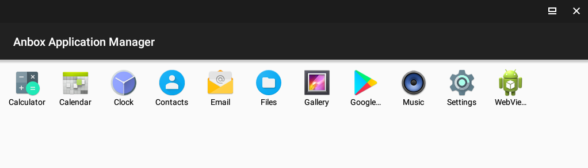

.. _anbox_scratch:

==========================
探索Anbox运行Andorid程序
==========================

说明
========

本文记录的是我折腾数天，在Arch Linux中通过Anbox运行Android程序的经历。这个过程非常曲折，所以我把最终经验总结重新整理成 :ref:`anbox` ，本文则依然有探索过程排查异常的经验，可以帮助我们了解Android和Anbox运行的原理以及问题排查的思路。

记录比较散乱，也许对你排查会有启发，所以汇总如下。

Anbox
-------

Anbox是开源兼容层，通过LXC容器构建Android运行环境，使得移动应用程序能偶运行在Linux环境。由于使用容器，采用原生Linux内核执行应用程序，所以非常轻量级并且保障了运行速度。

安装Anbox
===========

- 首先确保系统安装了Linux内核头文件::

   sudo pacman -S linux-headers

- 安装Anbox，如果镜像中不想包含Google apps和houdini，则用 anbox-image 替代 anbox-image-gapps::

   yay -S anbox-git anbox-image-gapps anbox-modules-dkms-git anbox-bridge

.. note::

   参考 `如何在 Anbox 上安装 Google Play 商店及启用 ARM 支持 <https://zhuanlan.zhihu.com/p/50994213>`_

   默认情况下，Anbox没有Google Play商店或者ARM应用支持。要安装应用，你必须下载每个应用的 APK 并使用 adb 手动安装。此外，默认情况下不能使用 Anbox 安装 ARM 应用或游戏 —— 尝试安装 ARM 应用会显示以下错误::

      Failed to install PACKAGE.NAME.apk: Failure [INSTALL_FAILED_NO_MATCHING_ABIS: Failed to extract native libraries, res=-113]

   通过 libhoudini 可以支持ARM应用。所以，建议上述安装Anbox时使用 ``anbox-image-gapps``

- 启动和激活服务::

   sudo systemctl start anbox-container-manager.service
   sudo systemctl enable anbox-container-manager.service

- 如果没有重启主机，则使用以下命令激活DKMS模块::

   sudo modprobe ashmem_linux
   sudo modprobe binder_linux

此时检查设备::

   ls -1 /dev/{ashmem,binder}

应该看到如下::

   /dev/ashmem
   /dev/binder

使用Anbox准备
==============

- 在执行 ``anbox`` 之前，需要先执行 ``anbox-bridge`` 来激活网络，此时使用 ``brctl show`` 可以看到::

   bridge name  bridge id               STP enabled     interfaces
   anbox0               8000.1edb3f6031c8       no

- 安装 ``adb`` 工具(用于给虚拟机内部安装应用程序)::

   pacman -S android-tools

编译报错处理
=================

- 编译报错::

   /home/huatai/.cache/yay/anbox-git/src/anbox/src/anbox/logger.cpp:20: error: "BOOST_LOG_DYN_LINK" redefined [-Werror]
      20 | #define BOOST_LOG_DYN_LINK

 这个报错解决方法见 https://bbs.archlinux.org/viewtopic.php?id=249747 ，其中有关patch的方法参考 :ref:`archlinux_aur` 中补丁方法。

运行报错处理
================

- 先在菜单点击 ``anbox-bridge`` 启动网桥

- 然后在菜单启动 ``anbox``

但是我遇到界面停留在 ``starting...`` ，并且执行 ``adb devices`` 显示并没有启动模拟设备。

使用命令行调试::

   export ANBOX_LOG_LEVEL=debug
   anbox session-manager --gles-driver=translator

显示::

   [ 2019-10-08 14:25:21] [Renderer.cpp:168@initialize] Using a surfaceless EGL context
   [ 2019-10-08 14:25:21] [Renderer.cpp:251@initialize] Successfully initialized EGL
   [ 2019-10-08 14:25:21] [service.cpp:41@Service] Successfully acquired DBus service name
   [ 2019-10-08 14:25:21] [client.cpp:49@start] Failed to start container: Failed to start container: Failed to start container
   [ 2019-10-08 14:25:21] [session_manager.cpp:148@operator()] Lost connection to container manager, terminating.
   [ 2019-10-08 14:25:21] [daemon.cpp:61@Run] Container is not running
   Stack trace (most recent call last) in thread 9740:

anbox的container日志位于 ``/var/lib/anbox/logs/container.log`` 可以看到以下报错::

   ...
   lxc 20191009031012.389 TRACE    cgfsng - cgroups/cgfsng.c:cg_hybrid_init:2562 - No controllers are enabled for delegation in the unified hierarchy
   lxc 20191009031012.415 TRACE    cgfsng - cgroups/cgfsng.c:cg_hybrid_init:2589 - Writable cgroup hierarchies:
   ...
   lxc 20191009031012.458 TRACE    cgroup - cgroups/cgroup.c:cgroup_init:61 - Initialized cgroup driver cgfsng
   lxc 20191009031012.459 TRACE    cgroup - cgroups/cgroup.c:cgroup_init:66 - Running with hybrid cgroup layout
   lxc 20191009031012.459 TRACE    start - start.c:lxc_init:923 - Initialized cgroup driver
   lxc 20191009031012.460 TRACE    start - start.c:lxc_init:930 - Initialized LSM
   lxc 20191009031012.461 INFO     start - start.c:lxc_init:932 - Container "default" is initialized
   lxc 20191009031012.516 DEBUG    cgfsng - cgroups/cgfsng.c:cg_legacy_filter_and_set_cpus:499 - No isolated or offline cpus present in cpuset
   lxc 20191009031012.568 INFO     cgfsng - cgroups/cgfsng.c:cgfsng_monitor_create:1405 - The monitor process uses "lxc.monitor/default" as cgroup
   lxc 20191009031012.587 ERROR    cgfsng - cgroups/cgfsng.c:__do_cgroup_enter:1500 - No space left on device - Failed to enter cgroup "/sys/fs/cgroup/cpuset//lxc.monitor/default/cgroup.procs"
   lxc 20191009031012.589 ERROR    start - start.c:__lxc_start:2009 - Failed to enter monitor cgroup
   lxc 20191009031012.596 TRACE    start - start.c:lxc_serve_state_socket_pair:543 - Sent container state "STOPPING" to 13
   lxc 20191009031012.598 TRACE    start - start.c:lxc_serve_state_clients:474 - Set container state to STOPPING
   lxc 20191009031012.600 TRACE    start - start.c:lxc_serve_state_clients:477 - No state clients registered
   lxc 20191009031012.600 DEBUG    lxccontainer - lxccontainer.c:wait_on_daemonized_start:861 - First child 1862 exited
   lxc 20191009031012.604 ERROR    lxccontainer - lxccontainer.c:wait_on_daemonized_start:872 - Received container state "STOPPING" instead of "RUNNING"
   lxc 20191009031012.694 DEBUG    cgfsng - cgroups/cgfsng.c:cg_legacy_filter_and_set_cpus:499 - No isolated or offline cpus present in cpuset
   lxc 20191009031012.706 WARN     cgfsng - cgroups/cgfsng.c:cgfsng_monitor_destroy:1180 - No space left on device - Failed to move monitor 1863 to "/sys/fs/cgroup/cpuset//lxc.pivot/cgroup.procs"
   lxc 20191009031012.868 TRACE    start - start.c:lxc_fini:1043 - Closed command socket
   lxc 20191009031012.873 TRACE    start - start.c:lxc_fini:1054 - Set container state to "STOPPED"
   lxc 20191009031012.567 TRACE    commands - commands.c:lxc_cmd:302 - Connection refused - Command "get_state" failed to connect command socket

检查启动以后建立的 ``/sys/fs/cgroup/cpuset/lxc.monitor/`` 和子目录 ``lxc.monitor`` 的所有proc文件内容都是空的，例如 ``/sys/fs/cgroup/cpuset/lxc.monitor/cpuset.cpus`` 和 ``/sys/fs/cgroup/cpuset/lxc.monitor/default/cpuset.cpus`` ，发现目录下所有的设置值都是空的。参考 `Cgroup - no space left on device <https://serverfault.com/questions/579555/cgroup-no-space-left-on-device>`_ ，实际上这些proc文件需要有初始值，否则就会出现 ``no space left on device`` 。

为何创建的cgroup配置没有默认继承上一级cgroup配置？

参考 `cgfsng - cgroups/cgfsng.c:__do_cgroup_enter:1500 - No space left on device - Failed to enter cgroup "/sys/fs/cgroup/cpuset//lxc.monitor/test/cgroup.procs" #6257 <https://github.com/lxc/lxd/issues/6257>`_ ，child cgroup继承parent的开关参数在 ``/sys/fs/cgroup/cpuset/cgroup.clone_children`` ，检查arch linux的默认配置，这个参数值是 ``0`` ，也就是没有继承::

   $ cat /sys/fs/cgroup/cpuset/cgroup.clone_children
   0

解决方法是在启动anbox之前，先执行::

   echo 1 | sudo tee /sys/fs/cgroup/cpuset/cgroup.clone_children

这样所有创建的cgroup子项默认继承上一级配置，就不会出现空值，也就不会出现 ``No space left on device`` ，再检查 ``/var/lib/anbox/logs/container.log`` 就可以看到日志不再出现ERROR。

启动anbox之后，在控制台使用 ``adb devices`` 检查可以看到系统运行了一个模拟器::

   List of devices attached
   emulator-5558        device
   
但是现在的anbox也只是显示 ``starting...`` 然后退出。不过，此时可以看到，原先始终没有输出的 ``/var/lib/anbox/logs/console.log`` 现在有大量内容输出，可以看到报错信息了::

   10-09 04:03:03.996     9     9 W         : debuggerd: resuming target 8694
   10-09 04:03:04.325    26    26 I lowmemorykiller: ActivityManager disconnected
   10-09 04:03:04.325    26    26 I lowmemorykiller: Closing Activity Manager data connection
   10-09 04:03:04.337    34    34 E         : eof
   10-09 04:03:04.338    34    34 E         : failed to read size
   10-09 04:03:04.338    34    34 I         : closing connection
   10-09 04:03:04.338    27    27 I ServiceManager: service 'batterystats' died
   10-09 04:03:04.338    27    27 I ServiceManager: service 'appops' died
   ...

看来是分配内存过小了。

.. note::

   参考 `Android和Linux关系 <https://blog.csdn.net/caohang103215/article/details/79493430>`_ :

   低内存管理(Low Memory Killer) -

      Android中低内存管理和Linux标准OOM(Out of Memory)相比，机制更加灵活，可以根据需要杀死进程类释放需要的内存。Low Memory Killer代码非常简单，里面关键函数lowmem_shrinker()，作为一个模块初始化调用register_shrinke注册一个low_shrinker()，会被vm在内存紧张时候调用。lowmem_shrinker完成具体操作，简单寻找一个最合适进程杀死，从而释放它的占用内存。drivers/staging/android/lowmemorykiller.c

由于后台不断重启模拟器android系统，所以console.log会不断输出日志。所以采用如下命令停止::

   systemctl --user stop anbox-session-manager.service
   systemctl stop anbox-container-manager.service

此时 ``adb devices`` 显示模拟器停止了。

`anbox splash screen disappears #814 <https://github.com/anbox/anbox/issues/814>`_ 提示修改 ``/usr/lib/systemd/user/anbox-session-manager.service`` ::

   ExecStart=/usr/bin/anbox session-manager --gles-driver=host

.. note::

   参考 `Anbox Does Not Running On Arch Linux #171  <https://github.com/anbox/anbox/issues/171>`_ 这里 ``--gles-driver`` 是允许你修改Anbox使用从物理主机获取libGL.so或者libGLES.so。如果是 ``--gles-driver=translator`` 就选择 libGL.so ，这样Anbox就会使用自己的 GL-to-GLES 转换来提供必要的GLES功能给 Android。
   
   另外，这个 `Anbox Does Not Running On Arch Linux #171  <https://github.com/anbox/anbox/issues/171>`_ 也提供一条线索 `How to install on archlinux or manjaro pls help me?? #305 <https://github.com/anbox/anbox/issues/305#issuecomment-306465578>`_ 就是我这里采用的方法。同样也存在应用程序不刷新窗口问题（只有resize才刷新），在 `app does not refresh/update #437 <https://github.com/anbox/anbox/issues/437>`_ 讨论过这个问题，是由于系统采用了较新的mesa库导致的，降级mesa库实在太麻烦了。所以还是推荐采用snap来安装Anbox

启动方式::

   sudo systemctl start systemd-resolved.service
   sudo systemctl start systemd-networkd.service
   sudo systemctl start anbox-container-manager.service

   systemctl --user start anbox-session-manager.service

最后再启动Anbox应用。果然，这个方法是正确的，现在可以完整的Android模拟器了：

不过，无法接受鼠标操作 - 实际我发现是Anbox的应用程序不会刷新图形，只有窗口缩放时候才刷新一次。因为我发现Clock一直不更新时间显示，还以为程序是死掉的，实际不是，缩放一下窗口就看到时间是正确的，只是不会刷新窗口内容。这可能就是无法响应鼠标的原因。

另外，程序启动后，后台console.log日志显示无法解析主机名::

   Unable to resolve host "android.googleapis.com": No address associated with hostname

不过，通过 ``ip addr`` 可以看到物理主机的虚拟网卡IP地址是 192.168.250.1 ，尝试 ``ping -b 192.168.250.255`` 然后检查 ``arp -a`` 可以看到这个 anbox0 网络中有另外一个地址 192.168.250.2 ，是Anbox虚拟机的IP地址。 - 请参考 `Anbox Network Configuration <https://docs.anbox.io/userguide/advanced/network_configuration.html>`_

关闭窗口，尝试命令行运行::

   ANBOX_LOG_LEVEL=debug
   anbox launch --package=org.anbox.appmgr --component=org.anbox.appmgr.AppViewActivity

完整设置
=============

为了能够今后自动就绪环境，设置系统服务自动启动::

   sudo systemctl enable systemd-resolved.service
   sudo systemctl enable systemd-networkd.service
   sudo systemctl enable anbox-container-manager.service
   
准备一个个人用户脚本 anbox-setup.sh ::

   echo 1 | sudo tee /sys/fs/cgroup/cpuset/cgroup.clone_children
   anbox-bridge
   systemctl --user start anbox-session-manager.service
   
然后就可以运行::

   anbox launch --package=org.anbox.appmgr --component=org.anbox.appmgr.AppViewActivity
   
或者从菜单选择运行anbox

改为snap来安装Anbox
=====================

如上所述，在Arch中确实很难解决运行Anbox问题，所以回退到采用snap来保障运行环境。

- 停止服务::

   systemctl --user stop anbox-session-manager.service
   sudo systemctl stop anbox-container-manager.service

- 卸载安装包，不过保留了anbox-dkms-git ::

   yay -Rns anbox-git anbox-image-gapps anbox-bridge

- 安装snapd::

   yay -S snapd

.. note::

   ``snapd`` 安装了一个 ``/etc/profile.d/snapd.sh`` 来输出snapd包和桌面的安装路径。需要重启一次系统来使之生效。

.. note::

   从2.36开始， ``snapd`` 需要激活激活 AppArmr 来支持Arch Linux。如果没有激活AppArmor，则所有snaps都运行在 ``devel`` 模式，意味着它们运行在相同的不受限制访问系统，类似Arch Linux仓库安装的应用。

   要使用AppArmor::

      systemctl enable --now apparmor.service
      systemctl enable --now snapd.apparmor.service

- 激活snapd::

   sudo systemctl enable --now snapd.socket  

为了激活经典snap，执行以下命令创建链接::

   sudo ln -s /var/lib/snapd/snap /snap

- 测试

先安装一个简单的 hello-world snap::

   sudo snap install hello-world

这里报错::

   error: too early for operation, device not yet seeded or device model not acknowledged

需要等一会等环境就绪再重新执行

需要将 ``/var/lib/snapd/snap/bin`` 添加到PATH环境(或者如前所述，先重启一次系统)

然后测试::

    hello-world

- (可选)成功以后，通过snap安装snap-store应用商店::

    sudo snap install snap-store

.. note::

   通过snap-store可以安装很多重量级软件，具有独立的容器运行环境，不影响系统。

- 命令行安装anbox(没有位于正式的snap-store中)::

   snap install --devmode --beta anbox

注意， ``--devmode`` 安装的snap不会自动更新，需要使用胰腺癌命令更新::

   snap refresh --beta --devmode anbox

如果beta通道的anbox还不能正常工作，则可以尝试edge通道

卸载方法如下::

   snap remove anbox

使用snap案例
==============
  
- 查询Ubuntu Store::

   snap find <searchterm>

- 安装snap::

   sudo snap install <snapname>

安装将下载snap到 ``/var/lib/snapd/snaps`` 并挂载成 ``/var/lib/snapd/snap/snapname`` 来使之对系统可用。并且将创建每个snap的挂载点，并将它们加入到 ``/etc/systemd/system/multi-user.target.wants/`` 软链接，以便系统嗯启动时素有snap可用。

- 检查已经安装的snap::

   snap list

可以看到::

   Name         Version    Rev   Tracking  Publisher   Notes
   anbox        4-e1ecd04  158   beta      morphis     devmode
   core         16-2.41    7713  stable    canonical✓  core
   hello-world  6.4        29    stable    canonical✓  -

- 更新snap::

   snap refresh

- 检查最新的刷新时间::

   snap refresh --time

- 设置刷新时间，例如每天2次::

   snap set core refresh.timer=0:00-24:00/2

- 删除snap::

   snap remove snapname

net::ERR_NAME_NOT_RESOLVED
---------------------------

使用snap来运行anbox，确实非常容易解决之前直接部署在arch linux主机模式无法刷新和相应键盘鼠标的问题。但是，使用webview浏览器就发现，实际上地址解析存在问题：

.. figure:: ../_static/android/startup/anbox_dns_error.png
   :scale: 75

``net::ERR_NAME_NOT_RESOLVED`` 报错表明Android系统无法解析DNS。

在 `如何在 Anbox 上安装 Google Play 商店及启用 ARM 支持 <https://zhuanlan.zhihu.com/p/50994213>`_ 提到了 `anbox需要主机安装DNSmasq <https://github.com/anbox/anbox/issues/118#issuecomment-295270113>`_ ，应该就是提供IP地址分配，以及分配DNS解析。

- 安装dnsmasq::

   sudo pacman -S dnsmasq

- 修改 ``/etc/dnsmasq.conf`` ::

   interface=anbox0
   bind-interfaces
   dhcp-range=192.168.250.50,192.168.250.150,255.255.255.0,12h

.. note::

   dnsmasq 默认就是设置default gw指向自身，以及dns也指向自身

不过，我还是没有解决这个问题。并且，我发现 anbox 项目实际上已经包含了 `Internet not working in Anbox on Ubuntu 18.04 <https://superuser.com/questions/1395384/internet-not-working-in-anbox-on-ubuntu-18-04>`_ 介绍的 `anbox-bridge.sh <https://github.com/anbox/anbox/blob/master/scripts/anbox-bridge.sh>`_ 脚本。

- 重启Anbox::

   sudo systemctl restart snap.anbox.container-manager.service

- 然后重启anbox网络::

   sudo /snap/anbox/current/bin/anbox-bridge.sh restart

但是我发现问题并没有解决。

进一步排查
~~~~~~~~~~~

- 执行 ``adb shell`` 命令可以登陆到Android虚拟机内部

``ip addr`` 可以看到Android虚拟机的IP地址是 ``192.168.250.2`` ，对应的网关应该是host主机上的 ``192.168.250.1`` ，但是，在虚拟机内部检查路由::

   netstat -rn

显示::

   Destination     Gateway         Genmask         Flags   MSS Window  irtt Iface
   192.168.250.0   0.0.0.0         255.255.255.0   U         0 0          0 eth0

这表明虚拟机没有默认路由指向外网。

参考 `anbox Networker Configuration <https://docs.anbox.io/userguide/advanced/network_configuration.html>`_ 结合 ` DNS Problem - I do have connection on anbox but it is not resolving names #954 <https://github.com/anbox/anbox/issues/954>`_ ::

   # 以下两个默认正确，不需要重复设置
   # snap set anbox bridge.address=192.168.250.1
   # snap set anbox container.network.address=192.168.250.2

   # 以下设置网络默认路由
   snap set anbox container.network.gateway=192.168.250.1

   # 检查物理主机当前使用的DNS
   nmcli dev show | grep DNS

   #根据上述输出的DNS记录 
   #设置anbox的DNS
   snap set anbox container.network.dns=192.168.1.1

   # 然后重启，注意不能使用systemctl重启 snap.anbox.container-manager.service (会清空配制)，而是
   sudo killall -9 anbox

   # 此时检查服务会看到这些配制都在服务参数中:
   ps aux | grep anbox
   # 显示:
   # /snap/anbox/158/usr/bin/anbox container-manager --data-path=/var/snap/anbox/common/ --android-image=/snap/anbox/158/android.img --daemon --use-rootfs-overlay --container-network-gateway=192.168.250.1 --container-network-dns-servers=192.168.1.1

   # 现在可以启动虚拟机
   snap run anbox.appmgr

不过，奇怪的是， ``adb shell`` 进入anbox虚拟机，依然没有看到正确的配制路由和DNS配制。

参考 ` The anbox container can not connect to the network #443 <https://github.com/anbox/anbox/issues/443>`_ 使用以下命令可以手工解决网络连接问题::

   adb shell
   su
   ip route add default dev eth0 via 192.168.250.1
   ip rule add pref 32766 table main
   ip rule add pref 32767 table local

然后再 ping 外部IP地址，就会发现虚拟机已经网络就绪了。

.. note::

   实践发现，实际上 `anbox Networker Configuration <https://docs.anbox.io/userguide/advanced/network_configuration.html>`_ 是有效的，只不过我发现还是需要重启一次物理主机，重启以后anbox服务启动就具备了配制参数，并且新启动的anbox虚拟机的网络就是按照传递配制设置的IP路由。

   不过，遇到的DNS解析还是有问题，看起来不是配制问题，有可能是物理主机转发IP masquerade问题。

但此时使用浏览器 WebView 访问网站报错依旧，此时问题原因和DNS解析相关。DNS解析取决于 ``resolv.conf`` ，参考 `How to set DNS Server on Android Phone <https://butterflydroid.wordpress.com/2011/10/19/how-to-set-dns-server-on-android-phone/>`_ ，可以看到Android的DNS配制位于 ``/system/etc/resolv.conf`` (系统的 ``/etc`` 是软链接到 ``/system/etc`` ，不过这个虚拟机中没有配制。

注意， ``/`` 文件系统挂载是只读的::

   Filesystem            Size  Used Avail Use% Mounted on
   overlay                47G   28G   16G  64% /

参考 `Root permission for apps #118 <https://github.com/anbox/anbox/issues/118>`_ 的思路，所有的overlay可以从 anbox 进程的配制参数 ``--data-path=/var/snap/anbox/common/`` ，即 overlay 是位于 ``rootfs-overlay/`` 子目录。对应anbox虚拟机内部的 ``/system/etc`` 目录就是host物理主机的 ``/var/snap/anbox/common/rootfs-overlay/system/etc`` ，只需要将 ``resolv.conf`` 配制在这个目录下，然后重启anbox就可以具有配制。

.. note::

   详细磁盘文件说明见 `Android rootfs overlay <https://docs.anbox.io/userguide/advanced/rootfs_overlay.html>`_ 

   Android的DNS解析似乎不是使用 /etc/resolv.conf

比较奇怪，在虚拟机内部可以ping外网，但是DNS解析和直接http的IP地址访问显示不能访问目标地址。在WebView中显示报错::

   net:ERR_ADDRESS_UNREACHABLE

检查Host物理机上 ``iptables -t nat -L`` 可以看到anbox-bridge已经添加了一个NAT::

   MASQUERADE  all  --  192.168.250.0/24    !192.168.250.0/24     /* managed by anbox-bridge */

`The anbox container can not connect to the network <https://www.bountysource.com/issues/48879647-the-anbox-container-can-not-connect-to-the-network>`_ 有一个调试的建议

`Internet Connection Sharing on CentOS 7 <https://www.rudraraj.net/internet-connection-sharing-ics-on-centos-7/>`_ 提示是由于网段原因导致防火墙阻碍。我想起来anbox是在设置过firewalld之后构建的，可能处于错误的zone被默认屏蔽了。

- 检查zone::

   firewall-cmd --get-active-zones

显示输出::

   libvirt
     interfaces: virbr0
   public
     interfaces: br0 wlp3s0

并没有包含anbox0接口。

- 将接口 ``anbox0`` 加入到内部zone::

   firewall-cmd --zone=internal --change-interface=anbox0

然后检查::

   firewall-cmd --get-active-zones

输出显示::

   internal
     interfaces: anbox0
   libvirt
     interfaces: virbr0
   public
     interfaces: br0 wlp3s0

此时anbox的浏览器还不能访问外部。

- 检查public接口，就会发现没有启用masquerade - ``masquerade: no`` ，(奇怪，为何libvirt网络能访问外部) ::

   firewall-cmd --zone=public --list-all

显示输出::

   public (active)
     target: default
     icmp-block-inversion: no
     interfaces: br0 wlp3s0
     sources: 
     services: dhcpv6-client rdp ssh
     ports: 24800/tcp
     protocols: 
     masquerade: no
     forward-ports: 
     source-ports: 
     icmp-blocks: 
     rich rules:

- 在public区域添加masquerade::

   firewall-cmd --zone=public --add-masquerade

That's It...!!! We are done...!!!

现在可以访问外网了。

- 将配制保存成永久::

   firewall-cmd --permanent --zone=internal --change-interface=anbox0
   firewall-cmd --permanent --zone=public --add-masquerade

安装Google Play
-----------------

- 安装Google Play::

     wget https://raw.githubusercontent.com/geeks-r-us/anbox-playstore-installer/master/install-playstore.sh
     chmod +x install-playstore.sh
     sudo ./install-playstore.sh

这样就可以直接访问Google Play安装应用程序，就和Android手机没有什么差异了。

安装应用程序
===============

最好是从Google Play应用商店安装，不过有很多国内应用提供apk包，可以通过adb命令安装到虚拟机中::

   adb install app.apk

安装完成后，在 Anbox Application Manager可以看到安装的应用程序。

微信
-------

微信虽然能够安装，但是无法启动。参考 `Although I installed wechat,but it can't run #976 <https://github.com/anbox/anbox/issues/976>`_ ，有建议改成 `Anbox Software Rendering <https://docs.anbox.io/userguide/advanced/software_rendering.html>`_ 来解决这个问题::

   snap set anbox software-rendering.enable=true
   snap restart anbox.container-manager

上述操作会停止所有运行的Anbox进程，必须要重启anbox。

如果要关闭software rendering，则::

   snap set anbox software-rendering.enable=false
   snap restart anbox.container-manager

.. note::

   修改成software rendering没有解决微信运行问题。但是我发现snap的edge通道的anbox版本可以运行钉钉，比之前beta版本通道要好很多。所以目前还是推荐使用edge通道的软件包。

微信Linux版本
===============

微信有一个Linux版本，基于Qt开发，可以方便在linux下实现基本的沟通。通过snap可以安装::

   yay -S snapd snapd-xdg-open

然后安装::

   snap install --devmode --channel edge wechart

运行::

   wechat.electronic-wechat

.. note::

   微信Linux版本支持托盘，就像原生程序一般，非常流畅。基本上和微信Mac版本一样简洁。

   参考 `How to install electronic-wechat on Arch Linux <https://snapcraft.io/install/electronic-wechat/arch>`_

Rambox和Franz
===============

Rambox和 `Franz <https://github.com/meetfranz/franz>`_ 提供了将消息应用(WhatsApp, Facebook Messenger, Slack, WeChat, Telegram等)包装成单一应用，可以跨平台运行在Windows，Mac, Linux等平台。类似的还有 ``Fedi`` (基于Frank)， ``Station``, ``Utopia`` , ``Hamsket`` 。这些应用大多都是基于 electronic 的web应用包装，所以运行起来非常消耗内存。优点是只要消息应用的服务方提供WEB方式，都能够包装到应用中。详细的应用对比可以参考
`Rambox Alternatives <https://alternativeto.net/software/rambox/>`_

.. note::

   我现在的工作平台已经转到使用 :ref:`wayland` 的 :ref:`sway` 窗口管理器，上述基于electronic的WEB应用实现都依赖X11，所以我没有具体实践，仅作记录。

参考
=======

- `Arch Linux社区文档 - Anbox <https://wiki.archlinux.org/index.php/Anbox>`_
- `Running Android applications on Arch using anbox <https://forum.manjaro.org/t/running-android-applications-on-arch-using-anbox/53332>`_
- `Bliss ROMs <https://blissroms.com/>`_ 是一个将Android改造成原生运行的操作系统，可以在PC或者KVM虚拟机中运行，或许有些类似ChromeBook，但是可以运行丰富的Android程序，可以在以后尝试一下。此外，类似还有 Phoenix OS 。
