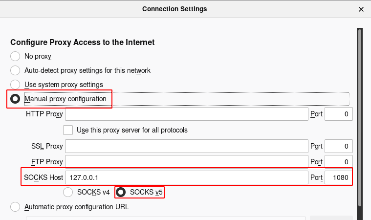
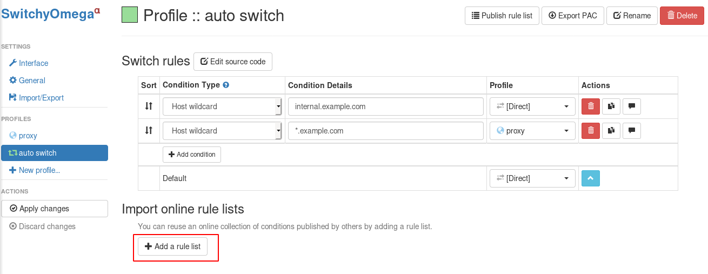

.. _ssh_tunnel_gfw_autoproxy:

====================================
结合SSH Tunnel和AutoProxy插件翻墙
====================================

为了能够安装部署Kubernetes，我们需要部署 :ref:`openconnect_vpn` 翻墙从Google软件仓库下载软件包。日常工作和生活，我们也需要能够在桌面操作系统上翻过GFW，自由地获取信息。不过，部署VPN服务器确实存在一定的技术门槛，也比较繁琐复杂，有没有比较简单易用的个人翻墙利器呢?

答案就是: SSH Tunnel - 你仅仅需要在海外租用一个最小规格的VPS虚拟机，能够ssh登陆这台服务器就可以实现自由访问因特网的目标。

.. note::

   翻越GFW，不仅仅是能够自由地获取技术类信息，也是一个自由的灵魂需要获取真实的历史、文化、思想，使得自己能够成为一个有独立思考能力人。

快速起步
==========

SSH Tunnel
-------------

假设你已经在云计算厂商这里租用了一台最小规格Linux虚拟机，并且已经能够ssh登陆新创建的虚拟机。

.. note::

   `AWS <https://aws.amazon.com/>`_ , `Google Cloud <https://cloud.google.com/>`_ , `Microsoft Azure <https://azure.microsoft.com/>`_ 甚至提供了一定期限的免费虚拟机，合理使用可以适当节约一些费用。

使用以下命令登陆虚拟机::

   ssh -C -D 1080 <SERVER_IP>

- 参数 ``-C`` 表示启用压缩，可以加快访问速度
- 参数 ``-D`` 则是关键，表示启用local "dynamic"应用级别的端口转发，本地会分配一个socket监听指定端口1080（实际上你可以指定任何端口，这里1080仅仅是举例）

接下来，你只需要在chrome或firefox浏览器中设置socks代理就可以自由访问因特网，方法如下：

Firefox Socks Proxy
----------------------

打开 FireFox 浏览器，打开 ``Preferences`` 设置选项，点击 "Network Settings" 栏的 ``Setting`` 按钮，设置网络代理，共需设置两个选项:

- "Manual proxy configuration" 设置为 "SOCKS Host" 是 ``127.0.0.1`` Port ``1080`` 。注意，SOCKS类型要选择 ``SOCKS v5``

- 勾选 ``Proxy DNS when using SOCKS v5`` - 这是因为在中国大陆，DNS污染使得你无法正确解析被屏蔽域名对应的IP地址，所以需要把DNS解析也通过SSH Tunnel转发到没有欺诈的DNS服务器进行查询

- 勾选 ``Enable DNS over HTTPS`` - 这是为了使用受信任的DNS服务器而不是本地的DNS服务商(国内电信运营商的DNS是污染的)。当然，如果你操作系统已经设置了采用Google的DNS 8.8.8.8并且已经勾选过 ``Proxy DNS when using SOCKS v5`` ，则这步可以省略。

.. figure:: ../_static/appendix/firefox_socks_proxy_dns.png
   :scale: 50

SwitchyOmega
--------------

SwitchyOmega是一个浏览器插件，用于自动切换代理。即部分被屏蔽的网站指定Proxy访问，其他则direct访问。这个插件有Chrome版本，也有firefox版本，设置方法相同。

这是一个非常有用的浏览器插件，可以极大提高上网效率，兼顾了跨越防火墙以及避免无谓的代理网速下降。

- 首先添加在线规则列表，这个规则列表是以前网友搜集的被屏蔽地址列表，虽然是几年前的地址列表，但是可以作为配置的起步基础：

地址从 https://raw.githubusercontent.com/gfwlist/gfwlist/master/gfwlist.txt 获取：

.. figure:: ../_static/appendix/switchy_omega_import_online_rule_setup.png
   :scale: 50

注意： ``Rule list rules`` 对应的动作要修改成 ``proxy`` ，因为我们添加的地址列表都是被屏蔽地址，需要启用代理。另外，案例的2条记录可选删除。

然后还要设置 ``proxy`` 这个profile，调整成自己实际的Proxy设置，别忘记最后还要 ``Apply changes``

.. figure:: ../_static/appendix/switchy_omega_import_online_rule_setup_proxy.png
   :scale: 50

- 如果在使用过程中，发现有页面资源不能加载，则点击 SigmaOmega 图标按钮，补充添加规则。

SSH Tunnel
===========

SSH Tunnel 原理请参考 `SSH TUNNEL <https://www.ssh.com/ssh/tunneling/>`_

.. figure:: ../_static/appendix/ssh_tunnel.png
   :scale: 50

参考
========

- `SSH TUNNEL <https://www.ssh.com/ssh/tunneling/>`_
- `SSH/OpenSSH/PortForwarding <https://help.ubuntu.com/community/SSH/OpenSSH/PortForwarding>`_
- `SwitchyOmega GFWList <https://github.com/FelisCatus/SwitchyOmega/wiki/GFWList>`_

