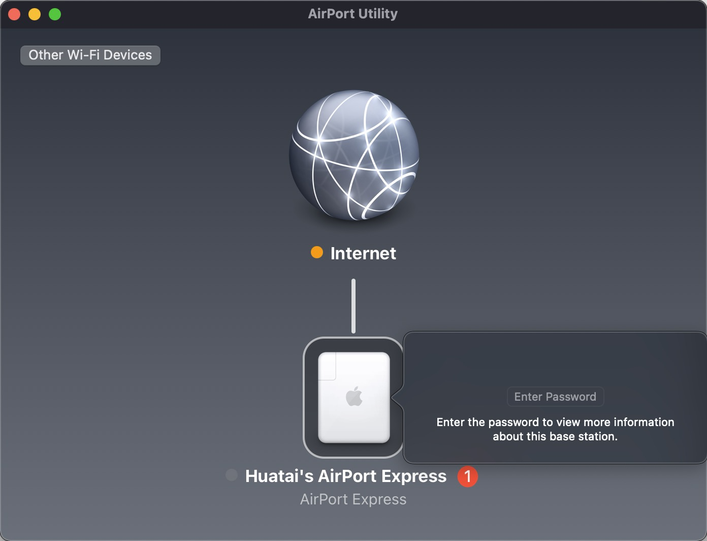
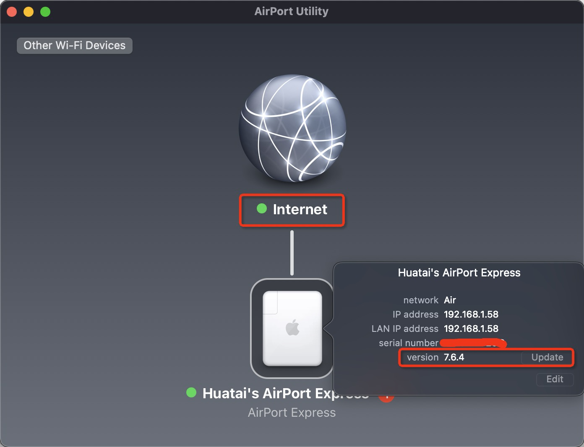
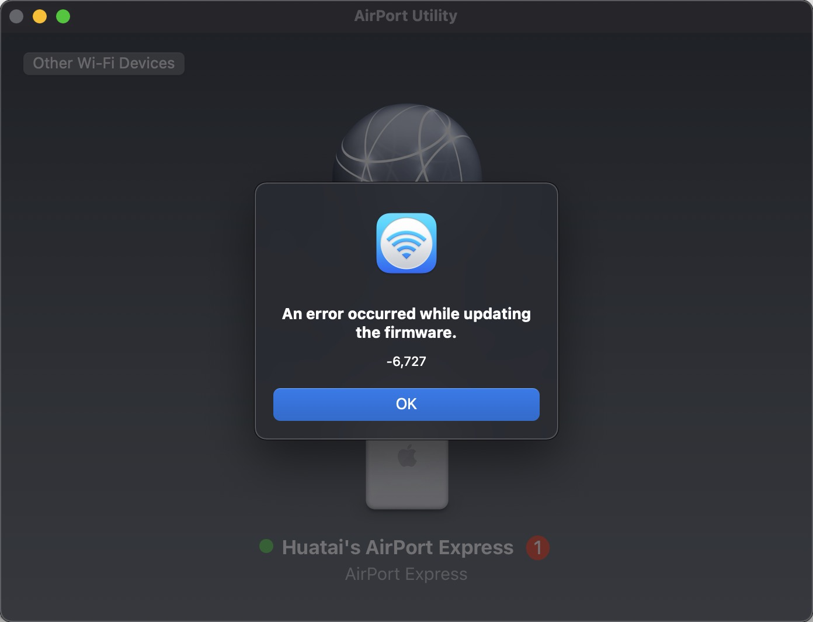

.. _airport_express:

====================
AirPort Express
====================

很多年前，当我刚开始实用苹果系列产品，我就曾经购买过一款现在已经停产的 ``AirPort Express`` 。当时对苹果产品非常着迷，出差的时候，想要能够在宾馆中实用无线(哪个时候很多宾馆只提供有线网络连接)，就订购了当时比较贵的 ``AirPort Express`` 。

现在，我再次拿出已经放在书架上很多年积灰的设备，想要再次让它 "焕发青春" 。

.. figure:: ../../_static/apple/airport/airport_express.png
   :scale: 50

网络连接
============

已经很久没有使用，当插上电源，橘黄色的指示灯开始闪烁。搜索 ``AirPort Utility`` 工具(是的，即使产品停产多年，现在最新的操作系统中依然内置了 ``AirPort Utility`` 配置工具，无需另外安装)，运行显示如下窗口:

这里需要注意， ``AirPort Express`` 是一个无线路由器的扩展，也就是说，它自身是需要把网线连接到一个无线路由器的有线网段，然后通过自己的无线来提供扩展功能。这在早期ADSL时代，是一个了不起的功能。

如果 ``AirPort Express`` 有线网络没有连接到宽带路由器(需要通过DHCP获得能够访问internet)，就会显示为上图的黄色指示灯闪烁。此时使用 ``AirPort Utility`` 设置看到的就是上图Internet连接上有一个黄色点状灯。

连接Internet
----------------

用一根网线连接宽带路由器，并连接到 ``AirPort`` 的有线网口上，再次重启 ``AirPort Express`` ，过一会启动完成，此时 Internet 连接就是绿色指示灯，表明设备已经正确获得DHCP地址，并且能够连接到Internet：

可以看到，设备当前 Firmware 版本是 ``7.6.4`` ，并且提示可以升级。所以点击版本号边上的 ``Update`` 按钮进行升级...

.. figure:: ../../_static/apple/airport/airport_setup_3.png
   :scale: 50

但是升级报错: ``An error occurred while updating the firmware. -6,727`` :

参考 `airport update error -6727 <https://discussions.apple.com/thread/3705182>`_ 用户提到升级 ``Airport Express`` 不能使用无线，所以把mac笔记本通过有线方式连接到 ``AirPort Express`` 相同的局域网络，然后再次通过 ``AirPort Utility`` 进行升级就可以成功。

升级以后Firmware版本是 ``7.8.1`` 

无线规格
===========

这款AirPort Express产品非常古老，大约是2008年产品，支持无线标准如下:

- 802.11n(802.11b/g compatible)
- 802.11n only (2.4GHz)
- 802.11n (802.11a compatible)
- 802.11n only (5GHz)

.. note::

   ``802.11n only (5GHz)`` 无线规格，如果使用全套Apple产品，可以看到Apple的设备都支持这个无线规格，性能优越

无线标准
----------

- 802.11b: Wi-Fi 1 ，工作在2.4GHz，是最古老的无线标准(1999年)，最高传输速度11Mbps
- 802.11a: Wi-Fi 2 ，工作在5GHz，传输带宽 54Mbps。较高的频率导致有效覆盖范围低于 802.11b ，并且较高的频率也导致难以穿墙或其他障碍
- 802.11g: Wi-Fi 3 ，工作在2.4GHz，但是提供了 54Mbps 带宽。由于频率采用2.4GHz所以覆盖范围较5GHz的802.11a要广，同时也具备了相同网络速度
- 802.11n: Wi-Fi 4 ，使用了多个无线信号和天线(也称为MIMO技术)，所以提供了高达600Mbps的带宽。802.11n也提供了比以前Wi-Fi标准更好的覆盖范围，原因是该标准提高了信号强度，并且向后兼容 802.11a/b/g 标准
- 802.11ac: Wi-Fi 5 ，使用双波段无线技术，同时支持连接2.4GHz和5GHz Wi-Fi设备，向后兼容 802.11a/b/g/n 并且在5GHz频率支持高达1300Mbps，在2.4GHz支持450Mbps。当前大多数无线路由器都采用这个标准
- 802.11ad: 2012年12月通过的高速无线标准，但是客户端设备必须在30英尺范围内
- 802.11ah: 2017年5月通过的无线标准，目标是低能耗并实现超过2.4GHz或5GHz网络工作范围，实现和蓝牙相竞争的低能耗
- 802.11aj: 也称为中国毫米波，是中国的802.11ad波段标准，目标是实现向后兼容802.11ad
- 802.11ax: Wi-Fi 6，2019年通过的替代802.11ac的新无线标准，Wi-Fi 6最高可达10Gbps，消耗较少电能并且在拥塞环境中较为可靠，且有更好安全性

选择
---------

为了能够实现较好的覆盖，我尝试采用 ``802.11n only (2.4GHz)`` ，可以比 ``802.11n only(5GHz)`` 更好穿墙，不过实际使用下来，还不理想，网络经常连接不畅。也测试了 ``802.11n(802.11b/g compatible)`` ，似乎穿透覆盖能力和 ``802.11n only (2.4GHz)`` 相差不大。总之，即使采用了上述两种相对覆盖较好的无线标准，依然不能实现稳定的穿墙通讯。

我考虑 :strike:`购买` :ref:`mikrotik` 设备(非常灵活且功能强大，但售价昂贵，暂时没有资金，所以后续考虑参考 mikrotik 的技术解决方案，自己hack linux来实现)

使用方案
============

要正确使用 AirPort Express 的关键条件:

- 局域网有一个DHCP服务器，能够提供 ``动态IP`` 给 AirPort Express
- DHCP提供的配置中包含: ``DNS`` 和 ``GATEWAY`` ，这个配置会被 AirPort Express 转发给连接的无线客户端
- DHCP提供 ``动态IP`` 会被 AirPort Express 转发给连接的无线客户端使用

总之，AirPort Express的无线客户端是通过 ``局域网DHCP服务器`` 获得配置，AirPort Express提供的是一个 ``透明转发`` 。 我发现这个架构非常适合我在 :ref:`priv_cloud_infra` 中提供的 :ref:`priv_dnsmasq_ics` 实现无线扩展，所以我实现了一个 :ref:`airport_express_with_dnsmasq_ics` 部署。

参考
========

- `设计AirPort网络-使用AirPort实用工具 <https://manuals.info.apple.com/MANUALS/0/MA349/zh_CN/Designing_AirPort_Networks_10.5-Windows_CH.pdf>`_
- `AirPort Express 设置指南 <https://manuals.info.apple.com/MANUALS/0/MA435/zh_CN/AirPort_Setup_Guide_Web_CH.pdf>`_
- `802.11 Standards Explained: 802.11ax, 802.11ac, 802.11b/g/n, 802.11a <https://www.lifewire.com/wireless-standards-802-11a-802-11b-g-n-and-802-11ac-816553>`_
