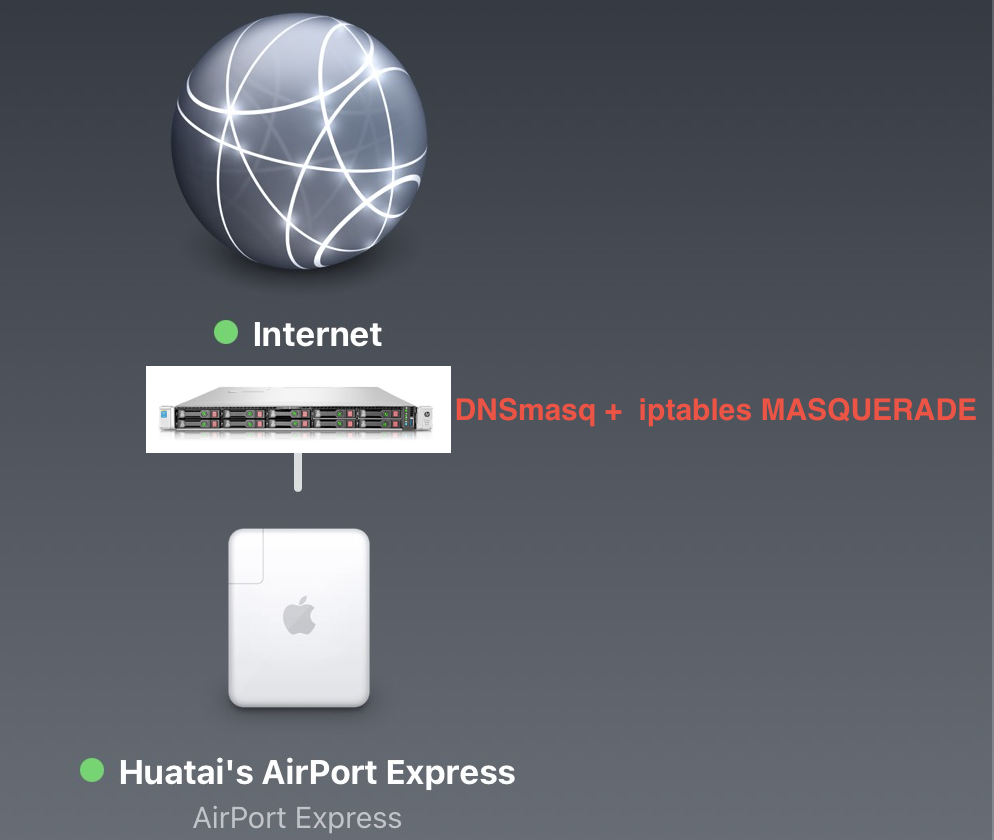

.. _airport_express_with_dnsmasq_ics:

=============================================================
结合DNSmasq+iptables使用AirPort Express实现无线访问因特网
=============================================================

AirPort Express通常在小型办公室或家庭网络中使用，只需要简单将 :ref:`airport_express` 连接到能够动态分配IP地址的局域网络，通过DHCP分配访问Internet的IP地址(类似 :ref:`iptables_ics` )就可以让AirPort Express通过无线扩展，允许连接AirPort Express的无线客户端访问Internet。

问题来了，我们是不是必须要买一个宽带路由器才能使用AirPort Express呢？

显然不是，只需要有一个DHCP( :ref:`dnsmasq` )提供对应的网络配置就可以

上图中，在 :ref:`hpe_dl360_gen9` 服务器上部署 :ref:`priv_cloud_infra` ，物理主机 ``zcloud`` 运行了 :ref:`priv_dnsmasq_ics` ，最初只是作为私有网络的DNS解析。不过 :ref:`dnsmasq` 可以同时提供 DHCP 和 TFTP 服务，特别适合局域网无盘工作站部署。这里的架构，就是采用 DNSmasq 的DHCP服务来提供IP配置:

DHCP配置
===========

在 :ref:`priv_dnsmasq_ics` 配置的DNS基础上，添加DHCP配置来完成进一步的 :ref:`deploy_dnsmasq` :

.. literalinclude:: ../../infra_service/dns/dnsmasq/deploy_dnsmasq/dnsmasq.conf
   :language: ini
   :emphasize-lines: 14-17
   :caption: dnsmasq添加DHCP配置

共享Internet连接
=================

完成上述DHCP的IP配置之后，所有连接到AirPod Express的无线客户端都会将 :ref:`hpe_dl360_gen9` 服务器上的网络接口IP ``192.168.6.200`` 作为默认网关，则该服务器需要提供 :ref:`iptables_ics` 以允许无线客户端:

.. literalinclude:: ../../real/private_cloud/priv_dnsmasq_ics/ics.sh
   :language: bash
   :caption: 共享Internet连接
