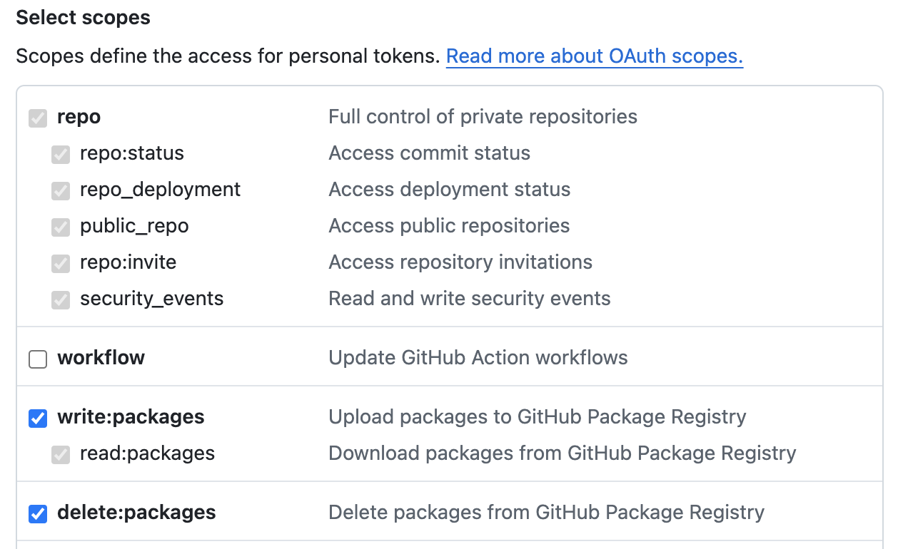

.. _darwin-containers_startup:

==============================
Darwin Containers快速起步
==============================

安装准备
===========

- 操作系统必须时 Catalina 或更新版本
- 关闭 `System Integrity Protection <https://developer.apple.com/documentation/security/disabling-and-enabling-system-integrity-protection>`_ ，因为SIP不允许 ``chroot`` :

System Integrity Protection (SIP) 时macOS的保护机制，拒绝非授权代码执行，系统只授权从App Store下载的应用运行，或者授权开发者认证的应用或者用户直接分发应用。默认不允许其他所有应用。

对于开发者，可能需要暂时关闭SIP以便安装和测试自己的代码。不过，在XCode中不需要关闭SIP来运行和调试apps，但可能需要关闭SIP才能安装系统扩展，例如DriveKit驱动。

关闭SIP
----------

- 重启计算机到 `Recovery mode <https://support.apple.com/en-us/HT201314>`_

  - 对于Apple Silicon主机，启动时按住电源开关不放就会提示 ``startup options``  ，选择 ``Options`` 
  - 对于Intel主机，启动时安装 ``Command (⌘) and R`` 进入 ``Recovery mode``

- 在Utilities菜单中启动 ``Terminal`` 应用

- 输入 ``csrutil disable`` 命令

- 重启主机

安装
=======

- 通过 :ref:`homebrew` 安装:

.. literalinclude:: darwin-containers_startup/install_darwin-containers
   :caption: 使用 :ref:`homebrew` 安装 ``darwin-containers``

- 在 ``~/.docker/config.json`` 添加如下配置激活 ``buildx`` 插件:

如果是apple silicon，则添加:

.. literalinclude:: darwin-containers_startup/config.json
   :caption: 在 ``~/.docker/config.json`` 激活 ``buildx`` 插件

如果是intel，则添加:

.. literalinclude:: darwin-containers_startup/config_intel.json
   :caption: 在 ``~/.docker/config.json`` 激活 ``buildx`` 插件

使用
========

授权GitHub Container Registry
-------------------------------

- 按照 `Authenticating to the Container registry <https://docs.github.com/en/packages/working-with-a-github-packages-registry/working-with-the-container-registry#authenticating-to-the-container-registry>`_ 配置GitHub Container Registry:

.. note::

   这里会使用一个GitHub的个人访问token，这个token时用来在命令行或API授权使用GitHub的:

   - 有两种token:

     - Fine-grained personal access tokens: 可以为每个token指定访问特定仓库，授权特定权限
     - Personal access tokens (classic): 部分服务API必须使用Classic token，例如这里的 Container registry

主要步骤是创建 ``Personal access tokens (classic)`` ，按照 `Creating a personal access token (classic) <https://docs.github.com/en/authentication/keeping-your-account-and-data-secure/managing-your-personal-access-tokens#creating-a-personal-access-token-classic>`_ 完成

  - 通过个人profile photo，点击 ``Settings >> Developer settings``
  - 在左方导航栏点击 ``Personal access tokens`` 下拉菜单，并选择点击 ``Generate new token`` 并点击 ``Generate new token (classic)``
  - 在命名上我输入 ``package-registry`` 表示这个token用于 ``GitHub Package Registry``
  - 在 ``Select scopes`` 部分勾选 ``write:packages`` (会自动依赖选择 ``repo`` 所有权限) 以及 ``delete:packages`` :

- 执行以下命令授权GitHub Container Registry:

.. literalinclude:: darwin-containers_startup/auth_github_container_registry
   :caption: 认证 GitHub Container Registry

和containerd一起使用
------------------------

.. note::

   如果是直接访问 :ref:`containerd` ，则只需要使用 ``ctr`` 命令，并且不需要启动 ``dockerd``

- 启动 ``containerd`` :

.. literalinclude:: darwin-containers_startup/start_containerd
   :caption: 通过 :ref:`homebrew` 启动 :ref:`containerd` 服务

- 下载基础镜像:

.. literalinclude:: darwin-containers_startup/pull_base_image
   :caption: 下载基础镜像

如果是非root用户执行上述命令，这里会出现一个访问sock权限不足报错:

.. literalinclude:: darwin-containers_startup/pull_base_image_error
   :caption: 因为 ``containerd.sock`` 访问权限不足报错

检查 ``/var/run/containerd/containerd.sock`` 可以看到这个sock是属于 ``wheel`` 组的，所以执行以下命令将自己加入到 ``wheel`` 组( :ref:`macos_user_account_cmd` ):

.. literalinclude:: darwin-containers_startup/groupadd_wheel
   :caption: 将自己 ``huatai`` 加入到用户组 ``wheel``

但是又遇到新报错，显示无法 anonymous token 下载镜像:

.. literalinclude:: darwin-containers_startup/pull_base_image_error_token
   :caption: 下载基础镜像报错显示token不正确

我忽然想到前面 ``授权GitHub Container Registry`` 按照GitHub官方手册执行是给 ``docker`` 添加了token，但是没有给 ``ctr`` 添加过token。怎么搞呢？

我执行了下面的 ``和Docker一起使用`` 看看能否解决认证问题(参考 `ctr does not read /etc/containerd/config.toml credential settings when pulling images from ghcr.io <https://github.com/containerd/containerd/discussions/6539>`_ 提到 ``ctr`` 不使用CRI API，所以不会读取配置文件，需要使用 ``crictl`` 。或者使用 ``ctr --user USER:PASS`` )

- 尝试使用 ``ctr`` 运行容器:

.. literalinclude:: darwin-containers_startup/ctr_run
   :caption: 尝试运行容器

和BuildKit一起使用
----------------------

在使用 ``BuildKit`` 之前，先要完成上述 ``和containerd一起使用`` 的步骤。

.. warning::

   我没有直接使用 ``BuildKit`` ，而是结合 :ref:`docker` 和 :ref:`containerd` 来使用，此时就不需要启动 ``BuildKit`` Daemon，直接使用习惯的 ``docker`` 命令来 ``build`` 就可以

和Docker一起使用
-------------------

首先完成上述 ``和containerd一起使用`` 的步骤，然后再开始本段 ``和Docker一起使用`` :

- 修订 ``/usr/local/etc/docker/daemon.json`` (Intel架构 :ref:`homebrew` ，如果是Apple Silicon则文件位置不同):

.. literalinclude:: darwin-containers_startup/daemon.json
   :caption: 修订 ``/usr/local/etc/docker/daemon.json`` 指定 ``runtime``
   :emphasize-lines: 3,6,7

这里的 ``runtime`` 配置要按照你的主机上安装 ``containerd-shim-rund-v1`` 位置调整，这里案例是我采用 :ref:`homebrew` 在Intel架构的MacbookPro上配置。

- 启动 ``dockerd`` :

.. literalinclude:: darwin-containers_startup/start_dockerd
   :caption: 通过 :ref:`homebrew` 启动 :ref:`docker` 服务

- 尝试运行测试容器:

.. literalinclude:: darwin-containers_startup/docker_run
   :caption: 尝试运行容器

遇到报错:

.. literalinclude:: darwin-containers_startup/docker_run_error
   :caption: 尝试运行容器报错

另外，我尝试用 ``docker image pull`` :

.. literalinclude:: darwin-containers_startup/docker_image_pull
   :caption: 执行 ``docker image pull`` 下载镜像

报错也同样是

.. literalinclude:: darwin-containers_startup/docker_image_pull_error
   :caption: 执行 ``docker image pull`` 下载镜像报错

debug问题
============

无法启动服务(权限)
--------------------

- 检查 ``/usr/local/log/containerd.log`` 有如下错误

.. literalinclude:: darwin-containers_startup/containerd.log
   :caption: 无法加载插件

我最初以为是无法创建目录 ``/var/lib/containerd/io.containerd.snapshotter.v1.blockfile/scratch`` ，就手工创建了这个目录。但是发现 ``containerd`` 进程依然无法在这个目录下创建文件。我这才发现，原来日志的属主是 ``huatai:admin`` ，也就是我自己的普通用户账号启动的进程。

我检查了 ``System Settings`` 中 ``Login Items & Extensions`` ，发现后台设置了 ``containerd`` 和 ``dockerd`` 启动，这个启动就是普通用户权限。所以我手工关闭掉，然后再次以 ``sudo`` 方式启动服务:

.. literalinclude:: darwin-containers_startup/sudo_start
   :caption: 使用 ``sudo`` 来启动 ``dockerd`` 和 ``containerd``

果然，这次解决了这些文件创建的问题，能够正常启动服务了

``manifest unknown``
------------------------

现在再次执行 ``docker image pull`` :

.. literalinclude:: darwin-containers_startup/docker_image_pull
   :caption: 执行 ``docker image pull`` 下载镜像

但是依然报错

.. literalinclude:: darwin-containers_startup/docker_image_pull_error
   :caption: 执行 ``docker image pull`` 下载镜像报错

不过，这次 ``docker.log`` 日志可以看到:

.. literalinclude:: darwin-containers_startup/docker_manifest_unknown.log
   :caption: 出现 ``Error response from daemon: manifest unknown`` 时后台日志

这个问题还是解决不了，感觉也可能时远端仓库无法下载，所以尝试 :ref:`darwin-jail` 中自己构建镜像

参考
========

- `GitHub: darwin-containers/homebrew-formula <https://github.com/darwin-containers/homebrew-formula#readme>`_
