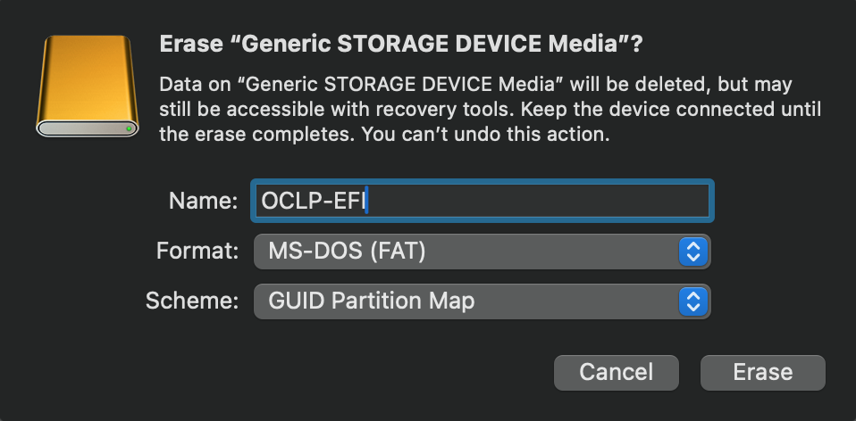
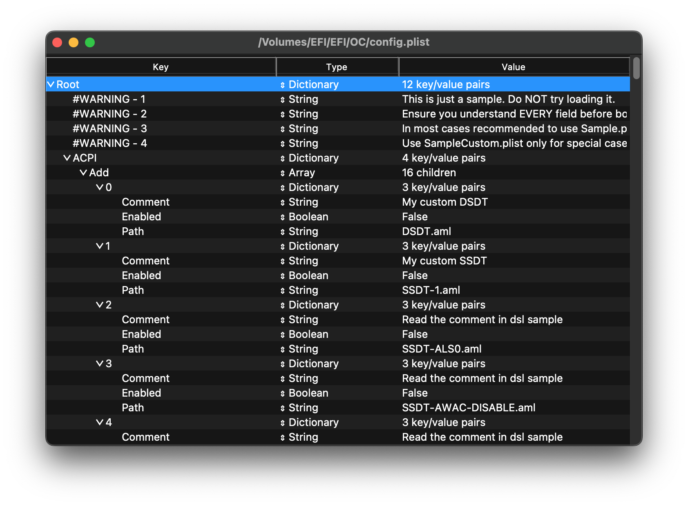
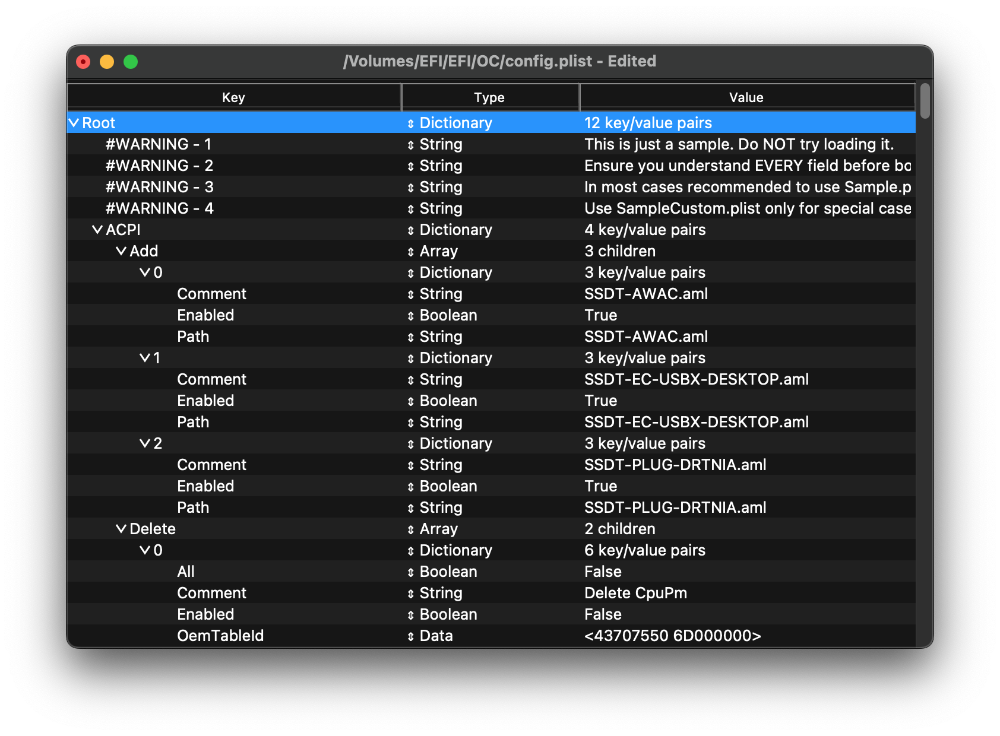
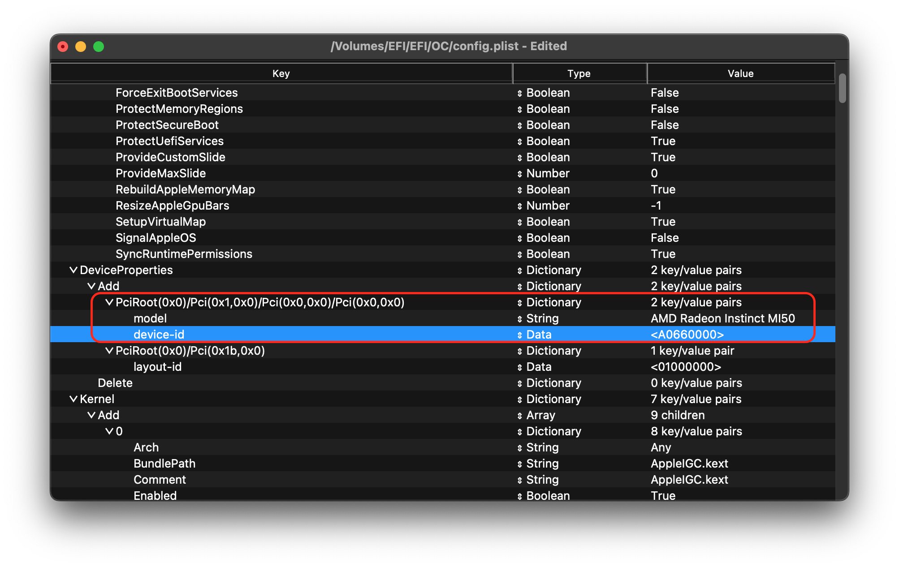
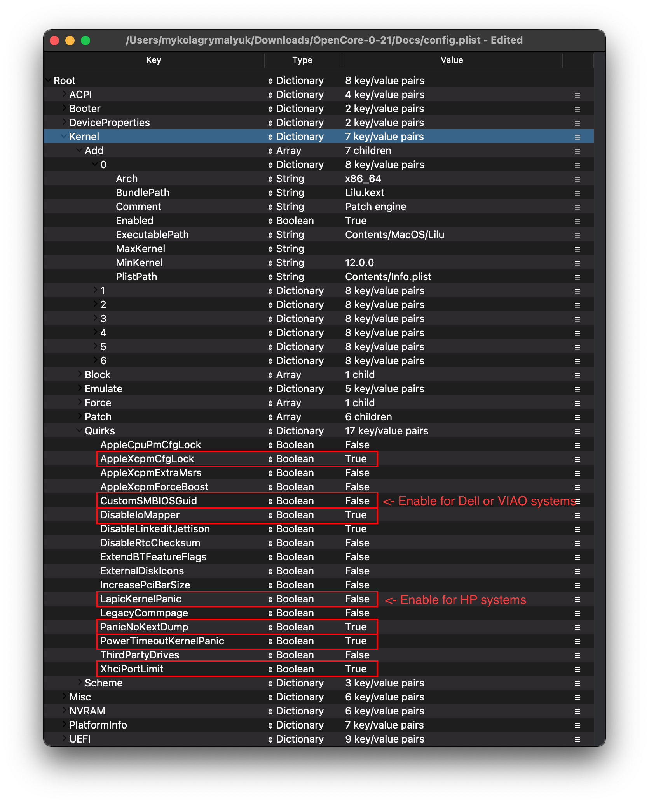
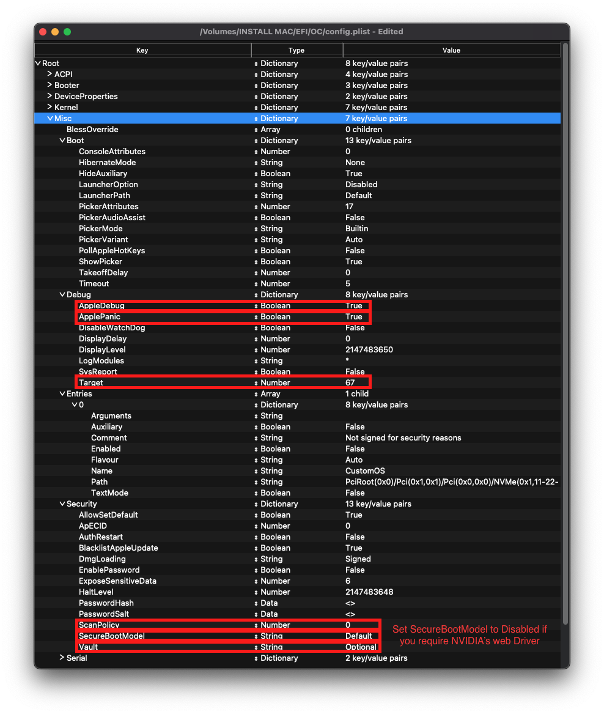

.. _c246_mi50_hackintosh:

===================================
Intel C246主板+AMD MI50运行黑苹果
===================================

我原本计划 :ref:`t5820_mi50_hackintosh` ，但是因为T5820硬件故障暂时没有修好，所以现在改为在我组装的 :ref:`nasse_c246` 台式机上安装 :ref:`amd_mi50` 来运行黑苹果。

准备工作
==========

已经通过 :ref:`amd_mi50_flash_vbios` 将没有显示输出的计算卡转换成真正的高性能显卡， 其次， :ref:`amd_mi50_shroud` 解决了显卡散热问题。

macOS的补丁改造
=================

当前我的 :ref:`mbp15_late_2013` 已经安装了 ``OCLP (OpenCore Legacy Patcher)`` ，并针对我的MacBook Pro老款硬件做了补丁
的引导，这和我将要迁移到的 C246 平台的黑苹果引导存在冲突。要实现无缝平滑迁移，需要执行改造。

.. note::

   本文采用了制作U盘引导进入系统，确保工作正常以后，再Unpatch删除掉原先OCLP打的针对 :ref:`mbp15_late_2013` 旧补丁，以确保安全(如果U盘启动失败还能重新回到MBP上使用)。

策略
-------------------------------------------

**不能使用 MBP 上的 EFI** 需要在 USB 闪存盘或 NVMe 的 EFI 分区中，放置一套针对 T5820 架构 **定制的 OpenCore EFI**

- **机型模版（SMBIOS）** : OpenCore 的 Target 机型 设置为 ``iMac19,1`` 或 ``iMacPro1,1`` (推荐，默认关闭CPU内部核显) ，这是因为 CPU (Xeon E-2274G) 属于 Intel 8/9 代 Coffee Lake 架构（4核8线程，带 UHD P630 核显）

- 核心 Kexts 驱动:

  - 主板 (C246 芯片组): 需要配置针对 Coffee Lake 芯片组的标准 Kexts（如 AWAC 补丁、USB 映射准备）
  - 网卡 (Intel I226-V 2.5G x4): 必须加载 AppleIGC.kext（针对 Intel I225-V/I226-V 2.5G 网卡原生驱动的开源 Kext），并配置 Boot-args 参数 e2000=0 以确保 2.5G 网卡正常工作。
  - 显卡 (AMD MI50 32GB / V420): 继承之前的配置，在 DeviceProperties 中将该 PCIe 槽位的 device-id 伪装为  ``AF660000`` (Radeon VII)，并添加 boot-args ``agdpmod=pikera`` 。

EFI 重构
==============

- 准备一个 8GB 以上的 U 盘，格式化为 FAT32

   在macOS中格式化U盘，选择FAT格式对于大于2GB的磁盘对应的就是标准低FAT32格式; Scheme（方案）: 选择 ``GUID Partition Map`` （GUID 分区图）

选择 ``GUID Partition Map + MS-DOS (FAT)`` 后，“磁盘工具”会 **自动在 U 盘的最前端创建一个隐藏的 FAT32 格式的 EFI 分区**

.. note::

   注意在格式化 ``GUID Partition Map`` Scheme之后，macOS在U盘上创建了2个分区:

   - 分区1是一个 ``EFI System`` 类型分区，但是这个分区是隐含分区，在macOS上默认不挂载(看不到)
   - 分区2是一个 ``Microsoft basic data`` 类型分区，这个分区在macOS上会自动挂载为 ``/Volumes/EFI`` 目录

需要注意的是，上述 ``GUID Partition Map + MS-DOS (FAT)`` 分区中，第一个隐含分区 ``EFI System`` 类型分区才是我们需要复制 ``OpenCorePkg`` 的分区。由于这是一个隐藏的 ``EFI`` 系统分区(ESP)，macOS不会自动挂载。需要通过以下命令挂载:

首先检查磁盘:

.. literalinclude:: c246_mi50_hackintosh/diskutil
   :caption: 检查磁盘

输出显示

.. literalinclude:: c246_mi50_hackintosh/diskutil_output
   :caption: 检查磁盘可以看到disk4是外置磁盘，分区1就是 ``EFI`` 类型
   :emphasize-lines: 4

挂载隐藏目录:

.. literalinclude:: c246_mi50_hackintosh/mount_efi
   :caption: 挂载EFI隐藏目录

- 在 U 盘的 EFI 分区中，构建全新的 C246 + Xeon E-2274G 专用 OpenCore 引导（不要直接用 MBP 上的 EFI）

从 `OpenCore官方原版 OpenCorePkg <https://github.com/acidanthera/opencorepkg>`_ 下载Release版本，并解压缩

.. literalinclude:: c246_mi50_hackintosh/opencorepkg
   :caption: 解压缩OpenCorePkg，获取其中的 ``X64/EFI`` 目录

此时，在U盘的 ``EFI`` 目录下就有 ``BOOT`` 和 ``OC`` 文件夹

OpenCore 基础文件
============================

Firmware驱动(统一需要)
-------------------------

Firmware驱动是OpenCore在UEFI环境中的必须驱动，主要用于启动主机。不论OpenCore的补丁能力还是在OpenCore picker中显示不同类型的驱动(例如HFS驱动)都依赖这个Firmware驱动。

- 清理 ``EFI/OC/Drivers/`` 目录下不需要的驱动，仅保留 ``OpenRuntime.efi`` ，其余 ``.efi`` 文件全部删除

官方 ``OpenCorePkg`` 发布包的 ``Drivers`` 目录是一个“全家桶”资源库，里面包含了针对不同硬件场景（如 32 位老电脑、旧版 Linux 挂载、扩展文件系统等）的驱动。这些驱动并不是全都需要，盲目保留会导致卡死或冲突。

对 ``C246`` + Intel ``9 代 Xeon`` 这类现代 x86 平台而言:

  - 必须保留 ``OpenRuntime.efi`` : 这是 OpenCore 的核心驱动，负责接管 UEFI 内存服务（Memory Map），没有它 OpenCore 完全无法引导 macOS。
  - 默认的 ``OpenVariableRuntimeDxe.efi`` / ``OpenSsdThunk.efi`` / ``NvmExpressDxe.efi`` 等 **通常不需要** (请根据 `OpenCore Install Guide: Adding The Base OpenCore Files <https://dortania.github.io/OpenCore-Install-Guide/installer-guide/opencore-efi.html>`_ 说明为特定硬件选择):

    - 现代主板（如 C246）的 BIOS 已经原生支持 NVMe 固态硬盘启动和标准的 NVRAM， **不需要额外加载驱动去重复注入 NVMe 或 NVRAM 支持**
    - 如果强行加载不匹配的驱动（例如在已原生支持 NVMe 的主板上加载 ``NvmExpressDxe.efi`` ），反而会导致启动延迟、内存分配冲突，甚至直接在选单界面卡死

黑苹果的原则是“驱动越少越稳定”。UEFI 启动阶段只需要提供最基本的“文件系统读取”和“内存接管”即可。

- 下载 `HfsPlus.efi <https://github.com/acidanthera/OcBinaryData/raw/master/Drivers/HfsPlus.efi>`_ (在 `acidanthera/OcBinaryData/Drivers <https://github.com/acidanthera/OcBinaryData/Drivers>`_ 搜集了所有二进制驱动) ，保存到U盘的 ``EFI/OC/Drivers/`` 目录下

.. note::

   对于不支持UEFI(2011年之前或更早)的硬件，则需要参考 `OpenCore Install Guide: Gathering files#Legacy users <https://dortania.github.io/OpenCore-Install-Guide/ktext.html#legacy-users>`_ (本文未整理)

Kexts
-----------

``Kext`` 是一个内核扩展，相当于macOS使用的驱动，这些文件存放在U盘的 ``/EFI/OC/Kexts`` 目录

必须的Kexts
~~~~~~~~~~~~~

以下2个Kexts是必须的，没有这2个文件，系统无法启动:

- `Lilu <https://github.com/acidanthera/Lilu/releases>`_ : 为很多进程提供补丁的Kext
- `VirtualSMC <https://github.com/acidanthera/VirtualSMC/releases>`_ : 在真实macs上找到的SMC芯片仿真，没有这个文件macOS无法启动

.. literalinclude:: c246_mi50_hackintosh/kexts_must_haves
   :caption: 必须的Kexts

VirtualSMC插件
-----------------

``VirtualSMC Plugins`` 虽然不是启动必须，但是对于系统硬件监控非常必要，这些插件是跟随上文提到的 `VirtualSMC <https://github.com/acidanthera/VirtualSMC/releases>`_ 一起提供，需要按照自己的硬件来复制(例如针对Intel或AMD的CPU有不同的kexts):

- ``SMCProcessor.kext`` : Intel处理器温度监控(不能用于AMD处理器)
- ``SMCAMDProcessor`` : AMD Zen处理器温度监控
- `SMCRadeonSensors <https://github.com/ChefKissInc/SMCRadeonSensors>`_ : AMD GPU 系统温度监控
- ``SMCSuperIO.kext`` : 风扇转速监控(不能用于AMD处理器)
- ``SMCLightSensor.kext`` : 笔记本电脑的环境光传感器(ambient light sensor)，如果是台式机则不需要(会引发问题)
- ``SMCBatteryManager.kext`` : 笔记本电池检测，如果是台式机不要使用
- ``SMCDellSensors.kext`` : 支持System Management Mode(SMM)的Dell主机所用的更好监视和控制风扇，主要是Dell笔记本使用，对于不支持的主机不要使用

注意:

- **依赖关系（加载顺序）** : 在 ``config.plist`` 的 ``Kernel -> Add`` 节点中， ``VirtualSMC.kext`` 必须排在最前面，其次才是 ``SMCProcessor.kext`` 和 ``SMCSuperIO.kext`` (因为子插件高度依赖主 Kext 的运行)
- **配套监控软件** : 在安装了VirtualSMC插件之后，就可以在macOS中下载 Sensei, iStat Menus 或者开源的的 Macs Fan Control / Stats 。这些软件能够直接读取主机CPU温度、各个核心频率以及风扇转速

图形(必须)
-------------

- `WhateverGreen <https://github.com/acidanthera/WhateverGreen/releases>`_ **必须安装**

  - 用于图形补丁，DRM修复，borad ID检查，framebuffer修复等；所有GPU都需要这个kext
  - ``SSDT-PNLF.dsl`` 只在笔记本和AIOs才需要，详见 `Getting started with ACPI <https://dortania.github.io/Getting-Started-With-ACPI/>`_
  - Mac OS X 10.6及以上版本都需要这个kext

声音
----------

- `AppleALC <https://github.com/acidanthera/AppleALC/releases>`_

  - 用于AppleHDA补丁，允许支持主要的板载声音控制器
  - ``AppleALCU.kext`` 是仅用于数字音频配合AppleALC使用，不过依然可以在只支持数字音频的系统使用 ``AppleALC.kext``
  - OS X 10.4 及以上版本需要这个kext

以太网
------------

需要根据系统的硬件来选择必要的以太网驱动:

- `AppleIGC.kext <https://github.com/SongXiaoXi/AppleIGC/releases>`_ 用于 :ref:`intel_i226-v_ethernet` (也就是我的板载2.5GB网卡)

.. note::

   由于以太网驱动非常多，需要对比原文仔细挑选

USB
----------

**USBToolBox** ( `USBToolBox tool <https://github.com/USBToolBox/tool>`_ 和 `USBToolBox kext <https://github.com/USBToolBox/kext>`_ )

**USBToolBox** 的 tool 和 kext 是 ``配套使用`` 的: Tool 用于 "定制（扫描生成配置文件）" ，Kext 用于 "驱动（加载配置文件）" : 在 macOS 11+ 苹果对 USB 接口有严格的 **15 个逻辑端口限制（15-Port Limit）** 。如果不进行端口映射，超出限制的 USB 3.0 接口、蓝牙、前面板接口可能会失效，甚至导致休眠唤醒崩溃。   

  - ``tool`` : USBToolBox 可执行工具，是一个用于 **扫描和定制 USB 端口** 的脚本工具。分为2个版本，一个是Windows版本(0.2版)一个是macOS版本(0.1.1版)。插入U盘测试各个物理接口，剔除不需要的接口，把它限制在15以内，最终导出一个专属当前主板的 ``UTBMap.kext`` (定制映射文件)
  - ``kext`` : USBToolBox.kext 主驱动，是一个 **通用驱动程序** ，负责将生成的 ``UTBMap.kext`` 中的映射配置注入到macOS系统中

在首次安装使用黑苹果之后，在运行的macOS中运行 ``tool`` 来生成 ``UTBMap.kext`` ，然后重启系统以正确使用USB

WiFi和蓝牙
----------------

.. note::

   WiFi 和 蓝牙设置需要根据硬件仔细选择，我只记录我所需

macOS 原生仅支持 Broadcom（博通）部分芯片以及苹果自家的无线网卡。对于 MediaTek（联发科）、Realtek（瑞昱）以及大多数 Intel 网卡，macOS 内部完全没有内置驱动。 社区开发了开源的 ``itlwm.kext`` 驱动，支持了大部分 Intel 无线网卡。

- 最廉价/现成方案：使用 Intel PCIe/M.2 网卡（如 AX200 / AX210 / AC9260），通过社区开源的 ``itlwm.kext`` （配合  ``AirportItlwm`` 或 ``HeliPort`` 客户端）
- 完美白苹果体验方案：使用 Broadcom（博通）拆机卡 + PCIe 转接卡，推荐 ``BCM943602CS`` 或 ``BCM94360CD`` （免驱卡/拆机卡）。这样能够在 macOS 14/15 上配合 OCLP 注入现代 Wireless 驱动后，可以开启完全原生的 Wi-Fi、蓝牙、AirDrop、隔空播放和苹果生态接力功能。

这种 :ref:`hackintosh_wifi_bluetooth` 方案很有趣，我入手了一块 ``BCM94360CD`` 尝试 :ref:`hackintosh_wifi_bluetooth` :

- `AirportBrcmFixup <https://github.com/acidanthera/AirportBrcmFixup/releases>`_ 用于Broadcom卡
- `BrcmPatchRAM <https://github.com/acidanthera/BrcmPatchRAM/releases>`_ 更新Broadcom蓝牙芯片的firmware

AMD CPU的特定kexts
---------------------

我没有AMD的处理器

其他扩展
-------------

- `AppleMCEReporterDisabler <https://github.com/acidanthera/bugtracker/files/3703498/AppleMCEReporterDisabler.kext.zip>`_ 在AMD系统中macOS 12.3之后版本需要；在双处理器Intel系统中macOS 10.15及以后版本需要
- `CpuTscSync <https://github.com/lvs1974/CpuTscSync/releases>`_ 在一些Intel HEDT和服务器主板上需要用于铜鼓TSC，否则macOS会非常缓慢或不能启动；不能用于AMD处理器，从OS X 10.8或更新版本需要
- `NVMeFix <https://github.com/acidanthera/NVMeFix/releases>`_ 修复非Apple NVMe存储的电源管理和初始化，从macOS 10.14或更新则需要
- `SATA-Unsupported <https://github.com/khronokernel/Legacy-Kexts/blob/master/Injectors/Zip/SATA-unsupported.kext.zip>`_ 用于支持大量的SATA控制器，主要用于笔记本；请首先测试不使用这个kext情况再对比
- `CPUTopologyRebuild <https://github.com/b00t0x/CpuTopologyRebuild>`_ Lilu插件，仅用于Alder Lake CPU的测试性插件
- `RestrictEvents <https://github.com/acidanthera/RestrictEvents>`_ 一些列macOS功能补丁，详见其README
- `EmeraldSDHC <https://github.com/acidanthera/EmeraldSDHC>`_ eMMC支持的macOS kernel extension，但当前不支持SD card

笔记本支持
--------------

暂时没有实验环境，忽略

SSDTs
-----------

DSDT (Differentiated System Description Table,差异化系统描述表)和SSDT(Secondary System Description Table,辅助系统描述表)是firmware固件中存在的表格，用于描述硬件设备，例如USB控制器，CPU线程，嵌入式控制器，系统时钟等等。DSDT是包含了大部分信息的主题，较小的信息则由SSDT传递。可以将 DSDT 想象成建筑蓝图，而 SSDT 则像是便签，用来记录项目的额外细节。

macOS 对 DSDT 中列出的设备要求非常严格，所以要确保macOS正常工作，需要修正的主要设备包括:

- 嵌入式控制器(Embedded controllers,EC)

所有较新的 Intel 机器的 DSDT 中都暴露了一个 EC（通常称为 H_EC、ECDV、EC0 等），许多 AMD 系统也暴露了该 EC。这些控制器通常与 macOS 不兼容，可能会导致系统崩溃，因此需要将其对 macOS 隐藏。然而，macOS Catalina 要求存在一个名为 EC 的设备，因此会创建一个虚拟的 EC。

对于笔记本电脑，实际的嵌入式控制器仍然需要启用才能使电池和快捷键正常工作，并且重命名 EC 可能会导致 Windows 出现问题，因此最好在不禁用实际嵌入式控制器的情况下创建一个虚拟的 EC。

- 插件类型(Plugin type)

插件允许使用 XCPM 在 Intel Haswell 及更新的 CPU 上提供原生 CPU 电源管理，SSDT 将连接到 CPU 的第一个线程。不适用于 AMD。

- AWAC 系统时钟(AWAC system clock)

适用于所有 300 系列主板，包括许多 Z370 主板。具体问题在于，较新的主板出厂时默认启用了 AWAC 时钟。由于 macOS 无法与 AWAC 时钟通信，因此我们需要强制启用传统的 RTC 时钟，或者如果传统 RTC 时钟不可用，则创建一个虚拟时钟供 macOS 使用。

- NVRAM SSDT

真正的 300 系列主板（非 Z370）在 ACPI 中没有将固件芯片声明为 MMIO，因此内核会忽略 UEFI 内存映射中声明的 MMIO 区域。此 SSDT 恢复了对 NVRAM 的支持。

- 背光 SSDT

用于修复笔记本电脑的背光控制支持。

- GPIO SSDT

用于创建一个存根(stub)，以便 VoodooI2C 可以连接到该存根，仅适用于笔记本电脑。

- XOSI SSDT

用于将 OSI 调用重定向到此 SSDT，主要用于欺骗硬件，使其认为正在启动 Windows，从而获得更好的触控板支持。这是一个非常不规范的解决方案，已知会导致 Windows 启动失败，请改用 GPIO SSDT。

- IRQ SSDT 和 ACPI 补丁

主要用于修复 DSDT 中的 IRQ 冲突，尤其适用于笔记本电脑。注意：Skylake 及更新的系统很少出现 IRQ 冲突，这种情况主要出现在 Broadwell 及更早的架构上。

.. note::

   需要根据自己的硬件来选择DSDT/SSDT修复，这里我只配置我所需的 :ref:`xeon_e-2274g` (Cofee Lake)

`Getting a copy of your DSDT <https://dortania.github.io/Getting-Started-With-ACPI/Manual/dump.html>`_ 介绍了获取DSDT的方法: 在Linux平台，使用 `SSDTTime <https://github.com/corpnewt/SSDTTime>`_ 来导出SSDT

不过，更为简单的方法是使用 `Prebuilt SSDTs <https://dortania.github.io/Getting-Started-With-ACPI/ssdt-methods/ssdt-prebuilt.html>`_ (OpenCore 官方预编译)

详细情况请参考 `What SSDTs do each platform need <https://dortania.github.io/Getting-Started-With-ACPI/ssdt-platform.html>`_ ，我这里仅针对 :ref:`xeon_e-2274g` (Cofee Lake) 下载 `Prebuilt SSDTs: Desktop Coffee Lake <https://dortania.github.io/Getting-Started-With-ACPI/ssdt-methods/ssdt-prebuilt.html#desktop-coffee-lake>`_

- `SSDT-EC-USBX-DESKTOP.aml <https://github.com/dortania/Getting-Started-With-ACPI/raw/refs/heads/master/extra-files/compiled/SSDT-EC-USBX-DESKTOP.aml>`_ : 创建伪 EC (Embedded Controller) 设备并修复 USB 供电 (供电与嵌入式控制器)
- `SSDT-PLUG-DRTNIA.aml <https://github.com/dortania/Getting-Started-With-ACPI/raw/refs/heads/master/extra-files/compiled/SSDT-PLUG-DRTNIA.aml>`_ : 注入 ``plugin-type=1`` ，开启 Xeon CPU 的原生 XCPM 电源管理与睿频 (Xeon CPU 原生电源管理)
- `SSDT-AWAC.aml <https://github.com/dortania/Getting-Started-With-ACPI/raw/refs/heads/master/extra-files/compiled/SSDT-AWAC.aml>`_ : 禁用 C246 主板上的新型 AWAC 时钟，强制启用系统兼容的 RTC 时钟 (修复 C246 / 300 系列主板 RTC 时钟冲突)
- :strike:`SSDT-PMC` 我的Intel C246芯片组(服务器/工作站级芯片组，对应 Intel Xeon E 系列)不可使用，因为C246 主板的 BIOS 底层架构极其标准，它的 NVRAM 在 macOS 15 下是 100% 原生支持的，不需要任何伪装补丁。实际上 ``SSDT-PMC`` 是专门用来给消费级 300 系列桌面主板（如 B360, Z370, Z390）修复 NVRAM 的，如果在一张本身就已经具备原生 NVRAM 功能的主板（如 ``C246`` 或大部分 ``X299`` /服务器主板）上注入 SSDT-PMC.aml，会导致 ACPI 设备冲突（与主板原生的 PMCR 设备重叠），直接造成开机卡死在 ``End RandomSeed`` 或崩溃重启。

在 ``EFI/OC/ACPI`` 目录下存放OpenCore 官方预编译的 Coffee Lake 架构基础 ACPI 文件

生成与配置 ``config.plist``
===============================

初始化 ``config.plist``
--------------------------

- 将OpenCore 官方包 ``Docs/`` 目录中的 ``Sample.plist`` 复制到 U盘 ``/EFI/OC/`` 目录下，并重命名为 ``config.plist``

- 参考 `config.plist Setup <https://dortania.github.io/OpenCore-Install-Guide/config.plist/#creating-your-config-plist>`_ 进行配置(使用 `ProperTree <https://github.com/corpnewt/ProperTree>`_ 和 `GenSMBIOS <https://github.com/corpnewt/GenSMBIOS>`_ )

ProperTree.py :

.. literalinclude:: c246_mi50_hackintosh/propertree
   :caption: 下载和使用ProperTree

一旦运行 ProperTree 之后，使用 ``Cmd/Ctrl + O`` 选择 ``config.plist`` 就可以开始

打开了配置文件以后，按下 ``Cmd/Ctrl + Shift + R`` 然后指向 ``EFI/OC`` 来执行一个 ``Clean Snapshot`` ，此时会移除 ``config.plist`` 中所有对象，然后添加所有前面配置的 ``SSDTs`` ， ``Kexts`` 和 Firmware驱动。

完成了上述步骤之后，该 ``config.plist`` 看起来类似如下(可以看到之前添加的 ``SSDT-EC-USBX-DESKTOP.aml`` 等文件):

.. note::

   如果弹出 "Disable the following kexts with Duplicate CFBundleIdentifiers?" 窗口，则点击 "Yes" 。这是为了确保不会注入重复的 kext，因为某些 kext 可能包含一些相同的插件。

.. warning::

   使用 OpenCore 时需要注意以下几点:

   - 所有属性都必须定义，OpenCore 没有默认值，因此除非明确说明，否则请勿删除任何部分。
   - 示例 config.plist 文件不能直接使用，必须根据自己的系统进行配置。

``config.plist`` 核心参数对齐
-------------------------------

.. note::

   参数设置需要根据硬件架构来调整，例如我的CPU架构是 `Desktop Coffee Lake <https://dortania.github.io/OpenCore-Install-Guide/config.plist/coffee-lake.html>`_

现在需要修订一些参数，即在上面 ``ProperTree`` 中对 ``config.plist`` 编辑一些参数来符合自己的硬件，这个步骤需要仔细阅读文档。我参考gemini建议和官方文档进行修订:

- ``Booter -> Quirks`` :

.. csv-table:: ``Booter -> Quirks``
   :file: c246_mi50_hackintosh/booter_quirks.csv
   :widths: 30,10,60
   :header-rows: 1

- ``DeviceProperties -> Add`` （配置 MI50 伪装）:

  - 新增节点 对应 :ref:`amd_mi50` PCIe 路径(见下文)
  - ``device-id`` (Data 类型): ``A0660000`` (伪装为 Radeon VII),这里填写Data是采用十六进制，会自动保存为等效的Base64 ``oGYAAA==``
  - ``model`` (String 类型): ``AMD Radeon Pro V420``

注意，这里对应 :ref:`amd_mi50` 需要实际查询，一种方式是使用 `gfxutil <https://github.com/acidanthera/gfxutil>`_ ( **但是这个工具奥在macOS上编译运行** )来查看 ``./gfxutil -f display`` 

.. literalinclude:: c246_mi50_hackintosh/gfxutil
   :caption: 安装gfxutil查看设备属性

另一种方法是使用 ``lspci`` :

.. literalinclude:: c246_mi50_hackintosh/lspci
   :caption: 检查AMD MI50对应的设备节点

输出显示:

.. literalinclude:: c246_mi50_hackintosh/lspci_output
   :caption: 检查AMD MI50 可以看到总线的BDF地址
   :emphasize-lines: 4

这里 ``03:00.0`` 是 MI50 在 PCIe 总线上的 BDF 地址:

  - 总线 (Bus): ``03``
  - 设备 (Device): ``00``
  - 功能 (Function): ``0``

通过 ``lspci -t`` 以树状图形模式查看该卡挂载哪个 ``PCIe Root Port`` 下:

.. literalinclude:: c246_mi50_hackintosh/lspci_t
   :caption: 树状结构检查

输出案例

.. literalinclude:: c246_mi50_hackintosh/lspci_t_output
   :caption: 树状结构检查
   :emphasize-lines: 1,2

则 MI50 PCIe 路径在 OpenCore config.plist 中对应的节点名称为:

.. literalinclude:: c246_mi50_hackintosh/config.plist_node
   :caption: MI50 PCIe 路径对应节点

.. note::

   这里拼接 OpenCore PciRoot 路径 是gemini提供的:

   - Root Port (总线 00, 设备 01.0): ``-[0000:00]-+-01.0`` 十六进制表示为 ``PciRoot(0x0)/Pci(0x1,0x0)``
   - Bridge 1 (总线 01, 设备 00.0): ``-[01-03]----00.0`` 十六进制表示为 ``/Pci(0x0,0x0)``
   - Bridge 2 (总线 02, 设备 00.0): ``-[02-03]----00.0`` 十六进制表示为 ``/Pci(0x0,0x0)``
   - MI50 GPU (总线 03, 设备 00.0): ``-[03]----00.0`` 此层即为 ``03:00.0`` 显卡本身，不需要再拼一层

- ``Kernel -> Quirks`` :

  - ``AppleXcpmCfgLock -> True`` (如果 C246 主板 BIOS 锁定了 CFG-Lock)
  - ``PanicNoKextDump -> True``

按照官方文档中示意图设置:

.. warning::

   ``XhciPortLimit`` 对于macOS 11.0 (Big Sur) 及更新的版本（包括 Monterey、Ventura、Sonoma、Sequoia）中，必须设置为 ``False``  (NO)

   从 macOS 11.3 开始，Apple 彻底破坏/废弃了 XhciPortLimit 补丁所依赖的内核接口。如果在较新的 macOS 系统上将 XhciPortLimit 设为 True，会导致 USB 驱动（AppleUSBXHCI）在内核加载时直接发生 Kernel Panic（内核崩溃） 或 USB 接口彻底失效（键盘鼠标卡死无响应）。

- ``NVRAM -> Add -> 7C436110-... -> boot-args`` :

  - 填入启动参数: ``-v keepsyms=1 debug=0x100 agdpmod=pikera e2000=0``

这里参数解释:

.. csv-table:: 启动参数说明
   :file: c246_mi50_hackintosh/boot-args.csv
   :widths: 10,30,60
   :header-rows: 1

- ``PlatformInfo -> Generic`` (机型信息):

  - ``SystemProductName -> iMacPro1,1``
  - 执行以下命令生成符合黑苹果机型全新的 Serial Number、MLB 和 SystemUUID(该工具位于OpenCore 官方提供的 macserial)

.. literalinclude:: c246_mi50_hackintosh/macserial
   :caption: 运行macserial生成信息

.. note::

   注意我这里使用的CPU是 :ref:`xeon_e-2274g` ，这是一款Intel Xeon W 处理器，macOS 对其内置了完整的 Xeon 处理器电源管理策略与 ECC 内存支持。所以最佳对应的是 ``iMacPro1,1`` ，该苹果设备原装搭载的就是 Intel Xeon W 处理器。

   ``iMacPro1,1`` 在 macOS 中完全不依赖 Intel 核显（iGPU），它的视频硬解（HEVC/H.264）全部交由 AMD 独显负责。

   禁用核显（推荐）: 建议在 C246 主板 BIOS 中将 Intel UHD P630 核显直接关闭，或者在 OpenCore 中仅用 MI50 作为唯一显示输出，这样系统拓扑最干净。

   ``RestrictEvents.kext`` : 使用 ``iMacPro1,1`` 或 ``MacPro7,1`` 时，为了防止系统设置里弹出“内存配置错误”的弹窗警告，建议在 ``Kext`` 列表中加上 ``RestrictEvents.kext`` 并配合启动参数 ``revpatch=sbvmm`` （如有需要）。

输出类似(格式为 ``序列号 | MLB`` )

.. literalinclude:: c246_mi50_hackintosh/macserial_output
   :caption: 运行macserial生成信息

然后执行 ``uuidgen`` Linux 命令生成一串全新 UUID，填写到 ``SystemUUID``

.. note::

   上述操作也可以使用 `CorpNewt/GenSMBIOS <https://github.com/CorpNewt/GenSMBIOS>`_ 工具来生成

- ``MISC`` 设置: 按照官方文档截图设置，可以为安装过程panic提供详细的调试信息

.. csv-table:: MISC参数说明
   :file: c246_mi50_hackintosh/misc.csv
   :widths: 20,30,30,20
   :header-rows: 1

另外，根据gemini提示， ``MISC -> Security`` 设置如下:

.. csv-table:: MISC->Security参数说明
   :file: c246_mi50_hackintosh/misc_security.csv
   :widths: 10,10,20,60
   :header-rows: 1

- ``UEFI`` 设置(这里参考gemini建议)

UEFI 顶层关键设置: ``ConnectDrivers : True`` 强制加载 UEFI -> Drivers 下引用的 .efi 驱动文件

``UEFI -> APFS`` 磁盘文件系统设置

  - ``EnableJumpstart : True`` 允许 OpenCore 加载 APFS 驱动
  - ``GlobalConnect : False``
  - ``HideVerbose : True``
  - ``MinDate : -1`` 如果安装 macOS Catalina 或更早版本，设为 -1 可以跳过 APFS 驱动版本时间校验；安装 Big Sur 及以上设为 0 也可以
  - ``MinVersion : -1`` 同上，设为 -1 禁用最小版本限制，确保能扫描出 APFS 卷

``UEFI -> Drivers`` 驱动列表

  - ``OpenRuntime.efi`` 核心运行库，必须保留在第一位或列表中
  - ``HfsPlus.efi`` 用于读取 HFS+ 卷/安装盘
  - (可选) ``ResetNvramEntry.efi`` 或 ``OpenCanopy.efi`` 如果配置了图形化引导界面或重置 NVRAM 功能

``UEFI -> Output`` 显示输出设置

  - ``ProvideConsoleGop : True`` 极为关键！ 确保在显示器和图形卡切换到 macOS 内核之前，GOP（Graphics Output Protocol）能够正常输出文本和 Logo 画面，防止开机过程黑屏。

``UEFI -> Quirks``

.. csv-table:: UEFI->Quirks核心补丁开关
   :file: c246_mi50_hackintosh/uefi_quirks.csv
   :widths: 20,10,10,60
   :header-rows: 1

- 验证 ``config.plist`` :

在OpenCore包中有一个 ``ocvalidate`` ( ``Utilities/ocvalidate/ocvalidate`` )可以用来校验配置:

.. literalinclude:: c246_mi50_hackintosh/ocvalidate
   :caption: 校验config.plist

如果没有报错，就可以继续

配置 C246 主板 BIOS 参数
===========================

必须禁用（Disable）
--------------------

- Fast Boot（快速启动）
- Secure Boot（安全启动）
- VT-d（如果无法关闭，确保 Kernel -> Quirks -> DisableIoMapper -> True）
- CFG Lock / MSR 0xE2 Lock（如果 BIOS 无法关闭，确保 Kernel -> Quirks -> AppleXcpmCfgLock -> True）
- Intel SGX / Intel Platform Trust Technology (PTT)

必须开启（Enable）
--------------------

- VT-x（虚拟化技术）
- Above 4G Decoding（4G 以上解码，这对 MI50 计算卡/大显存独显非常关键！）
- Hyper-Threading（超线程）
- Execute Disable Bit
- EHCI/XHCI Hand-off（接管 USB 控制权）
- SATA Mode 设为 AHCI（严禁使用 RAID 模式）
- Primary Display 设为 PEG / PCIe 独显（让 MI50 或独显优先输出）

引导启动并正式安装
=====================

制作安装盘
--------------

黑苹果的安装启动过程，本质上是 OpenCore（OC）扮演了一个“中介”与“翻译官”的角色，把普通的 PC 硬件伪装成一台真正的 Apple Mac，然后欺骗并引导苹果官方的 macOS 安装程序。

以下是启动过程概述:

- 读取 U 盘分区：主板的 UEFI 固件扫描 U 盘，找到格式化为 FAT32 的 EFI 系统分区（ESP）
- 加载 OpenCore 引导器：主板加载 U 盘中的 ``/EFI/BOOT/BOOTx64.efi`` ，进而启动 ``/EFI/OC/OpenCore.efi``
- 当 OpenCore 运行的瞬间，开始读取 ``config.plist`` 文件，在内存中动态完成以下欺骗与改造:

  - ACPI 补丁（硬件伪装）: 加载 ``SSDT-AWAC.aml`` 、 ``SSDT-EC-USBX.aml`` 等补丁，向 macOS 注入苹果设备特有的嵌入式控制器（EC）和电源管理设备，解决 PC 主板与 Mac 设备树不一致的问题。
  - Kext 驱动注入: 将 ``Lilu`` 、 ``VirtualSMC`` （伪装 Apple SMC 芯片）、 ``IntelMausi`` （网卡驱动）等 Kext 预先加载到内存中。
  - NVRAM 参数注入: 注入 **Boot-args** （如 ``-v`` 显示详细日志、 ``-amfi_get_out_of_my_way=1`` 关闭 AMFI 校验、 ``csr-active-config`` 关闭 SIP 保护）。
  - SMBIOS 伪装（赋予“Mac 身份”）: 告诉系统内核自己是 iMac19,1（或 MacPro7,1）

- OpenCore 完成内存初始化后，会向屏幕输出 OpenCore Picker 界面（图形化或文本菜单）:

  - 提供启动项 ``Install macOS Sonoma (External)`` (U 盘里的 macOS 安装镜像)

.. note::

   只之前的步骤中，如果想要模拟macOS的本地安装，应该先用 :ref:`create_boot_usb_from_iso_in_mac` ，然后执行前面的UEFI system分区部署OpenCore的UEFI内容

   另外一种模拟苹果的Net Install方式是采用 :ref:`opencore_macos_basesystem_install`

- 选择 ``Install macOS Sonoma (External)`` 后，OpenCore将控制权移交给U盘镜像中苹果官方引导文件:

  - 加载BaseSystem: OpenCore 指向 U 盘中的 /macOS Install Data/ 或 BaseSystem.dmg（苹果官方的基础系统镜像）
  - XNU 内核启动: 苹果的 XNU 内核开始初始化，加载刚才由 OpenCore 注入在内存中的 Kexts。
  - 最终呈现出标准的苹果安装面板——包含 “磁盘工具” (Disk Utility) 和 “安装 macOS” (Install macOS) 选项。

操作
-------

- 插入 U 盘，开机按 F12（或对应主板的 Boot Menu 快捷键）选择 UEFI U 盘引导
- 进入 OpenCore 引导菜单

  - 第一次启动，先选择 Reset NVRAM 跑一遍（清空旧 NVRAM 缓存），电脑会自动重启。
  - 再次进入 OpenCore 菜单，选择 Install macOS (External)。

- 观察跑码过程

  - 因为之前设置了 -v，屏幕会开始刷屏跑码。如果卡住了，拍照记录最后停留在哪一行（例如 EXITBS:START 或 apfs_module_start），便可对照 Dortania 的 Troubleshooting 快速排查。

- 磁盘工具抹盘与安装

  - 成功进入苹果安装界面后，打开 磁盘工具 (Disk Utility)
  - 点击左上角“显示” => 显示所有设备
  - 选择你要安装 macOS 的目标固态硬盘，点击 抹掉 (Erase):

    - 名称：Macintosh HD（或自定义）
    - 格式：APFS
    - 方案：GUID 分区图 (GUID Partition Map)

  - 退出磁盘工具，选择 安装 macOS，选中刚才抹好的硬盘，等待系统自动安装（中间会自动重启 2~3 次，每次重启都在 OpenCore 菜单选择名字带 macOS Installer 或目标硬盘名称的选项）。

完善后处理
-------------

成功进桌面后:

- 使用工具（如 ESP Mounter Pro 或终端命令）将 U 盘中的 EFI 文件夹完整复制到本地硬盘的 EFI 分区中，以后即可脱离 U 盘独立开机。
- 确认 MI50 显卡驱动加速、网卡、声音和电源管理是否全部工作正常。

引导启动和系统迁移
===================

实际上，我的 :ref:`mbp15_late_2013` 已经 :ref:`oclp_macos` ，也就是说操作系统已经安装过了。我现在是把Macbook Pro的NVMe盘拆下来，然后拿到我的C246台式机上使用，操作系统不需要重装，所以上述步骤需要做一些调整:

- 调整 BIOS：按照之前列出的 C246 BIOS 要求（开启 4G Decoding、关闭 Secure Boot/Fast Boot 等）设置台式机主板。
- 插盘引导：接入 MBP 拆下来的 NVMe 硬盘和 U 盘，开机 Boot Menu 选择 UEFI U 盘启动。
- 清理 OCLP：顺利进桌面后，运行 OCLP 执行 Revert Root Patches。

  - 运行 ``OpenCore Legacy Patcher``
  - 点击 ``Post-Install Root Patch => Revert Root Patches`` 还原系统根目录补丁
  - 还原完成后不要立即重启，打开终端（Terminal）运行一次 NVRAM 清理命令或重启时在 OC 菜单执行 Reset NVRAM，让系统加载 C246 EFI 提供的原生/伪装驱动。

- 固化 EFI：将 U 盘中的 EFI 复制到 NVMe 硬盘的 EFI 分区，拔掉 U 盘，完成迁移！

参考
======

- `Dortania's OpenCore Install Guide <https://dortania.github.io/OpenCore-Install-Guide/>`_ 黑苹果（OpenCore）最权威、最官方的文档

  - `Dortania's OpenCore Install Guide: Coffee Lake 官方配置说明 <https://dortania.github.io/OpenCore-Install-Guide/config.plist/coffee-lake.html>`_
  - `Dortania's OpenCore Install Guide: Gathering files <https://dortania.github.io/OpenCore-Install-Guide/ktext.html>`_ 详细的OpenCore文件列表，需要根据自己的硬件来仔细选择

- `Getting started with ACPI <https://dortania.github.io/Getting-Started-With-ACPI/#a-quick-explainer-on-acpi>`_

- gemini
