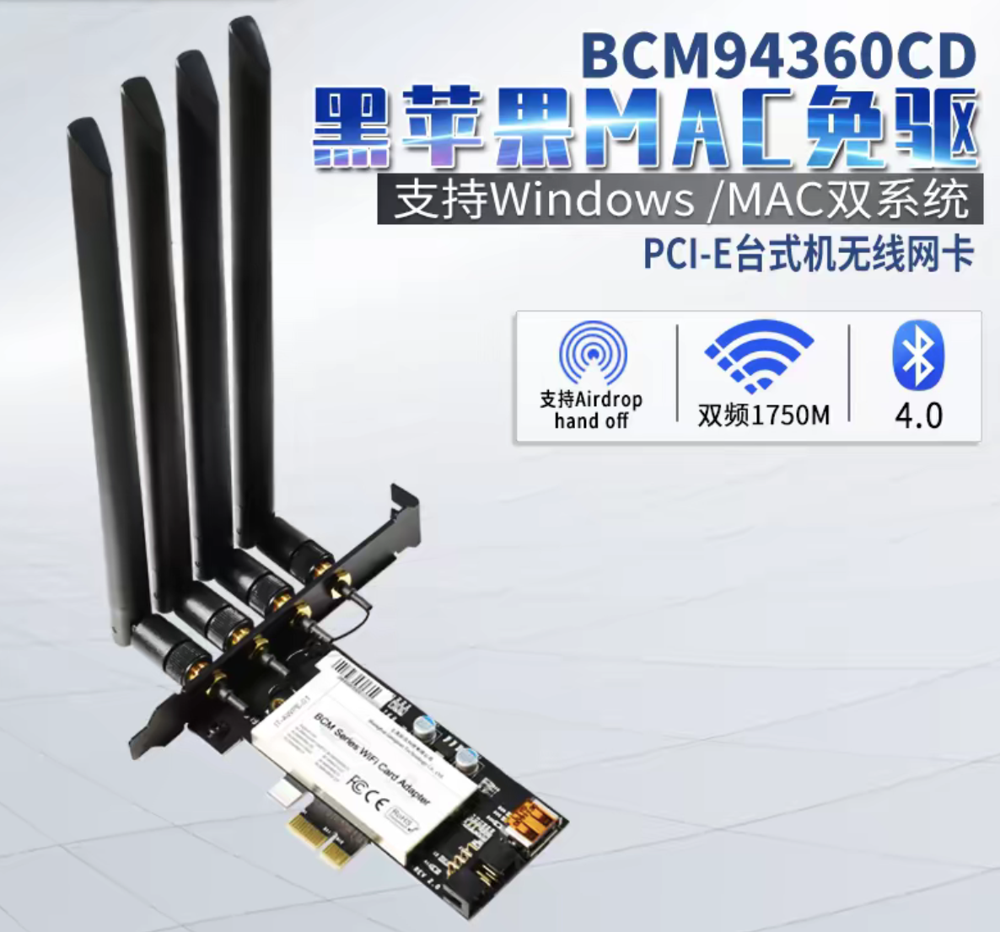

.. _hackintosh_wifi_bluetooth:

=============================
黑苹果无线和蓝牙
=============================

.. warning::

   由于我的台式机和 :ref:`dell_t5820` 的 PCIe 接口非常宝贵，全部用于 :ref:`machine_learning` GPU 和万兆网卡，所以当前我暂时还没有实践。

   不过，我对这个方案很感兴趣，考虑到后续 :ref:`dell_t5820` 可以把主板上的 2个 SFF-8654 接口 (PEIe0/PCIe1)转接PCIe插槽，如果没有足够的存储或GPU来填满这个接口，可以考虑购买一块 **BCM94360CD千兆双频5G台式机无线网卡蓝牙**

   BCM94360CD千兆双频5G台式机无线网卡蓝牙4

我最初想在 :ref:`c246_mi50_hackintosh` 复用我为Linux购买的 :ref:`mediatek_mt7921au` ，但是发现macOS 原生仅支持 Broadcom（博通）部分芯片以及苹果自家的无线网卡。对于 MediaTek（联发科）、Realtek（瑞昱）以及大多数 Intel 网卡，macOS 内部完全没有内置驱动。

gemini推荐的方法 **使用 Broadcom（博通）拆机卡 + PCIe 转接卡** : 这两款网卡都是非常成熟的"原生白苹果拆机卡" ，主要核心差异在于 **天线通道数量、速率、天线接口规范 以及 PCIe 转接卡的物理尺寸**

.. csv-table:: BCM94360CD vs BCM943602CS 核心对比
   :file: hackintosh_wifi_bluetooth/bcm.csv
   :widths: 20,40,40
   :header-rows: 1

- 天线与蓝牙独立性（BCM94360CD 占优）

  - **BCM94360CD** : 具备 4 个独立的 IPEX 接口，其中 3 根给 5GHz/2.4GHz Wi-Fi 数据传输，第 4 根专门作为蓝牙天线。这种设计使得在连接大量蓝牙设备（如蓝牙键盘、鼠标、AirPods、手柄）同时传输大文件时，蓝牙与 Wi-Fi 之间几乎零干扰。
  - **BCM943602CS** : 只有 3 个接口，蓝牙是与 Wi-Fi 天线共用的。在某些高负载 2.4GHz Wi-Fi 环境下，可能对蓝牙音质或鼠标延迟有极其微小的干扰。

- 蓝牙版本细节

  - BCM94360CD 原厂标配蓝牙 4.0
  - BCM943602CS 采用了稍新的芯片，支持 蓝牙 4.1/4.2（在对低功耗蓝牙 BLE 设备和 AirPods 的连接稳定度上稍微好一点点，但体感差异不大）

我的选择: ``BCM94360CD（4 天线版）`` - 常年挂载多个蓝牙音频/外设，且不在意机箱内部空间和额外的 1 根天线，它的独立蓝牙天线设计在多设备并发时最稳固

参考
=======

- gemini
