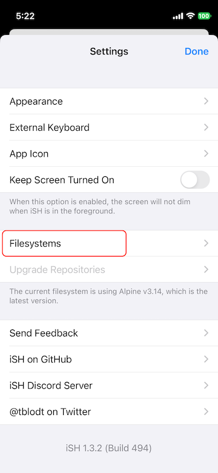

.. _upgrade_ish_alpine_linux:

=================================
升级iSH内置的alpine linux系统
=================================

``iSH`` 本质是运行 :ref:`alpine_linux` 的 x86 :ref:`qemu` 虚拟机，由于其完整运行了最小化的Alpine Linux，所以可以通过 :ref:`alpine_apk` 进行各种软件包安装和升级，为我们带来无限的可能。

不过， ``iSH`` 官方发布已经很久没有出release，虽然GitHub仓库还在不断commit，但是如果你是从Apple AppStore安装版本，其内置的Alpine Linux版本停滞在 ``3.14`` 很久，甚至执行 ``apk update`` 会报错(默认是 ish.app 提供软件仓库，似乎不太稳定，有时候好有时候访问不了)。

升级方法一
=============

实际上， ``iSH`` 只是提供了一个qemu运行alpine linux环境，内部运行的虚拟机操作系统可以直接替换为 :ref:`alpine_linux` 官方 `Alpine Linux Downloads <https://www.alpinelinux.org/downloads/>`_ 提供的 ``MINI ROOT FILESYSTEM`` **x86** 版本。 

``iSH`` 提供了手工更新虚拟机镜像的功能，也就是用下载的 ``MINI ROOT FILESYSTEM`` **x86** 打包镜像作为虚拟机根目录挂载:

- 使用iPhone手机的Safari浏览器访问 `Alpine Linux Downloads <https://www.alpinelinux.org/downloads/>`_ 下载 ``MINI ROOT FILESYSTEM`` **x86** 打包镜像，存放到 ``iCloud`` 中( ``iSH`` 能够访问 ``iCLoud`` )
- 在 ``iSH`` 中，访问 ``Settings`` 按钮，然后在设置中访问 ``Filesystems`` 页面，点击右上角 ``Import`` :

- 选择 ``iCloud`` 中已经下载好的 ``alpine-minirootfs-3.22.1-x86.tar.gz``

此时会看到 ``Filesystems`` 中除了 ``default`` 又新增了一项刚才导入的 ``alpine-minirootfs-3.22.1-x86``

- 点击 ``alpine-minirootfs-3.22.1-x86`` 菜单选项，选择 ``Boot From This Filesystem``

- ``iSH`` 会自动重启，再次访问 ``iSH`` 就会看到系统被替换成最新的 ``3.22.1`` 版本了

.. literalinclude:: upgrade_ish_alpine_linux/os-release
   :caption: 检查 ``/etc/os-release`` 版本

.. warning::

   这种替换根文件系统的升级方法会导致之前 **所有的修改和数据丢失** ，相当于重建了虚拟机，请先备份好数据再操作，完成后还需要恢复备份数据。

升级方法二
============

.. note::

   这个方法来自 `iSH - Upgrade Alpine Persistently <https://www.reddit.com/r/AlpineLinux/comments/1dqhwpp/ish_upgrade_alpine_persistently/>`_ ，不过我没有实践。原理上没问题，应该可行

- 更新仓库配置:

.. literalinclude:: upgrade_ish_alpine_linux/update_repo
   :caption: 更新iSH使用的alpine linux仓库配置

需要注意，这个配置文件在 ``iSH`` 重启以后会reset，不过可以通过修改用户的 ``.bashrc`` 或者 ``.shrc`` 设置脚本来每次登陆时自动修正:

.. literalinclude:: upgrade_ish_alpine_linux/shrc
   :caption: 通过用户目录的 ``.shrc`` 来自动修订仓库配置

参考
======

- `iSH - Upgrade Alpine Persistently <https://www.reddit.com/r/AlpineLinux/comments/1dqhwpp/ish_upgrade_alpine_persistently/>`_
