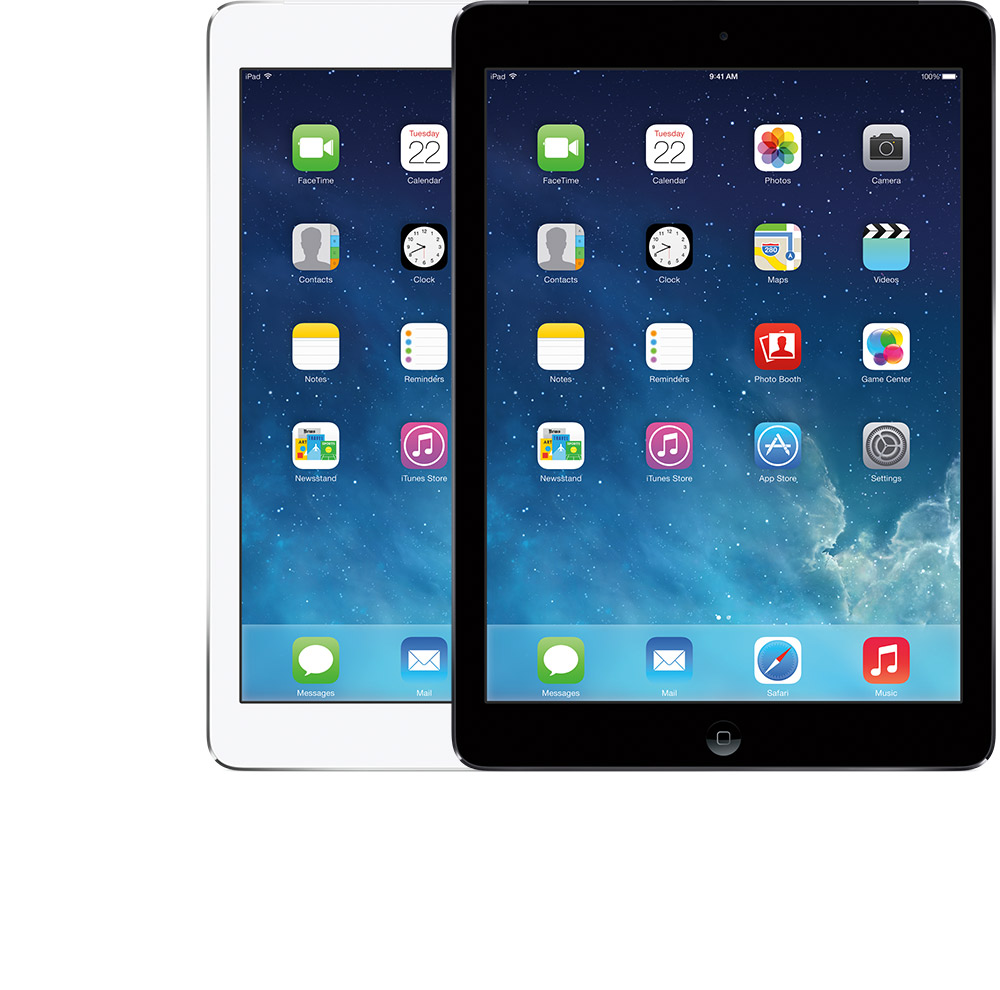

.. _iphone_air1:

==================
iPad Air一代
==================

.. note::

   2014年初，我曾经购买过iPad Air一代，现在2022年2月，重新拿来使用，看看老设备能否再次发挥青春。

Apple官方网站提供了一个 `识别您的 iPad 机型 <https://support.apple.com/zh-cn/HT201471>`_ 的引导页面，提供了苹果公司推出的历代iPad产品以及相应技术规格页面索引。我所使用的是最早一代iPad Air产品，2013年末推出:

硬件规格
===========

乞丐版iPad Air (A1474) 配置:

- 64 位架构的 A7 芯片 M7 运动协处理器 (苹果2013年9月11日发布的首款划时代64位处理器，也是iPhone 5s所使用处理器)
- 16GB 存储容量
- Retina 显示屏: 

  - 9.7 英寸 (对角线) LED 背光 Multi-Touch 显示屏，具有 IPS 技术
  - 2048 x 1536 像素分辨率，264 ppi

- 尺寸: 240(长)x169.5(宽)x7.5(厚)，重 469克
- 镜头:

  - 前置 120 万像素
  - 后置 500 万像素

- 无指纹识别
- 具有3.5毫米耳机插孔
- 内置 32.4Whr 可充电锂聚合物电池，使用时长10小时

iPad软件
========

对于已经问世8年的电子产品，最好的使用方式是提供持续的操作系统升级。这样能够体验最新技术同时又能够弥补安全漏洞。秉承苹果的软硬件一体化，从最早iPad Air一代面世时iOS 9，可以持续升级4代(4年)，目前最高iOS版本是 ``12.5.5`` (2021 年 9 月 23 日)。

目前(2022年)，大多数主流iOS应用依然提供iOS 12兼容软件，也就是iPad Air一代面世8年之后，依然可以满足日常使用要求。

Apple One
----------

:ref:`apple_one` 提供了大量原创影视以及聚合各种新闻报刊资讯，同时提供音乐和运动指导。iPad Air的大屏带来极佳的观影体验

Kindle和iBook
----------------

iPad的优势是屏幕，9.7英寸屏幕已经能够清晰阅读pdf文档，对于漫画也不在话下。对于技术资料而言，大量的电子书籍，非常适合iPad mini(8.3 英寸)及以上屏幕阅读。

iPad Air一代毕竟是最古老产品，便携性虽然在当年独步天下，但是放到今天，则稍有沉重。此外，屏幕非贴合，比之现代的iPhone/iPad屏幕逊色很多。不过，我的目标是学习，能够方便我获取知识和信息，iPad Air一代已经足够。

.. note::

   需要注意iPad Air一代的性能较弱，第三方大型软件运行缓慢。例如，Kindle比较吃资源，而iBook则相对较为轻量级。所以，可以通过 :ref:`calibre_remove_drm` 将Kindle的 ``.azw`` 书籍转换成开放的 ``.epub`` 书籍，这样就能够导入 iBook 阅读。

   iBook通过苹果的iCloud同步书籍，可以在不同的苹果设备间实现同步阅读。

Reeder
----------

大屏幕对于阅读新闻图片非常有利，视觉冲击感比我所使用的 :ref:`iphone_se1` 要好，除了存储空间捉襟见肘不得不仅保留少量缓存内容意外，其他使用体验极佳。 

GoodReader
-----------

GoodReader是PDF最佳阅读软件，提供了PDF实时裁边功能，以及阅读转换文字功能。对于扫描版PDF，通过裁边以及iPad大屏幕加持，可以获得较好的阅读体验。
