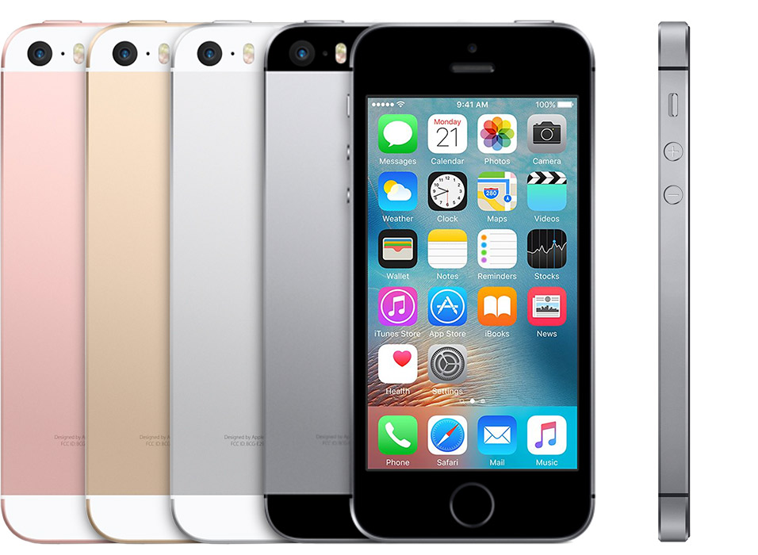

.. _iphone_se1:

================
iPhone SE一代
================

2021年10月初，在使用了 :ref:`pixel_3` 几个月之后，我尝试通过 :ref:`iphone5s` 回归iOS不尽如人意，所以改为使用性价比最佳的 iPhone SE 一代。

.. note::

   我对小屏手机特别偏爱，实际上2020年购买了 :ref:`iphone12_mini` ，可以说是小屏手机的巅峰之作(iPhone 13 mini略有优化)。不过，iPhone 12 mini的缺点是太贵了(需要戴套否则摔不起)，超出了我的经济能力。所以，我回退到使用SE，兼有小屏手机90%的优点，同时使用心理负担也小。

   不过，如果经济宽裕，或许iPhone 13 mini 这样的小屏手机更是上佳，毕竟 :ref:`iphone12_mini` 光是摄影摄像功能，就已经让你惊艳到忍不住想要拍尽这个世界的美景。

我其实在2018年10月初(恰好3年前同一时间)曾经购买过同样的iPhone SE一代，当时的二手售价恰好是现在的两倍。我使用了大约1~2年，很不幸被摔坏了。那么为何过了3年，依然选择了相同的老款手机呢？

穷当然是第一原因(玩笑)，我想要一个能够在经济能力可承受范围的最佳性价比的小屏手机

iPhone SE技术规格
==================

- 芯片: A9芯片+嵌入式M9运动协处理器
- 运行内存: 2GB - iPhone SE的运存(RAM)和iPhone 6s一致，这是相比前代iPhone 6仅有1GB运存巨大的飞跃。 :ref:`iphone5s` 之所以运行缓慢以及很多现代程序运行出错，很大原因就是因为内存不足导致的。
- 1200 万像素 iSight 摄像头，单个像素尺寸为 1.22 微米，ƒ/2.2 光圈
- 支持NFC功能
- Touch ID指纹识别和iPhone 5s/6相同，是第一代Touch ID模块，速度比iPhone 6s慢
- 4 英寸LED背光显示屏，1136 x 640 像素分辨率，326 ppi
- 尺寸和重量: 高123.8 毫米、宽58.6 毫米、厚7.6毫米，重量113克 (真是再也找不到这么轻巧的手机了)

iPhone SE A1622/A1723/A1724
------------------------------

苹果的iPhone SE一代有3种型号:

A1662 
~~~~~~~~

A1662称为 ``美版`` :

- 美国发售版本，可以在美国Apple Store或者美国运营商 AT&T, T-Mobile 或 Verizon购买
- 支持频段: 

  - LTE (Bands 1, 2, 3, 4, 5, 8, 12, 13, 17, 18, 19, 20, 25, 26, 29)
  - CDMA EV‑DO Rev. A  (800, 1700/2100, 1900, 2100 MHz)
  - GSM/EDGE (850, 900, 1800, 1900 MHz)
  - UMTS/HSPA+/DC‑HSDPA (850, 900, 1700/2100, 1900, 2100 MHz)

A1662型号中有部分是无锁版本，需要注意的是美版没有包括  7 / 28 或 TD-LTE 波段 (38, 39, 40, 和 41) ，而在中国大陆，中国移动恰恰是主要使用 TD-LTE 波段 39, 40(室内) 和 41 作为主要的4G频段，虽然随着2G退网，中国移动又启用了B3, B8 和 B34 作为4G频段，但可能信号覆盖差一些。所以，可以看到，美版iPhone SE在中国市场，如果是用于中国移动网络，则会出现信号较弱及无信号情况。

如果你使用中国联通或中国电信，则没有任何影响，因为这两家运营商采用的是国际主流的 FDD-LTE 波段，得到美版iPhone良好支持。

A1723
~~~~~~~~

A1723也称为 ``global version`` 

- 由美国运营商 Sprint 销售，也在全球英国、加拿大、欧洲、澳洲以及亚洲销售
- 覆盖了最多频段:

  - LTE (Bands 1, 2, 3, 4, 5, 7, 8, 12, 17, 18, 19, 20, 25, 26, 28)
  - TD‑LTE (Bands 38, 39, 40, 41)
  - TD‑SCDMA 1900 (F), 2000 (A)
  - CDMA EV‑DO Rev. A (800, 1700/2100, 1900, 2100 MHz)
  - GSM/EDGE (850, 900, 1800, 1900 MHz)
  - UMTS/HSPA+/DC‑HSDPA (850, 900, 1700/2100, 1900, 2100 MHz)

A1724
~~~~~~~~

A1724也就是所谓 ``国行``

- 只在中国大陆销售
- 支持频段类似A1723，但是不支持 CDMA EV‑DO Rev. A (800, 1700/2100, 1900, 2100 MHz)
- 完整支持频段如下

  - LTE (Bands 1, 2, 3, 4, 5, 7, 8, 12, 17, 18, 19, 20, 25, 26, 28)
  - TD‑LTE (Bands 38, 39, 40, 41)
  - CDMA1700/2100 (BC15)
  - TD‑SCDMA 1900 (F), 2000 (A)
  - GSM/EDGE (850, 900, 1800, 1900 MHz)
  - UMTS/HSPA+/DC‑HSDPA (850, 900, 1700/2100, 1900, 2100 MHz)

A1724可以用于中国移动的4G TD-LTE, 3G 或者 TD-SCDMA 网络。不过需要注意中国移动售卖的无锁版本不能用于中国电信的CDMA网络。

iPhone之禅
===========

iPhone SE一代当前依然能够流畅运行当前最新的iOS系统以及达到 :ref:`iphone_zen` 有克制的应用软件:

- Kindle + Books 阅读
- Music 音乐 + Apple TV+ + Apple News (订购了 :ref:`apple_one`)
- 必要的衣食住行: 支付宝、微信、大众点评、高德地图、淘宝、知乎、豆瓣

二手iPhone SE使用体验
======================

iOS选择
---------

在2021年苹果推出的最新iOS 15操作系统，依然把5年前的iPhone SE一代列入支持范围，也就是说，今天这款手机依然达到了运行现代手机系统的及格线。并且，2021年9月，苹果公司在推出iOS 15正式版的同时，依然推出(可能因为iOS15尚未成熟)了前一代iOS 14最新升级补丁版本 ``14.8`` 。由于同时提供了 ``14.8`` 和 ``15``
的认证签名，使得我们可以为旧设备选择略低版本的最新iOS系统，在体验最新技术的同时，能够确保手机系统流畅。

不过，如果你的手机是 14.x 的低版本，则默认只能升级到 iOS 15。苹果只是暂时保留了 ``14.8`` 的认证，只能通过刷机方式一步直达 iOS 14.8 。我就是采用这种方式，即确保 iPhone SE 能够停留在前一代最优适配系统上，同时又能够获得最新的补丁。我对比了 iOS 15 和 iOS
14，虽然15的有很多细节提升，例如图片文字识别(使用了手机端AI)，但是这都是需要采用最新的硬件AI协处理器来实现的，对于早期手机硬件，还是太消耗资源。

目前，iOS 13是现代应用软件的入门基准，很多App Store中的应用最新版本都已经只支持iOS 13(变相杀死了早期的手机)。考虑到iPhone SE能够流畅运行iOS 14，相信在未来几年内还能得到应用软件的支持。

.. note::

   iPhone SE的硬件较iPhone 5s有较大提升，CPU处理能力是iPhone 5s的2倍，GPU处理能力是iPhone 5s的3倍。所以我在使用应用软件时，几乎感受不到卡顿(实际使用支付宝流畅度还是逊色于iPhone 12mini)，基本满足了日常生活所需。

   :strike:`注意，出于使用体验，我没有选择将iPhone SE升级到iOS 15，除非有确凿证据能够证明iPhone SE一代的iOS 15运行流畅和iOS 14完全一致，否则，不建议强行升级，以免遗憾(无法降级)。`

由于苹果很快关闭了iPhone SE一代的iOS 14，我最终还是使用iOS 15系列...

我是在淘宝上选择了一家评论没有明显差评的买家，多少还是有些冒险的。不过，这款手机确实已经年代久远，已经无法买到正规渠道行货了。淘宝店家的广告宣传事后看来真是非常巧妙(模棱两可) - ``iPhone SE全新正品未激活se三网通4G手机`` 并且在详情介绍中说明 "中国大陆套餐：只为了方便买家下单 默认中国大陆套餐 国家版本随机发 支持移动、联通、电信三网4G (包括美版S版、日本版、加拿大版等 版本随机发送)" 。从字面上理解所谓 "中国大陆套餐" 就是不同版本水货，然而卖家又附加 "特别说明：拍下即默认此条款 介意者慎拍" 。敢情已经埋下了伏笔... 

- 收到的iPhone SE是带完整包装的，就像在苹果官网买的一样，包装、充电器、耳机一应俱全。不过，店家也说过，只有加100元才能给原装配件，我也没有去尝试，毕竟苹果配件水深。

- 我选的是白色 128G 版本，收到的买家宣称的 ``iPhone SE全新正品未激活`` 外观确实看上去全新

根据手机的 ``型号号码`` ``MLLX2LL/A`` 可以查到，这款手机是 美版 A1662 ，是AT&T的 ``无锁`` ``玫瑰金`` ``128GB``  版本，也就是说，至少手机的内部规格和我购买的规格一致。不过我购买的是白色 128G 版本，也就是外壳是翻新的。既然序列号显示该机是玫瑰金而收到手机外观是银白色，至少证明所谓全新iPhone SE至少是外观翻新过的。

.. note::

   最初拿到的是 美版 AT&T A1662 ``MLLX2LL/A`` ，由于不支持中国移动的主要4G频段，所以和卖家协商更换了 A1723 ，换回来的是 ``MP882J/A`` ，是日版无锁 128 Gold 型号。经验证，A1723在中国移动网络中信号极好，使用非常流畅。

使用体验
----------

- 电池是100%全新的

既然是二手iPhone，电池健康度是关系手机使用续航的关键。还好，从iOS的电池检查来看，目前手机电池健康度100%，我在一天的使用体验中，也基本能够在轻度使用中坚持大半天。

- 基本功能验证全部正常: 拍照、电话、音乐、指纹识别等功能正常

  - 拍照聚焦还算快速，不过清晰度确实和 :ref:`iphone12_mini` 差距太大，使用过好的再对比，感觉iPhone SE的拍摄功能太渣了(也有可能我这个二手拍摄质量更差)
  - 扫码功能满足要求(但是二维码扫描对焦非常慢甚至需要前后手动移动来帮助对焦)，对于我这样佛系用户来说，除了拍摄功能有所遗憾，其他已经达到预期

- 通过刷机升级升级iOS 14.8系统没有任何报错异常

  - 至少证明手机的内部功能满足要求，能够满足体验苹果iOS生态的需求
  - 系统升级也是对手机硬件的全面验证

- :strike:`手机信号偏差一些` 一定要选购匹配运营商的 ``型号`` : 中国移动一定要订购A1723，联通则A1723/A1662都可以

  - ``A1662`` 中国移动网络使用体验

    - 办公室信号显示只有2格，洗手间信号消失: 我最初以为是翻新组装存在一些问题，但是后来查看了A1662支持频段，发现主要原因还是美版iPhone SE支持和频段只有部分和中国移动4G频段重合
    - 美版iPhone SE A1662支持的频段(3,8,24)是中国移动清退2G(GSM)网络后翻頻重耕的LTE FDD频段，所以在大城市由于基站设备更新快，相对还能支持美版手机；但是如果到了部分未覆盖LTE FDD地方或者农村，则几乎无法使用4G
    - 大体上使用没有影响，启用VoLTE通话功能，在1格信号情况下，通话还可以进行，但是似乎受房间位置影响，通话对方听到的声音有强有弱(本人听到的声音稳定正常)

  - ``A1723`` 中国移动网络使用体验

    - A1723在中国移动网络使用体验较好，大部分地区信号都能达到满格，通话清晰，上网速度也不错
    - 在外地和高铁上信号较弱，使用体验较差

- 小屏手机电池容量确实不足

  - 需要通过一些配置精简(关闭动态缩放特效等)以及常开 ``低电量模式`` 来延长使用时间
  - 我近期在摸索使用方式，想尽可能一次充电能够满足一天轻度使用

- 总体来说，我买到的二手iPhone SE一代让我觉得 ``物有所值`` ，毕竟只花费了748元就能够获得最现代化的手机系统以及几乎所有的应用体验。不过，万事皆有缺陷，我来说一下二手的缺陷:

  - 手机屏幕不是原装屏幕: 我不了解二手手机的背后(灰色)供应链，毕竟每个环节的人都是要"讨生活"吃饭的，在买卖双方都基本满足情况下获取利润。我买过两次二手的iPhone，屏幕都偶尔因为静电而产生突然偏色，然后过一会慢慢恢复。还好这种情况出现次数不多，并且能够自己恢复并无其他影响
  - 手机装配质量略差，我三年前购买的iPhone SE一代在摄像头一角有些翘边漏缝，导致使用一段时间就进灰影响摄像头；还好这次再次购买的iPhone SE一代装配还不错，使用了一个多月没有任何硬件问题。所以这个问题可能还是要看运气

iPhone SE使用Tips
===================

实际上，现代手机的功能已经非常丰富，很多使用者可能只关注了屏幕大小和拍照效果，很少会注意到一些使用细节是影响我们使用的体验。

更新iOS系统
--------------

由于iPhone SE一代推出已经5年，虽然苹果官方2021年推出的iOS 15依然把iPhone SE一代和iPhone 6s列入支持，但是考虑到系统运行流畅性，还是建议停留在上一代 iOS 14 上。并且苹果在推出 iOS 15时，意外(也许只是暂时)提供了 14.8 升级版本，允许用户选择升级到 14.8 或者 15.0.1 。不过，这个升级版本在我购买的iPhone SE一代 14.2 上看不到选项，只提供直接升级到 15.0.1 ，或许是因为版本差距较大苹果反而不提供停留在iOS 14选项。

通过IPSW下载网站的 `iOS 14.8 (18H17) for iPhone SE <https://ipsw.me/download/iPhone8,4/18H17>`_ 从出厂镜像通过iTunes恢复，然后再进行注册使用。这样，可以确保手机系统保持在最新的iOS 14系列，手机使用体验非常流畅。除了内存有限，开启过多程序会杀后台，在开启2~3个常用程序情况下切换使用，感觉行云流水一气呵成。

.. note::

   So Sad!

   果然苹果只是因为15.0.1的稳定性考虑，暂时保留了14.8的验证。只因为我购买的二手iPhone SE一代需要从A1662更换成A1723，快递一个来回，恰好在10月12日上午收到返回的手机。而苹果在10月12日凌晨发布了 15.0.2 版本，同时关闭了 14.8 的验证。仅仅差半天，永久错过了升级停留在iOS 14.8的窗口!!!

   只能升级到 iOS 15 系列了，让我来看看iPhone SE一代是否能够再战3年!!!

由于错过了停留在iOS 14的验证窗口期，我使用的iPhone SE一代最终还是跟随iOS前进的脚步升级到了iOS 15系列。不过，iOS 15整体上运行效率很高，在这么陈旧的硬件上运行依然非常流畅。除了一些联网应用切换操作时候有卡顿，其他时候完全满足我的使用需求。总之，iPhone SE一代使用iOS 15完全没有问题(不吹毛求疵)，至少使用到2022年iOS15软件生命周期结束前没有问题。

VoLTE
--------

由于中国移动运营商裁撤2G网络，目前国内必须使用激活4G VoLTE功能的手机才能正常通话。好在iPhone 6开始，苹果已经全面支持VoLTE，iPhone SE也不在话下。

开启VoLTE: ``设置`` => ``蜂窝网络`` => ``蜂窝数据选项`` => ``语音与数据`` => ``4G`` & ``VoLTE``

成功开启VoLTE的标志是在电话通话过程中，依然能够通过4G上网。并且语音效果要明显好于2G的语音通话。

NFC
------

NFC是一个很容易被人忽视，但是实际上在都市生活中非常有用的功能。首先，使用公交卡的轨道交通和公共汽车交通，都是支持NFC。也就是说，出门不需要带公交卡，只需要一部支持NFC的手机即可。通过激活iOS中的 ``钱包`` 功能，添加信用卡和交通卡，就可以实现交通卡在线充值和随时使用，过地铁闸机，只需要潇洒一挥。

所谓Apple Pay也是通过NFC实现的。虽然现在生活中大家都习惯使用二维码扫码支付，但是实际上NFC方式的Apple Pay更方便安全，只是支持商家太少了。

续航
-------

iPhone SE的手机屏幕只有4英寸，1136 x 640 像素分辨率，326 ppi，带来便利的一点是单手握持操作方便，同时也相应带来耗电较少的优势(原因是显示屏较小消耗电能较少)。不过，电池容量还是太小了，所以为了能够延长iPhone SE的单次充电使用时长，可以尝试以下一些策略

- 避免滑动关闭后台: iOS的运行机制和Android不同，显示的后台运行程序实际是冻结状态，不消耗CPU资源，占用内存资源也较少，如果滑动关闭后台程序反而导致重新启动加载耗时和电力消耗
- 关闭 ``后台APP刷新`` : 原因是iOS通知机制完全不依赖应用后台刷新，这种后台App刷新只是为了应用程序能够在后台静默下载内容，但是往往被国产应用用于提前下载广告以及视频缓冲，对于我个人使用完全没有必要，白白浪费电能以及网络带宽
- 对于iPhone SE使用的LCD屏幕，由于白色和黑色显示都是需要背板发光，所以消耗电能相近，甚至因为黑色背景肉眼查看文字不便，反而调高了屏幕亮度导致更多耗能。所以对于iPhone SE，选择浅色背景并且在阅读软件选择浅黄色背景黑色字体，则更容易调低亮度节约电能。不过，如果你使用OLED屏幕(例如 :ref:`iphone12_mini` )则建议采用深色背景，因为OLED的黑色是真的不发光
- 关闭 Siri 功能
- 关闭显示特效以及动态壁纸，进一步降低耗能;我感觉关闭透明效果似乎对于节电很有帮助，其次关闭动态缩放功能加快切换观感
- 如非必要，全天候开启 ``低电量模式`` 可以降低后台应用活跃，明显减少电能消耗;不过，iPhone SE一代的硬件性能确实在发布5年以后偏弱，如果在使用支付宝等大量消耗资源的应用，还是需要关闭节点功能才能正常体验。我使用了 ``快捷方式`` 设置了开启wifi和开启蜂窝(同时打开蓝牙)，开启时同时关闭节点，就可以非常流畅地使用应用
- 关闭iOS系统默认的 ``抬起唤醒`` 功能，这个功能虽然方便观察消息，但是很多时候是误亮起屏幕，白白消耗电能
- 由于我不需要时时刻刻联网(我对社交软件比较厌烦，关闭了所有社交软件的通知功能)，所以配置了 ``捷径`` 一键关闭 ``wifi`` ``移动网络`` ``蓝牙`` 并同时启用 ``低电量模式`` ，这样不影响我使用手机阅读和听音乐，已经可以满足大多数时候的使用需求。仅在支付、共享单车、查阅网络资讯时候联网

通过这种 ``锱铢必较`` 的手段，轻度使用还是有可能达到一天一冲的效果。对于中度使用(主要是YouTube,RSS,阅读,音乐)，大致是一天 :strike:`1.5冲~2冲` 2冲。

运动健身
-----------

目前Apple Watch各系列都需要配合iPhone使用，并且最低入门iPhone系列就是iPhone 6s和iPhone SE，也就是说，即使使用5年前的iPhone SE，也能充分利用好Apple Watch进行各项健身运动。

.. note::

   苹果生态确实在自家产品中得到完美统一，特别是iPhone、Apple Watch、AirPods Pro完整实现了运动、音乐以及生活的全面覆盖，使用流畅体验绝佳。不过，目前(2021年底)AirPods Pro一代发布已久，二代传闻明年发布，确实不适合入手，只能等待...

   我暂时购买了 :ref:`jabra_sport_pulse` 运动蓝牙耳机，兼有心率检测功能，这样可以在运动时听音乐和记录心率，作为没有Apple Watch和AirPods Pro时期过渡。

HomePod和音乐
---------------

我购买了 HomePod mini 来听音乐和尝试一些智能家电功能，HomePod的入门配置手机也是iPhone SE。

真是非常犀利的一款手机，能够充分适配苹果生态，功能齐备，大有可为。

二手iPhone的缺憾
==================

虽然二手iPhone SE 1Gen 低廉的售价使得性价比非常突出，不过我在使用中依然发现存在 ``小小`` 的缺血:

- 手机 ``定位`` 功能偶尔会无法激活（补充：这个问题应该是软件BUG，见下文）:

:strike:`似乎是硬件稳定性问题，` 我购买的二手iPhone SE 1Gen，在最初使用的2个半月，大约发生过3次应用突然发生闪退问题，不论重启应用或手机都无法恢复。

第一次我以为是内存或者存储有坏块，那就比较悲剧了。不过，发现刷机恢复到出厂，则工作完全正常。因为手机还安装了公司都安全软件，也比较怀疑安全软件影响，所以恢复以后就没有再安装那种涉及底层改动的安全软件。

第三次在餐厅刷支付宝时候出现无法打开支付宝支付码时，特别尴尬，我清理缓存依然发现打开不稳定，1~2秒就会退出。非常偶然，我发现系统自带的 ``天气`` 应用能够显示指定城市的天气情况，但是根据定位显示天气的页面始终是空白卡住的。我这才发现，手机应用程序运行时，指示栏的定位图标始终没有出现。果然，地图应用也无法打开了(苹果内置地图闪退)。这也就能够解释为何突然间，支付宝、微信、大众点评应用都无法打开了: 因为这些应用运行都会读取定位数据，无法打开定位都会导致程序异常。

我尝试关闭定位，但是尴尬的是，设置功能中，要打开 ``private`` 功能首先要访问定位，而当前定位功能异常，连关闭设置页面也无法开启。

不得已，再次通过重新刷机方式恢复手机工作:

  - 好在，苹果手机只要充电同时连接局域网，就会自动进行icloud备份。以我的使用习惯，基本上每天都会自动备份一次
  - 所以，这种刷机方式恢复系统，每次只会损失1天的使用数据，影响及其轻微

目前，这是唯一一个比较严重影响使用体验的缺憾，不过，看在性价比上，我会依然坚持使用，直到这个手机无法工作为止，希望一直坚持到2026年。

.. note::

   很幸运，上述定位稳定性不是硬件问题: 我偶然发现2022年1月15日相同故障最后一次出现，之后直到今天(4月底)整整3个半月，再也没有出现过定位故障引发的死机。推测应该是1月下旬的iOS升级修复了iOS 14在早期iPhone SE上运行的bug。最近3个半月，使用一直非常流畅，体验极佳。

- 手机屏幕冬季偶然会因为静电原因偏色:

不过，这个偏色情况很少见，只是在很冷且干燥的环境下，从口袋里拿出手机的短时间内会出现偏色，过一会会恢复正常。所以这个小小缺陷(应该是屏幕非原装导致)对使用体验影响不大，也就忍了。冬去春来，这个屏幕偏色现象消失，所以还不算太糟。

和Pixel对比
==============

我有两台Pixel设备:

- :ref:`pixel` - 2016年10月发布，和 iPhone SE gen1 晚半年发布
- :ref:`pixel_3` - 2018年10月发布，比 iPhone SE gen1 晚两年半

从使用体验来看，iPhone SE gen1是远超同时代Pixel 1代的，不论是流畅程度还是操作系统使用体验，以及软件生态，iPhone SE gen1都比Pixel 1代强很多。直到今天，2021年底，iPhone SE gen1依然可以更新到最新操纵系统，使用流畅度也几乎不减，这点Pixel 1代是无法企及的。不过，Google为Pixel 1代提供了无限容量的照片存储，这是Pixel 1代能够扳回部分优势的亮点。

两年以后的Pixel 3硬件进步极大，全面屏加上升级2代之后的高通晓龙845处理器，以及Google的智能摄影技术，已经全面超越了iPhone SE gen1。特别是2021年，Android 12推出以后，Pixel 3立即得到推送升级，升级后系统流畅程度进一步得到提升，可以说使用体验全面碾压了iPhone SE gen1。

当然，iPhone SE 1代的优势依然在于iOS生态，以及和MacBook和Apple Watch的全系列数据一体化。在软件的融合使用体验上，Apple依然有一定优势。(我指硬件不升级情况下)

总体上，我在日常生活中依然会主力使用iPhone SE gen1，多设备无缝使用体验，低调而满足日常所需。不过，也会把玩 :ref:`pixel_3` ，体验 :ref:`android` 12 在高性能硬件加持下快感。

我的愿望
===========

我希望这次购买的二手iPhone SE一代能够再使用四年半，支撑到2026年3月31日(上市10周年)!

也许这个奇迹真能实现，你说呢?

参考
=======

- `Apple iPhone SE (United States/A1662) 16, 32, 64, 128 GB* Specs <https://everymac.com/systems/apple/iphone/specs/apple-iphone-se-a1662-united-states-att-tmobile-verizon-specs.html?__cf_chl_captcha_tk__=pmd_0C9FUuYnKDx9i1hJmAOLRyns7z3KAY8RtMTYnEpOGoU-1633331739-0-gqNtZGzNAyWjcnBszQbR>`_
- `Apple - iPhone SE 128GB - Rose Gold (AT&T) <https://www.bestbuy.com/site/apple-iphone-se-128gb-rose-gold-at-t/5789714.p?skuId=5789714&intl=nosplash>`_
- `最全整理！四大运营商频段使用情况 <https://tech.sina.cn/csj/2020-01-06/doc-iihnzhha0718024.d.html>`_
- `4G有哪些频段？ <https://wukong.toutiao.com/question/6775595558070386944/>`_
- `Differences between iPhone SE Models (A1662, A1723, A1724) <https://www.techwalls.com/iphone-se-model-numbers-a1662-a1723-a1724-differences/>`_
- `TheiPhoneWiki: iPhone SE (1st generation) <https://www.theiphonewiki.com/wiki/IPhone_SE_(1st_generation)>`_
