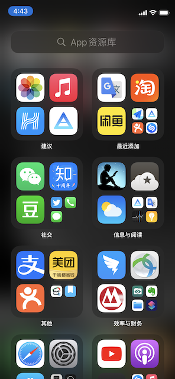
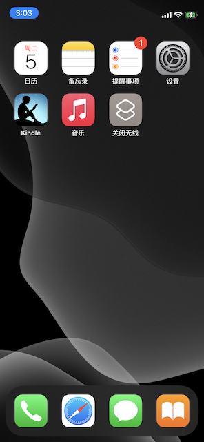
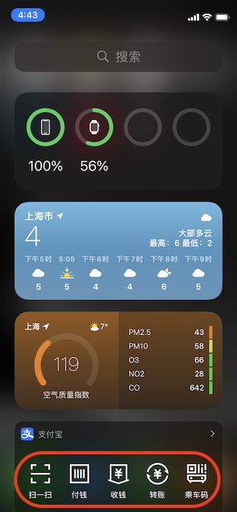

.. _iphone_zen:

=================
iPhone之禅
=================

.. note::

   本文仅是我的一点随想，我希望能够用iPhone的时候感受到心灵平静，用最简单的方式来体会真实的需求的满足感。

   或许我会在读了 `禅的行囊 <https://book.douban.com/subject/5290370/>`_ 和 `禅与摩托车维修艺术 <https://book.douban.com/subject/6811366/>`_ 之后有不同的体会，我会再来更新这篇随笔。

我对iPhone的需求其实只有音乐和阅读，其他通过订阅RSS以及豆瓣/Twitter/知乎来获取资讯。不过，通过互联网获取信息的方式非常容易随着链接不断走远，甚至忘记最初的目标和想法。

断舍离
=======

一直以来，我有一个愿望，就是所有图标显示不超过一屏。随着我日益感到时间不够使用，我不希望把大量时间都用在无意义的Internet浏览，所以我内心是希望只使用必要的应用软件。我不希望看到吸引自己浪费时光的应用图标。

我最初想通过iOS的 ``屏幕使用时间`` 功能来限制自己 ``使用`` 令人分心的应用。但是我发现只有 ``屏幕使用时间 >> 内容和隐私访问限制 >> 内容访问限制 >> App`` 可以隐藏掉应用图标。但是iOS没有提供自定义分组，只能使用内建的 ``年龄分段`` 来分组隐藏。这就不能满足我仅显示必要应用，其他皆隐藏的需求。

不过，iOS 14借鉴(copy)了Android的AllApps应用程序菜单功能，终于可以不用把所有应用图标都显示在桌面了。iOS 14在最后一屏的右方隐藏了一个 ``App资源库`` ，通过右边缘左滑方式唤出:

也就是说，即使你在主屏幕中隐藏了所有应用程序，也可以在这个资源库中找到很少使用但有时又必要的应用软件。这基本上就达到了我的预想：

是的，我只使用阅读和音乐，其次支付应用(支付宝)可以通过iOS 14的最左一屏 ``小组件`` 快速唤起，所以甚至不需要桌面图标。在iPhone上第一屏上，通过屏幕从左向右划可以唤出 ``小组件`` ，可以快速访问常用程序。

如何规划应用
==================

- 只在工作日白天利用零碎的时间阅读新闻、使用社交软件(twitter/豆瓣)以及不得不使用的IM工具
- 每天晚上8点到早上8点，只阅读和做需要大段时间专注的工作

  - 在这12小时内，尽可能只使用 :ref:`kindle`

- 双休日远离网络
