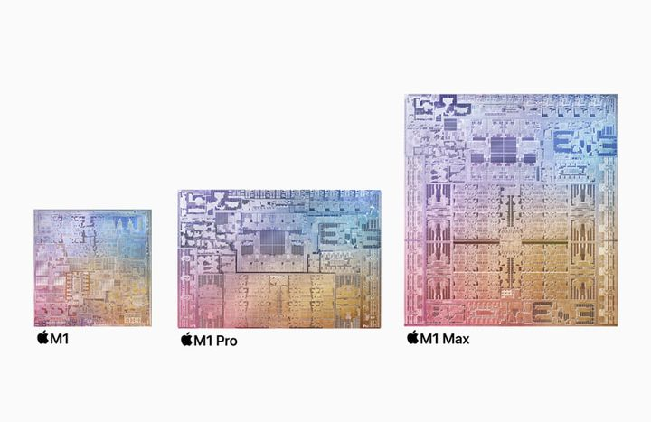

.. _apple_silicon_m1_pro:

=========================
Apple ARM架构芯片M1 Pro
=========================

M1 - 划时代
============

Apple M1是2020年推出的第一代苹果自研桌面处理器芯片，但是带来了全新的ARM设计架构，也将苹果电脑设备引入了下一个时代。M1系列是划时代的产品，一改传统的PC认知，那种内存条卡槽，单独的CPU处理器，独立的显卡，I/O芯片，各种零零散散的模块，可能很快就会一去不复返了！

.. note::

   使用Bench工具去对比处理器性能只能作为参考，实际上现代处理器的最高性能需要很多综合技术才能发挥出来。特别是软件，如果没有精心设计和高超开发，是难以发挥硬件的真正性能的。

   苹果集成GPU和统一内存的ARM架构设计，使得其处理器在极低的功耗下发挥出强大的性能，也改变了计算机性能度量的游戏规则。

M1 Pro/MAX
============

Apple M1 Pro/MAX是2021年推出的第二代桌面处理器芯片，从加工工艺保持上一代5nm，单核性能提升不大。但是开创了全新的ARM处理器设计思路: 类似Intel服务器的SMP多处理器架构，但是苹果高度集成的设计能力，硬生生将所有外部连接都集成到两个直接连接的处理器上，实现了双处理器高速互联。

.. figure:: ../../_static/apple/macos/m1-pro-chip.jpg
   :scale: 80

- M1，8核CPU + 7核GPU
- M1，8核CPU + 8核GPU
- M1 Pro，8核CPU + 14核GPU
- M1 Pro，10核CPU + 14核GPU
- M1 Pro，10核CPU + 16核GPU
- M1 Max，10核CPU + 24核GPU
- M1 Max，10核CPU + 32核GPU

.. note::

   从芯片设计简单来看(朴素的小白理解): M1 Pro和MAX就是两个M1直连合并成一个处理器，并根据Pro/MAX规格提供更多的CPU和GPU核心。实际上现代处理器设计上都是按照该型号最大规格来加工的，也就是一个晶圆上所有的Pro版本或者MAX版本都是按照其设计最大核心数加工的，但是受限于良品率，越大的处理器集成的晶体管越多，越容易出现某个CPU/GPU核心未达标准，就会在封装测试时关闭未达标CPU/GPU核心。所以才会有不同版本的Pro/MAX。

M1 Pro配备了2块SLC，各有12MB大小，这意味着M1 Pro的一级片上缓存达到了24MB。而且M1 Pro的二级缓存也达到24MB，是M1的2倍。M1 Pro配备了256-bit的LPDDR5，内存带宽达到200GB/s。

M1 Max配备4块SLC，即M1 MAX的一级缓存达到惊人的48MB，同时配备了512-bit的LPDDR5，内存带宽提升到400GB/s。

.. note::

   M1 Pro对上一代M1的内存改进: M1最高支持 16GB 内存，而 M1 Pro提升到支持 32GB 内存

GPU性能
---------

有一个夸张的说法是: 苹果的Apple Silicon处理器是买GPU送CPU。也就是说，苹果处理器的GPU优势更大: 

- M1 Pro和其他集成显卡的设备相比，同等功耗下性能可以达到7倍。而高性能情况下，功耗同样可以低70%。
- M1 Pro达到独显相同的水准，功耗可以低出100W，也就是60W功耗跑出人家160W的水平；在达到专业级笔记本电脑内图形处理器性能的时候，功耗可以低出40%。

.. note::

   综合性价比来看，M1加持的MacBook Air最值得普通消费者选择；有极致性能需求的专业用户(不差钱)，选M1 Pro或者M1 Max吧。

机器学习(Metal)
=================

Apple Silicon Mac最大的优势是集成了强大性能的GPU (Metal)，从硬件角度来说，具备 :ref:`machine_learning` 加速的条件。

PyTorch
----------

2022年5月， `PyTorch官网 <https://pytorch.org/>`_ 宣布 `Introducing Accelerated PyTorch Training on Mac <https://pytorch.org/blog/introducing-accelerated-pytorch-training-on-mac/>`_ 从PyTorch v1.12 release开始，支持Apple silicon GPU来加速模型训练。

PyTorch能够使用Apple的Metal Performance Shaders(MPS)作为后端激活加速的GPU训练。MPS的后端扩展了PyTorch框架，提供脚本和能力来设置和运行在Mac上。MPS 使用针对每个 Metal GPU 系列的独特特性进行微调的内核来优化计算性能。

由于Apple silicon Mac使用一个统一的内存架构(unified memory architecture)，使得GPU能够访问整个内存存储。这使得Mac能够在本地训练更大的网络或者更大的批量，也就降低了常规训练需要依赖云计算或者本地GPU的开发成本，并且统一内存架构还降低了数据检索延迟，提高了端到端性能。

我在 :ref:`pytorch_startup` 实践在macOS上安装PyTorch

TensorFlow
------------

2020年11月，TensorFlow官方Blog就宣布支持在 `TensorFlow 2.4集成新的机器学习框架，支持Apple M1处理器的加速 <https://blog.tensorflow.org/2020/11/accelerating-tensorflow-performance-on-mac.html>`_ 。

在苹果开发网站 `Getting Started with tensorflow-metal PluggableDevice <https://developer.apple.com/metal/tensorflow-plugin/>`_ 介绍如何安装M1优化的 tensorflow-metal 插件。

.. note::

   公司目前配备给技术工作者的MacBook Pro最高可提供 M1 Pro，10核CPU + 16核GPU ，我将在后续实践中充分发挥软硬件性能，实践更多有意思的技术。

参考
========

- `M1 Pro和M1 Max到底有多强？新款的MacBook Pro是否值得入手？ <https://zhuanlan.zhihu.com/p/423197138>`_ 
- `Apple's M1 Pro Chip: Everything You Need to Know <https://www.macrumors.com/guide/m1-pro/>`_
