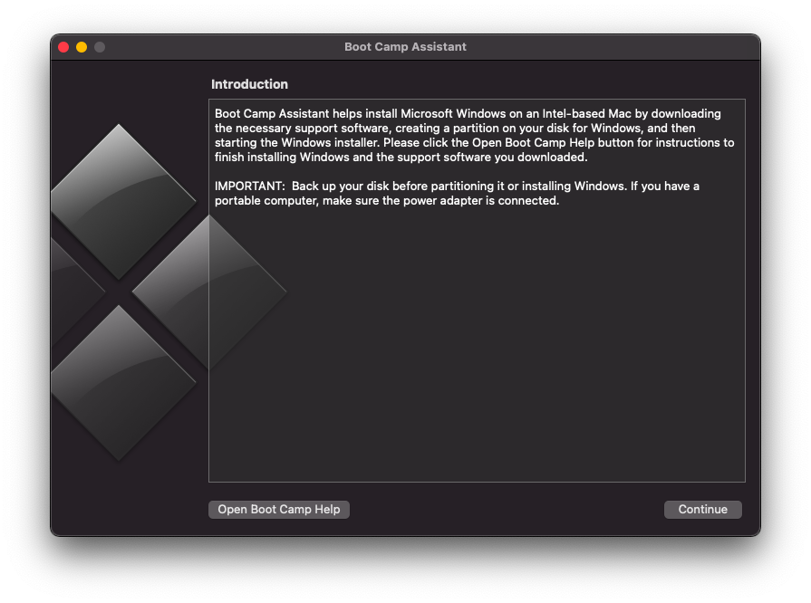
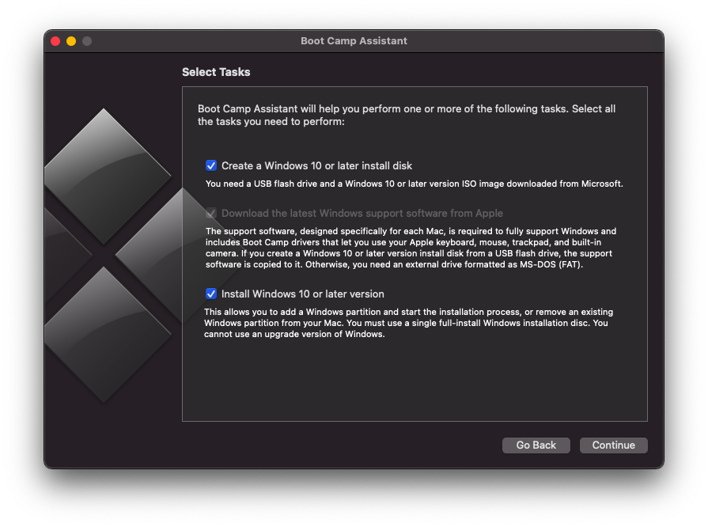
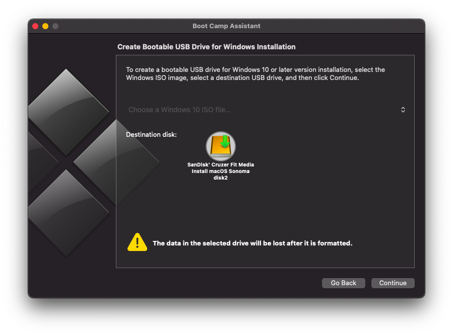
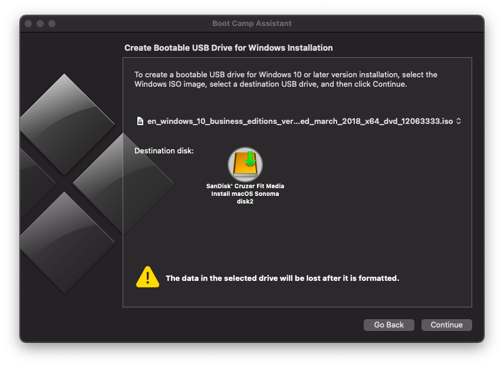
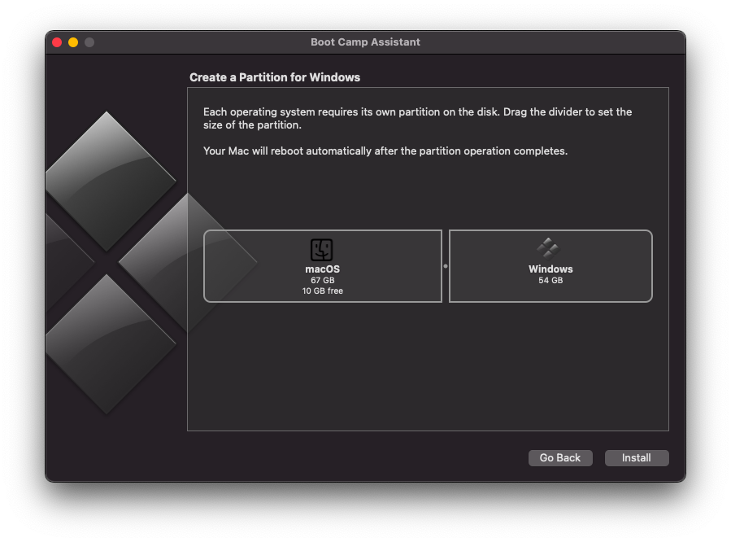
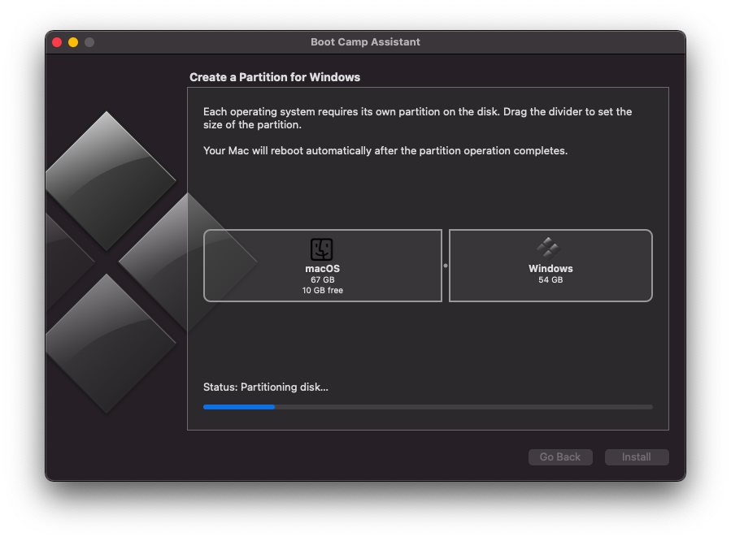

.. _install_win10_on_mac_with_boot_camp:

===============================================
在Mac上使用Boot Camp Assistant安装Windows 10
===============================================

macOS非常适合工作学习，然而有时候也需要使用Windows软件。通常我采用 :ref:`vmware_fusion` 或者 :ref:`virtualbox` 来运行Windows软件。但是，如果经常使用Windows系统，并且希望硬件性能不要因为虚拟化而损失，则可以考虑在Mac硬件上直接安装Windows操作系统。macOS提供了 ``Boot Camp Assistant`` 来帮助我们以双启动方式切换macOS和Windows。由于是Apple官方支持，所以相对于双启动方式 :ref:`install_gentoo_on_mbp` 要更为简单易用。

使用Boot Camp的要求
=======================

- 注意Mac的硬件有一定要求，通常需要2012年之后的Mac硬件，具体请参考官方 `Install Windows 10 on your Mac with Boot Camp Assistant <https://support.apple.com/en-us/HT201468>`_ 。我的实践是在 :ref:`mba13_early_2014` 完成
- macOS需要升级到最新版本: 我在 :ref:`mba13_early_2014` 上使用的是macOS Big Sur Version 11.7.10
- :strike:`需要至少64G空间用于创建Boot Camp分区，如果使用Windows自动更新，则至少128G` 我的实践由于笔记本硬盘只有128G，在使用Boot Camp Assistant划分磁盘时最多只能给Windows分区54GB，但是安装过程也没有报错，所以具体需要多大空间以实践为准(请自行尝试)
- 注意: **Windows 10必须是64位版本**
- 参考 在 `macOS Mojave 上通过 Boot Camp 安装最新的 Windows 10 <https://imtx.me/archives/2725.html>`_ ：最新的Windows ISO镜像解包文件有单个文件超过4GB的，超过Boot Camp安装Windows时创建的FAT32分区所支持的最大4GB文件限制，会导致安装失败。需要使用 `Boot Camp ISO Converter <https://twocanoes-software-updates.s3.amazonaws.com/Boot%20Camp%20ISO%20Converter1_6.dmg>`_ 处理

安装Windows
==============

安装过程其实是一个Wizard过程，只需要小心选择就可以完成，几乎没有技术含量。以下记录仅供参考:

- 这里选择 ``Create a Windows 10 or later install disk`` 就能够格式化并创建一个Windows 10安装U盘

- 注意， ``Boot Camp Assistant`` 会自动搜索系统中的Windows安装iso，如果没有找到，这里提供安装源就是灰色的，需要自己手工下拉菜单进行查找选择

- 我将一个Windows 10安装iso文件复制到Downloads目录，则 ``Boot Camp Assistant`` 立即自己找到并显示在安装源上(见下图)

- ``Create a Partition for Windows`` 步骤可以通过鼠标拖动来调整macOS和Windows分区大小，但至少要保证macOS分区有10GB空闲(无法进一步缩小)

- 开始安装了，自动创建分区磁盘，后续步骤都是自动化的没有截图

首次完成Windows 10安装，进入系统后会提示进行 ``Boot Camp installer`` 安装，但是我的实践安装过程弹出了错误框(完全没有内容)，确认以后提示安装成功(但实际是失败的)，直接重启了系统。这个问题我后来才明白，原来首次进入Windows系统时候，此时Windows安装U盘不能拔掉:  ``Boot Camp installer`` 实际上是安装U盘上的驱动程序。我当时以为Windows启动起来安装过程已经结束，所以在Windows启动过程中拔掉了安装U盘，但是没有想到首次进入Windows系统自动运行 ``Boot Camp installer`` 无法读取安装U盘就报错了(这个辅助程序有点问题，没有给出有效的错误提示)

.. note::

   首次启动Windows完成Windows安装过程，一定不要拔掉 ``Boot Camp`` 的安装U盘，因为这个过程Windows安装系统会扫描安装驱动，而苹果提供的驱动都在这个安装U盘上。如果没有这个U盘，Windows安装过程会找不到无线网卡的驱动，也就无法联网了。我确实遇到了这个问题，非常折腾。

驱动安装
==========

我第一次完整实践 ``Boot Camp`` 安装Windows 10，因为上文的误拔掉安装U盘，导致首次进入Windows系统时候，网卡、声卡以及PCIe总线的驱动都没有正确安装。

我的实践解决方法，是采用了 :ref:`android_usb_tethering` 为这个缺少无线网络的残缺Windows 10系统先搞好联网。此时Windows 10会自动更新，这个更新过程就会自动安装补丁，也包含了一些能够找到的驱动。很巧，无线网卡的驱动在Windows升级补丁中包含，所以当完成了Windows upgrade之后，无线网卡就能够正常工作并联网，也就方便了后续操作。

不过，对于 :ref:`mba13_early_2014` 笔记本，Windows自动更新的驱动中缺少声卡驱动，这个驱动还是需要通过苹果官方提供的 ``Boot Capm Installer`` 安装。由于第一次启动时安装失败，后续就需要通过手工安装。这个安装方法参考苹果官方的 `Install Windows 10 on your Mac with Boot Camp Assistant <https://support.apple.com/en-us/HT201468>`_ :

- 将 ``Boot Camp`` 生成的Windows安装U盘插入，然后找到U盘中 ``D:\\BootCamp/Setup.exe`` 执行安装，一步步进行，会完整安装所需的驱动程序。

就这样，所有驱动更新完成后，就能正常在 MacBook Air 笔记本上运行 Windows 10系统了。

参考
=======

- `Install Windows 10 on your Mac with Boot Camp Assistant <https://support.apple.com/en-us/HT201468>`_
- `在 macOS Mojave 上通过 Boot Camp 安装最新的 Windows 10 <https://imtx.me/archives/2725.html>`_ 使用Boot Camp安装的Windows系统可以使用的最新的TouchBar硬件，另外介绍了处理超大Windows镜像文件的技巧 Boot Camp ISO Converter
