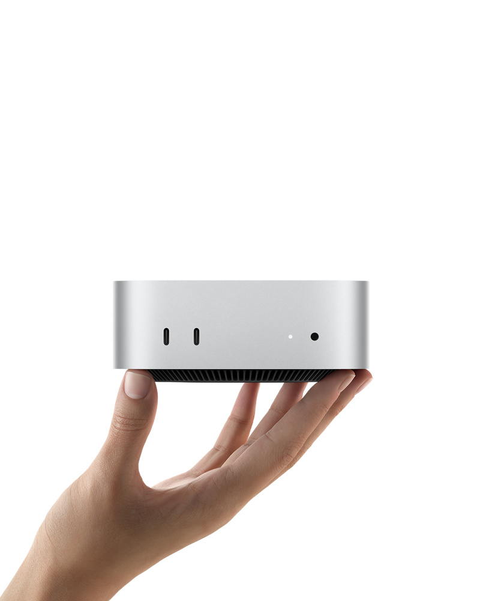

.. _mac_mini_2024:

=====================
Mac Mini 2024
=====================

2024年10月29日，苹果 **重磅发布** (对于追求性价比) 全新设计的 Apple M4芯片 Mac mini 2024:

   全新设计 Mac mini (设计类似 Apple TV)

- 有史以来最具性价比的Mac mini:

  - "满血" Apple M4: 

    - 10 核中央处理器(4 个性能核心和 6 个能效核心) 
    - 10 核图形处理器
    - 硬件加速光线追踪
    - 16 核神经网络引擎: ``38 TOPS`` (AI性能普通，不过苹果的CPU性能强劲提供了弥补和平衡) - :ref:`jetson_nano` AI性能横向对比参考 `seedstudio NVIDIA® Jetson Comparison <https://www.seeedstudio.com/blog/nvidia-jetson-comparison-nano-tx2-nx-xavier-nx-agx-orin/>`_

      - iPhone 14 Pro的A16 Bionic芯片提供了17 TOPS的AI性能
      - :ref:`hailo_ai` 为 :ref:`pi_5` 配套的AI Kit( ``Hailo-8`` )就提供了 13/26 TOPS (M.2 key售价为 580 RMB 和 1300 RMB，如果是AI HAT+型号则售价会再低一些，为580 RMB 和 900 RMB)
      - 早期的 Nano B1(4G内存)则仅仅0.5 TFLOPS (FP16性能)
      - :ref:`jetson_nano` 最新Orin Nano版本提供了 20/40 TOPS (INT8性能) (配置为4G/8G内存)
      - :ref:`jetson_nano` 最新Orin NX版本提供了 70/100TOPS (INT8性能) (配置为8G/16G内存，不过售价非常惊人，分别是 2400 RMB 和 3400 RMB，高阶版本其实已经是一台Mac Mini售价了)

    - 120GB/s 内存带宽

  - 16GB 统一内存 **起步**
  - 256GB 固态硬盘 **起步**
  - ``RMB 4499`` (教育优惠仅需 ``RMB 3749`` )

参考
=======

- `Mac mini 2024 技术规格 <https://www.apple.com.cn/mac-mini/specs/>`_ (实际规格文档可能会随着产品迭代更改，所以后续可能需要更新链接)
- `TOPS explained – exactly how powerful is Apple's new M4 iPad chip? <https://www.techradar.com/computing/artificial-intelligence/tops-explained-exactly-how-powerful-is-apples-new-m4-ipad-chip>`_
