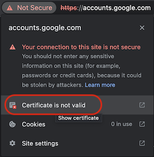
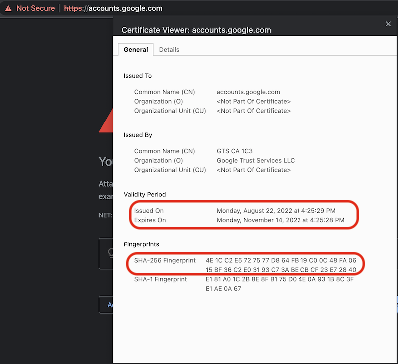

.. _macos_big_sur_gts_root_certificate:

=========================================
macOS Big Sur不支持Google GTS根证书问题
=========================================

由于我的 :ref:`mbp15_late_2013` 硬件限制，只能安装 macOS Big Sur 。我遇到一个奇怪的问题，使用了 :ref:`openconnect_vpn` 能够访问 https://www.google.com ，但是当使用 ``Sign in`` 登陆Google账号时，Safari提示出错信息::

   Safari Can't Open the Page
   
   Safari can't open the page "https:://accounts.google.com/ServiceLogin?hl=en&passive=true&continue=https://www.google.com/%3Fclient%3Dsafari&ec=GAZAmgQ" because Safari can't entablish a secure connection to the server "accounts.google.com"

并且很多google网站由于无法下载完整的页面信息导致无法正常工作，例如 https://translate.google.com

开始我以为是我VPN问题，或者是Safari浏览器问题。但是我发现使用chrome也无法访问 https://www.google.com ，原因是证书错误。在chrome中能够显示出相信错误::

   Your connection is not private
   Attackers might be trying to steal your information from accounts.google.com (for example, passwords, messages, or credit cards). Learn more
   NET::ERR_CERT_AUTHORITY_INVALID

.. figure:: ../../_static/apple/macos/macos_big_sur_google_gts_1.png
   :scale: 80

通过 chrome 的网站证书检查可以点击 ``Certificate is not valid`` :

检查证书可以看到是 2022年8月22日签发证书，注意观察 SHA-256 Fingerprints :

我找了另外一台最新的 macOS Monterey，发现同样的访问 https://accounts.google.com 则没有问题，检查证书可以看到，根证书 GTS Root R1 完全一致，并且子证书也完全一致。但是只有低版本 macOS Big Sur提示错误。

.. note::

   正当我在排查这个问题时(我已经推测是苹果公司macOS问题)，苹果发布了macOS 11.7 。果然，升级后这个问题消失了 。

GTS: Google Trust Services
==============================

Google于2017年8月推出了自有的证书颁发机构(Certification Authority)，当前作为商业CA，根证书已经获得主流浏览器的内置支持。

为了采用独立的基础架构并构建“更安全网络的基础”，Google Trust Services 允许公司发布自己的 TLS/SSL 证书，以通过 HTTPS 保护其网络流量，而不是依赖第三方证书。

参考
======

- `How do I update my root certificates on an older version of Mac OS (e.g. El Capitan)? <https://apple.stackexchange.com/questions/422332/how-do-i-update-my-root-certificates-on-an-older-version-of-mac-os-e-g-el-capi>`_ 
