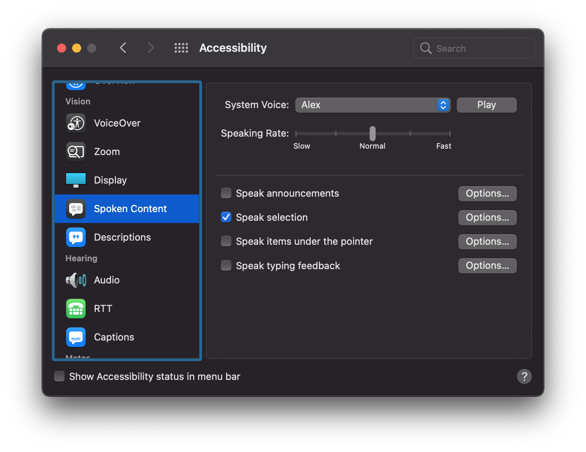

.. _macos_spoken_content:

============================
在macOS中朗读屏幕内容
============================

在我们学习 :strike:`英语` 外语的时候，总想如何能够正确朗读或者发音，查音标当然是一个方法，但是太繁琐。现代操作系统，如macOS，提供了一个内置的朗读引擎，能够以标准读音朗读屏幕内容，特别是屏幕选择内容，朗读片段非常适合语言学习。

我只懂得英语，所以主要测试英语朗读，标准(虽然略显生硬)英语读音至少能让我知晓不熟悉的单词准确发音。另外，我想学点日语，简单测试看起来也没有任何问题。可以说对于初级用户来说非常友好。

- 设置: 

  - ``苹果菜单>“系统设置”，然后点按边栏中的“辅助功能”``
  - ``点按“阅读与朗读”``
  - ``打开“朗读所选内容”``

然后，在程序中选择文字段落，然后按下 ``option+Esc`` 快捷键，就能够准确读出内容。

参考
======

- `让 Mac 朗读屏幕上的文本 <https://support.apple.com/zh-cn/guide/mac-help-cn/mh27448/mac>`_
