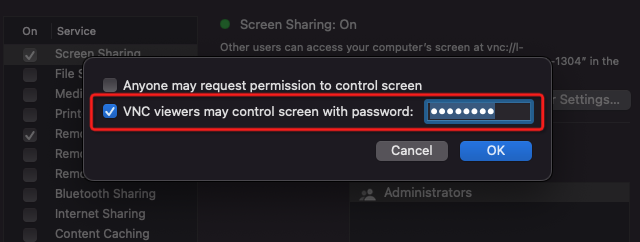

.. _macos_vnc:

==============
macOS VNC
==============

macOS内置了VNC桌面功能，分为服务器端和客户端:

- 服务器端是通过 ``System Preferences => Sharing => Screen Sharing`` 激活后提供了远程VNC访问
- 客户端是直接在浏览器地址栏中输入 ``vnc://IP`` 来访问远程服务器上的VNC

需要注意，macOS的 ``Screen Sharing`` 默认是只能自家的客户端访问，如果要提供给Linux/Winodows上标准的vncviewer客户端访问，则需要在 ``Screen Sharing`` 配置页面点击 ``Computer Settings..`` 按钮配置VNC客户端访问密码: ``VNC viewers may control scren with password``

参考
======

- `connecting to OS X remote management VNC from Linux or Windows <https://serverfault.com/questions/188018/connecting-to-os-x-remote-management-vnc-from-linux-or-windows>`_
