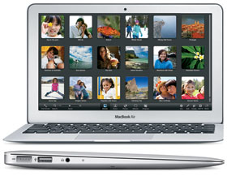

.. _mba11_late_2010:

============================
MacBook Air 11" Late 2010
============================

我的第一台MacBook是2011年2月购买的 MacBook Air 11寸, Late 2010。这是苹果推出的第二代Macbook Air，虽然不是现在流行的Retina屏幕(分辨率只有 1366x768)，但是非常轻薄，只有1.06公斤，即使放到十二年后的现在，依然属于便携笔记本中的佼佼者。

硬件规格
============

- 1.4GHz Intel Core 2 Duo processor with 3MB on-chip shared L2 cache (同型号还有一个高性能版本是 1.6GHz)
- 800MHz 前端总线
- 4GB 1066MHz DDR3 SDRAM(我选择了4G最大支持规格，同型号默认是2GB)
- 64GB固态硬盘(同型号还有升级版本是 128GB)
- NVIDIA GeForce 320M 图形处理器(使用主内存共享的256MB of DDR3 SDRAM)

这款笔记本在当时可谓超级Air，因为同时代几乎都是如同板砖一般沉重的笔记本。而且MacBook Air开创了一体式CNC加工铝合金外壳，引领了一代风潮。

我当时非常犹豫是选择11"还是13"，最后考虑便携，选择了11"。确实，后来我也发现，非高分辨率屏幕，实际上11"可能比13"更细腻一些。而且13"其实沉重了很多。

这款2010年重新设计的二代MacBook Air，设计非常成功，其外观设计整整延续了近8年，直到2018年才因为硬件制造工艺的飞跃以及苹果销售产品线变更，引入了Pro系列直方设计以及Retina高分屏。我个人非常喜欢自己购买的这代产品，当时的制造工艺也非常先进和扎实，基本硬件几乎没有损坏过(我怀疑SSD硬盘可能有些异常，所以 :ref:`macbook_sata` )。

MacBook Air (11-inch, Mid 2011) 
--------------------------------

如前所述，我购买的是 MacBook Air (11-inch, Late 2010) ，随即苹果在2011年中推出了改进版本 MacBook Air (11-inch, Mid 2011)。主要升级是处理器升级到 i5 和 i7

我的 MacBook Air (11-inch, Late 2010) 其实有一些硬件异常( :strike:`主板可能老化` ，最终验证是SSD已经无法读写导致)，所以我在淘宝上搜索发现同样的 A1370 型号的主板价格不贵，但是差异的是只有 Mid 2011 版本，也就是 i5 和 i7 版本。两者能否兼容呢? 这个问题其实有人已经提出和尝试过: `Upgrading the logic board possible? A1370 late 2010 <https://discussions.apple.com/thread/6023599>`_ :

- 需要购买一个新电池(原因是电池位置和老版本2010不同)，也就是需要买一块 mid 2011 的电池
- 需要一个新的散热器(heatsink)，也就是买一个 mid 2011 的散热器(通常主板会带上散热器)
- 最困难的问题: 蓝牙和WiFi天线的电缆不适配，因为airport天线(airport antenna)短了2英寸

  - 这个问题也不是不能解决， :strike:`购买 mid 2011 显示屏就能够轻松解决(但是投入就很大了)` 使用外接USB无线网卡: :ref:`gentoo_mba_wifi` 我采用了 ``aic8800`` 芯片的 ``AX5L`` (AX300)无线网卡，实践是能够很好满足Linux运行的 

综上来看，如果要使用 mid 2011 主板，实际上需要同时更换 :strike:`显示屏` ( `Is Mid 2011 MacBook Air (11") display compatible with Late 2010? <https://www.ifixit.com/Answers/View/67566/Is+Mid+2011+MacBook+Air+(11%22)+display+compatible+with+Late+2010>`_ ) **电池** ， :strike:`差不多把整台主机都更换了，非常不经济` 我准备调研一下是否替换

总的来说，mid 2011主板是可以用于 late 2010主机的，只是较新的主板设计略有不同，连接器被移动了，所以需要使用不同的电缆(恐怕难以找到)

.. note::

   考虑到购买后的组装风险(购买屏幕不太现实)以及大量的资金投入(内部几乎全换)，我放弃这个方案

操作系统
============

- 随机操作系统: Mac OS X Snow Leopard
- 最高兼容操作系统: macOS High Sierra

.. _mba11_late_2010_win10:

起死回生安装Windows10
======================

在经过多次拆装和尝试，我偶然验证发现，原来 :ref:`install_win10_on_mac_with_boot_camp` 创建的 :ref:`win10` 启动安装U盘，能够通过 :ref:`macos_recovery` 启动按住 ``option(alt)`` 键启动安装。我简单尝试了一下:

- 安装过程有一个比较奇怪的地方是键盘无法正确识别，此时无法使用数字键(而只能输入数字键shift以后的特殊符号)，这导致安装过程有点折腾(很难调整硬盘分区以及安装时连接到无线网络)，不过通过一些变通方法还是能够完成安装的: **解决了** :ref:`fix_macbook_stuck_shift`
- 安装完成后键盘输入就恢复正常了，此时连接到无线网络后，Windows会自动开始安装升级包，并且包含了监测到的硬件的驱动(例如NVidia显卡)

.. note::

   实际上我想明白了，之所以无法完成 ``internet recovery`` 以及开机时安装 ``option`` 键选择启动磁盘，是因为笔记本的 ``shift`` 键卡住了(无法正常)；而上面偶然发现能够从 :ref:`win10` 启动安装U盘启动，是因为当时我更换了笔记本SSD存储(空白)，此时没有系统启动磁盘，MacBook Air会尝试从U盘启动才实现。之前没有成功是因为当时笔记本内部SSD上有 :ref:`macos` 在，虽然因为SSD磁盘故障IO异常，但是能够非常缓慢读取反而导致无法从U盘启动。

很遗憾，我在升级补丁时候，重启了一次操作系统，结果发现 :ref:`win10` 再也无法正常启动，所以我不确定是不是我升级安装导致的问题。

不过，上述至少验证了 :ref:`win10` 是能够在 ``MacBook Air 11" Late 2010`` 上安装的，而且我的旧笔记本实际上除了SSD磁盘故障之外其他尚好，也为我后续重新安装Linux提供了线索支持。

我准备从新开始一次 :ref:`lfs` 探索，在古老的 **14年前** 笔记本上编译安装一个轻量级的Linux工作环境，折腾好玩。

参考
======

- `MacBook Air (11-inch, Late 2010) - Technical Specifications <https://support.apple.com/kb/sp617?locale=en_US>`_
- `MacBook Air (11-inch, Mid 2011) - Technical Specifications <https://support.apple.com/kb/sp631?locale=en_US>`_
- `WikiPedia: MacBook Air <https://en.wikipedia.org/wiki/MacBook_Air>`_
- `Apple MacBook Air "Core 2 Duo" 1.4 11" (Late '10) Specs <https://everymac.com/systems/apple/macbook-air/specs/macbook-air-core-2-duo-1.4-11-late-2010-specs.html>`_
- `Upgrading the logic board possible? A1370 late 2010 <https://discussions.apple.com/thread/6023599>`_
