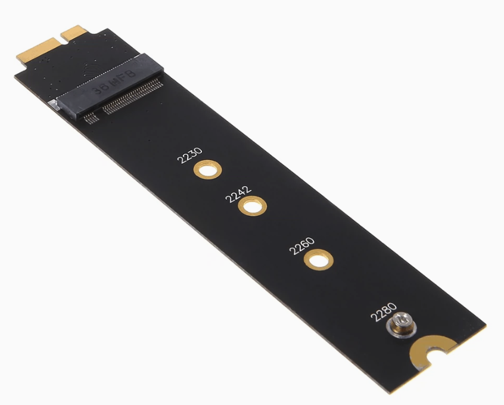
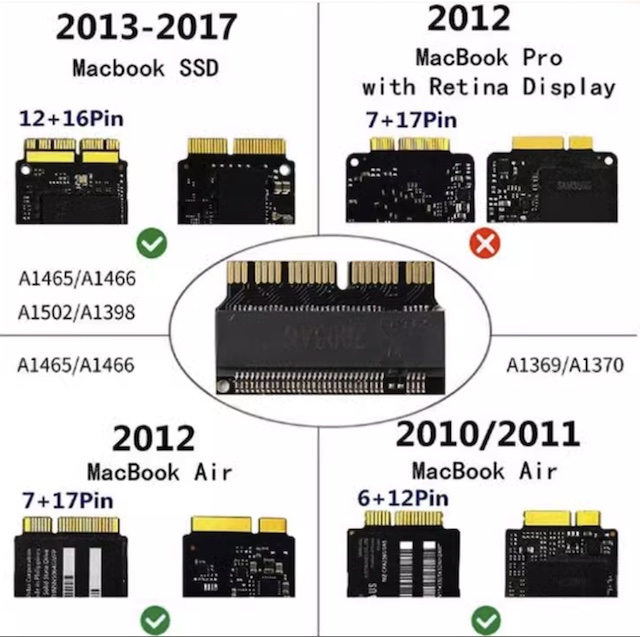

.. _mba11_late_2010_update_sata:

=============================================
升级MacBook Air 2010存储SATA硬盘(m.2转接)
=============================================

:ref:`mba11_late_2010` 的存储还是SATA时代的技术，和 :ref:`mbp15_late_2013` / :ref:`mba13_early_2014` 不同，不能 :ref:`macbook_nvme` 方式升级，必须购买特定的早期SATA固态硬盘。

苹果的产品接口总是独树一帜，虽然底层其实也是采用业界标准的SATA传输协议，但是就是给整出一个特别的接口，和别家完全不兼容。好在，市场有需求总有产品来满足，实际上第三方苹果接口转 :ref:`m2` 的转接卡非常廉价，只是需要注意:

- 2010-2012 年代的苹果产品SSD存储都是SATA协议，只能购买淘宝上所谓NGFF固态硬盘(实际上这种叫法不准确，NGFF是接口标准，其实就是 :ref:`m2` 。底层传输协议分为SATA和 :ref:`nvme` 。不过，大家似乎约定俗成把M2接口SATA协议的SSD称为 NGFF协议硬盘，而区别于 :ref:`nvme` 协议硬盘)
- 2013年代开始，MacBook产品处于SATA过渡到NVMe阶段，此时笔记本官方硬件是SATA SSD存储，但是可以通过升级Firmware(升级操作系统)来支持 :ref:`macbook_nvme`

为了能够让我的 :ref:`mba11_late_2010` 焕发青春(我想在外出时携带廉价轻巧的设备，以降低身心负担)，2023年618，我决定尝试升级 :ref:`mba11_late_2010` :

- `Ulove优乐 10-11 MacBook Air (NGFF) 固态硬盘转接卡 <https://detail.tmall.com/item.htm?_u=i1k88vu69b8>`_

- 三星 CM871a 512GB MZ-NTN5120 (注意，这款是 :ref:`m2` SATA存储，非 :ref:`nvme` )

.. figure:: ../../_static/apple/macos/samsung_cm871a_m2.jpg
   :scale: 40

.. note::

   由于我的 :ref:`mba11_late_2010` 有点异常，无法从USB接口启动，所以我采用将 ``三星 CM871a 512GB MZ-NTN5120`` 存储(SATA)安装在 奥睿科（ORICO）M.2 NVMe/SATA双协议移动硬盘盒(主控芯片是 `Realtek RTL9210B-CG <https://www.realtek.com/en/products/connected-media-ics/item/rtl9210b-cg>`_ ) 中，在第三方主机上作为外接磁盘来安装 :ref:`gentoo_linux` ，然后再安装到 :ref:`mba11_late_2010` 尝试启动: :ref:`clone_gentoo` 就是我的操作系统移植实践

安装
=======

性能测试
===========

