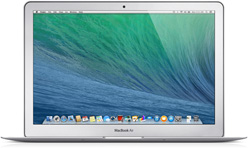

.. _mba13_mid_2013:

============================
MacBook Air 13" Mid 2013
============================

我的第二台MacBook是MacBook Air 13寸, Mid 2013。配置不高，是公司提供的工作电脑，按照阿里的IT规定，使用3年以后可以回购，所以现在是我的 :strike:`备用电脑` 外出携带 :ref:`mobile_work` 电脑(相对较轻)

硬件规格
============

- 1.4GHz dual-core Intel Core i5 (Turbo Boost up to 2.6GHz) with 3MB shared L3 cache
- 8GB 1600MHz DDR3 SDRAM
- 128GB固态硬盘(公司配置的是最低乞丐版)
- 显卡: Intel HD Graphics 5000 显存 1.5GB

  - 外接显示器最高分辨率 2560x1600

- 屏幕: 13.3-inch 分辨率1440x900

- 重量: 1.35kg

- 操作系统: 随机Mac OS还是拟物版本 Mavericks ，不过最高兼容 macOS Big Sur

.. note::

   为了能够让硬件充分发挥，我采用 :ref:`gentoo_linux` 来实现

参考
======

- `MacBook Air (13-inch, Mid 2013) - Technical Specifications <https://support.apple.com/kb/sp678?locale=en_US>`_
