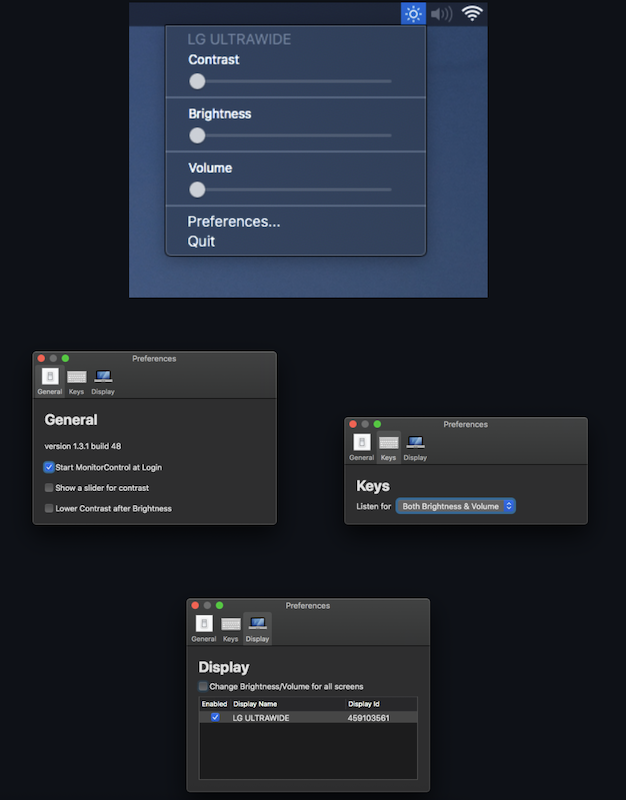

.. _monitorcontrol:

===========================
macOS显示器亮度和音量控制
===========================

我在 :ref:`pi_400_4k_display` 实践时选择购买了 AOC U28P2U/BS 28英寸4K显示器，这是我第一次使用4K显示器，也发现现代显示器提供了一些有趣且游有用的功能：

- HDMI和DP显示输入包含了数字音频信号，所以显示器额外提供了一个3.5mm耳机插孔，这就方便我们外接专业的耳机或者音箱来实现视听体验
- 提供2个HDMI和1个DP接口，并且支持同时接入两路信号共用屏幕(分屏)，也就是可以两台电脑同时共用一个显示器，结合 :ref:`synergy` 软件，可以实现非常巧妙的多机工作桌面
- 提供一个快充USB接口和2个USB3.2接口(现在需要充电的移动设备实在太多了，这不失一种比较方便的稳定电源)

我在使用4K显示器遇到一个问题，就是无法控制音量。在 :ref:`xfce` 的Linux桌面提供了对外接HDMI音量的控制，不过使用比较繁琐，需要到设置界面中操作。而在macOS上，则根本没有提供HDMI/DP数字输出音量的控制，需要到播放程序的音量控制中一一调整，非常麻烦。

无法调节外接显示器的音量是因为HDMI、DisplayPort 和 Thunderbolt 等接口传输的都是带有固定音量的数字音频信号，外接显示器的音量是在显示器内部实现的数字信号转模拟信号，这部分没有受到macOS控制。

幸好，现代显示器都支持 Display Data Channel(DDC)协议，这个协议是计算机显示器和显卡之间的数字通讯协议，这样计算机就能够调整显示器的参数，如亮度和对比度。

开源的 `GitHub MonitorControl <https://github.com/MonitorControl/MonitorControl>`_ 工具，提供了通过DDC协议调整显示器参数(包括亮度、对比度和声音)的功能，由于是软件控制，可以结合到macOS的键盘内置调节键功能上，使用非常方便。这也解决了传统显示器菜单调整的繁琐操作问题，可以说是现代显示器配套的必备macOS软件，强烈推荐。

安装
=======

- 通过 :ref:`homebrew` 安装::

   brew install --cask monitorcontrol

- 使用非常简便，启动以后就可以通过状态栏上的 ``亮度`` 图标进行操作，如上截图。建议在 ``Perference`` 中开启登录时启动以及启用对比度调整。这样就无需再使用显示器蹩脚的按钮调整功能了。

参考
======

- `HDMI音量控制 <http://bbs.pcbeta.com/forum.php?mod=viewthread&tid=1831208>`_
- `GitHub MonitorControl <https://github.com/MonitorControl/MonitorControl>`_
