.. _oclp_macos:

================================================
使用OCLP(OpenCore Legacy Patcher)安装最新macOS
================================================

我的 :ref:`mbp15_late_2013` 已经使用了12年了，期间应为原装SSD存储损坏，我更换了 :ref:`samsung_pm9a1` 第三方SSD，虽然初步测试没有遇到问题(不影响休眠)，但是我最近一次重新安装macOS Big Sur时，意外发现系统启动非常缓慢、应用程序启动慢、编译 :ref:`sphinx_doc` 缓慢，虽然多次尝试 :ref:`fix_macbook_slow` 并最终偶然恢复，但是推断下来的原因是 :ref:`samsung_pm9a1` 早期firmwarm在非原生系统下会导致严重的性能衰减

:ref:`mbp15_late_2013` 最大的问题是无法安装最新的macOS操作系统，由于硬件已被苹果列为淘汰产品，所以苹果官方限制最高只能安装macOS Big Sur (11)。这导致很多软件已经无法运行，例如我非常需要的 :ref:`homebrew` 以及 :ref:`obsidian` 。

工作原理
==========

OCLP的核心工作发生在系统启动之前：

- 引导层 (OpenCore)： OCLP 会生成一个定制化的 OpenCore 引导程序。它会驻留在 U 盘或硬盘的 EFI 分区。当 Mac 启动时，它首先加载 OpenCore，OpenCore 会向 macOS “撒谎”，伪装 :ref:`mbp15_late_2013` 是一台支持 macOS 15 的较新机型（比如 MacBook Pro 15,1）。
- 内核层 (Kexts)： macOS 15 删除了大量老旧硬件的驱动（如你的 Haswell 显卡驱动、旧款 Broadcom 网卡驱动）。OCLP 会在内核加载阶段，强行注入这些被苹果删除的驱动（Kexts）。
- 应用层 (Root Patching)： 系统进入桌面后，OCLP 的 App 会提示你安装 Root Patches。这是为了修改系统受保护的文件，以恢复非原生的图形加速（Metal 支持）。

``OpenCore Legacy Patcher 2.0.0`` 支持在以下型号上运行Sequoia(macOS 15):

.. figure:: ../../_static/apple/macos/oclp_sequoia.png

   OCLP支持运行Sequoia(macOS 15)的硬件型号

**当前主要的硬件支持障碍是T2安全芯片** 导致安装过程panic

**当前不支持iPhone Mirroring功能** 原因也是因为该功能依赖于T2安全芯片，另外 **不支持Apple Intelligence** 是因为只有Apple Silicon提供NPU，所以OLCP无法支持这个需要硬件的功能。

Mac Pro 2008(MacPro3,1) 或 Xserve 2008(Xserve2,1)由于使用了超过4个 CPU核心，导致Sequoia panic，所以OpenCore Legacy Patcher会自动禁止多余的Cores。

使用
======

不需要先安装 Big Sur。OCLP 支持“跨代直接安装”:

准备阶段（在任何一台 Mac 上）
------------------------------

- `下载 OCLP App <https://github.com/dortania/OpenCore-Legacy-Patcher/releases>`_ 并运行

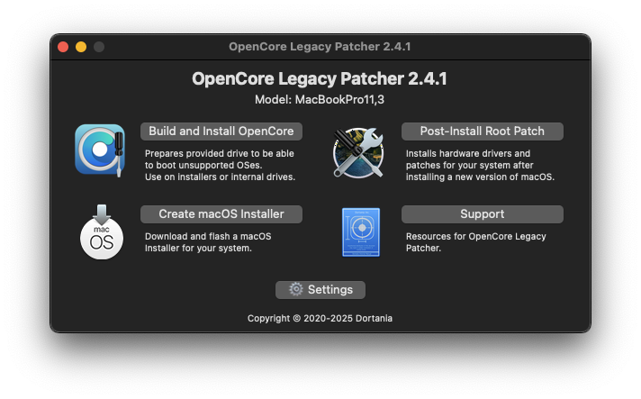

- 在 OCLP 菜单中选择 "Create macOS Installer"。它会自动从苹果官网下载完整的 macOS 15 Sequoia 镜像(也提供了从已经下载的 macOS Installer构建)

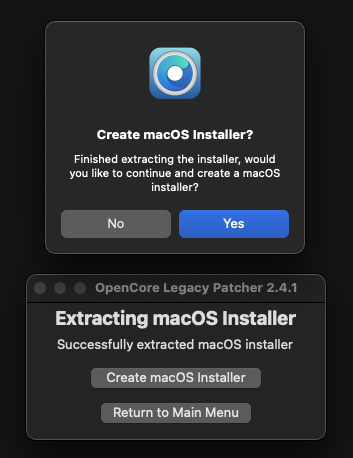

这里可以选择你希望安装的目标版本(从 Monterey 12.7.6 到 Sequoia 15.7.5)

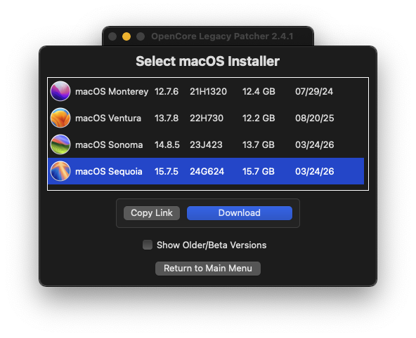

下载Installer完成后会自动展开，如果一切正常会看到提示下一步 ``Create macOS Installer`` :

然后提示 "Select macOS Installer" (如果你下载了多个版本，这里就会看到已经下载的不同macOS Installer；不过，我只下载了Sequoia，所以这里只看到一个选项):

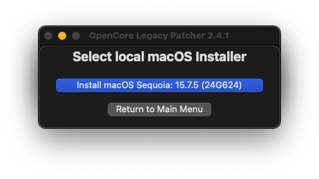

- 插上一个 32GB+ (如果准备安装旧版本macOS可能不需要这么大容量，但是Sonoma和Sequoia的最新版本已经证实需要超过16GB空间)的 U 盘，OCLP 会将镜像写入 U 盘

点击上面 "Select macOS Installer" 对话框中的 "Install macOS Sequoia" 按钮，此时会有安全提示是否允许 ``OpenCore-Patcher`` 访问移动卷，请点击允许 ``OK`` :

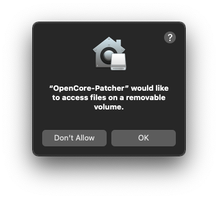

此时再在弹出的 "Select local disk" 对话框中选择移动U盘( **U盘中所有数据会被抹除** )

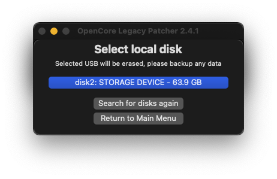

这里会提示警告数据抹除，点击 ``Yes`` 确认

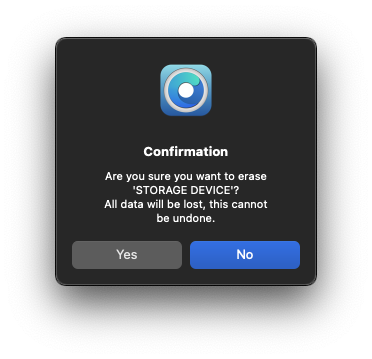

这个创建U盘数据的过程时间很长，需要30+分钟:

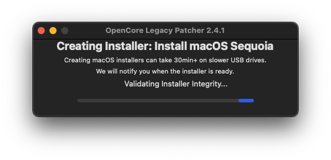

完成后会提示成功，并询问是否在这个U盘上创建OpenCore，如果你就是在本机安装这个新版本macOS，可以选择 "Yes" ，如果你是在其他Mac电脑上安装，就选 "No" ，回到主菜单(就可以在另外的目标主机上执行下一步"构建引导器")

构建引导器（关键步骤）
------------------------

- 在 OCLP 点击 "Build and Install OpenCore" (我是在上一步直接点击确认在U盘创建OpenCore，所以界面稍微有点不同)

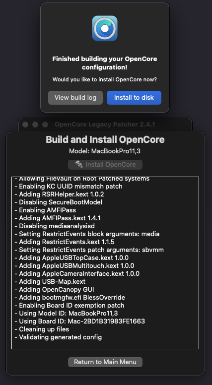

- 目标选择： **选择 U 盘** （ ``不是硬盘`` ）

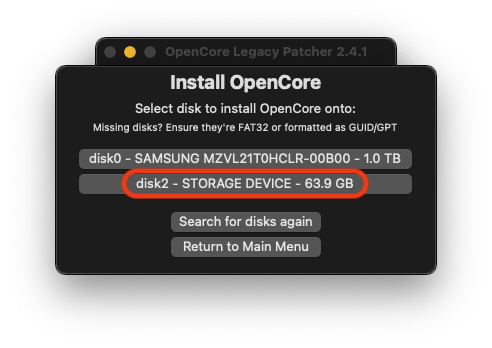

- 会在 U 盘里创建一个 EFI 分区，里面放着伪装 :ref:`mbp15_late_2013` 硬件的配置

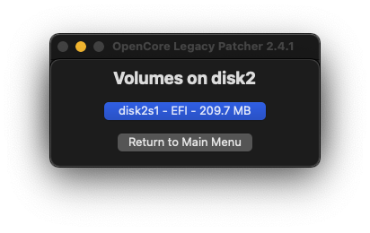

如果要开始安装，就在接下来的 "Reboot to apply?" 提示框点击 "Reboot" ，否则点 "Ignore" 则结束OpenCore安装操作(我选Ignore是因为我更换 :ref:`mbp15_late_2013` 硬盘，并且从头开始全新安装系统)

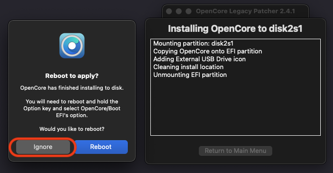

启动与安装
--------------

- 将 U 盘插回 :ref:`mbp15_late_2013`
- 开机按住 Option (⌥) 键
- 首先选择图标为 OpenCore 的 "EFI Boot"
- 然后屏幕会闪一下，再次出现启动菜单，此时选择 "Install macOS Sequoia"

最后的补丁（进入系统后）
------------------------------

.. note::

   我在这一步遇到了无法安装补丁的问题，原因就是驱动补丁都是通过GitHub下载的。由于GitHub被GFW屏蔽，这步安装会失败。解决的方法是采用 :ref:`clash-verge-rev` 来使得 OCLP 的核心(python编写)能够通过tun来访问 :ref:`ssh_tunneling_dynamic_port_forwarding` 构建的socks5代理。只要能够正确翻墙，这步补丁安装就会顺利完成，并最终获得流畅的shying体验

- 系统安装完成后进入桌面。此时因为没有显卡驱动，你会感觉非常卡顿（没有动画，窗口撕裂）
- 运行系统内自带的 OCLP App，它会自动检测到你的硬件，并提示 "Post-Install Root Patch"
- 点击开始安装补丁，重启后，显卡加速、Wi-Fi 等功能就会恢复正常

一些调整
==========

使用OCLP在古早的Mac设备上运行最新的macOS还是有一些硬件压力的，主要是缺乏现代的Metal3图形加速，所以需要 :ref:`oclp_macos_firefox` 。此外，建议做一些图形显示相关的优化设置(降低要求):

- :ref:`mbp15_late_2013` 屏幕显示分辨率是是 2880x1800(220 ppi)，为降低渲染压力，可以采用一半的缩放(1440x900 HiDPI)，这样显卡负担极低，只需要把1个像素分配给4个物理像素，渲染完全是对齐的。

  - 我实际选择了看起来更为舒服的 ``1680x1050`` (需要GPU先渲染出2倍大小虚拟画布，然后再采用 **重采样算法（Downscaling）** 将画面压缩、像素插值，塞入2880x1880屏幕，所以显卡对非整数倍的像素缩放计算，会导致GPU的光栅单元(Rasterization)持续处于工作状态
  - GPU硬件内置了专门用于 2D 图像缩放的硬件标量器（Hardware Scaler），所以上述实时缩放是硬件电路完成，负载还是可以承受的

- 开启“减弱动态效果”与“降低透明度”（强烈推荐）

  - 系统设置 -> 辅助功能 -> 显示
  - 勾选 ``减弱动态效果 (Reduce Motion)``
  - 勾选 ``降低透明度 (Reduce Transparency)``

.. note::

   我在外接的4k显示器 AOC U28P2G6B（物理分辨率为 ``3840x2160`` ）采用了28寸4K显示屏经典的 ``2560x1440``

   需要注意 :ref:`mbp15_late_2013` 只有雷雳接口输出的显示才支持60Hz刷新率

参考
======

- `OpenCore Legacy Patcher Documentation <https://dortania.github.io/OpenCore-Legacy-Patcher/START.html>`_
- Google Gemini
