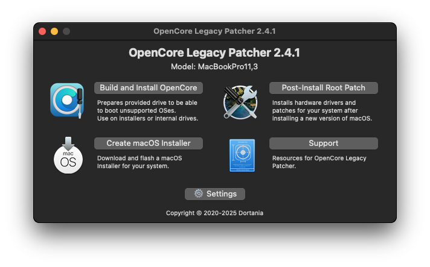
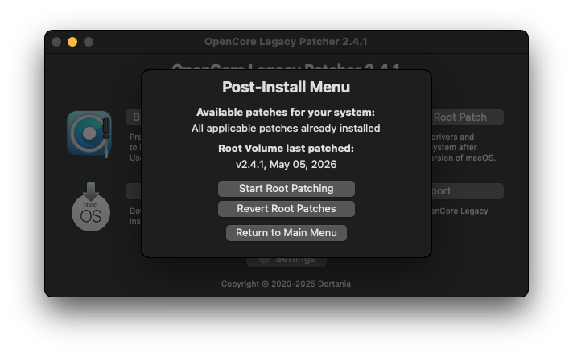
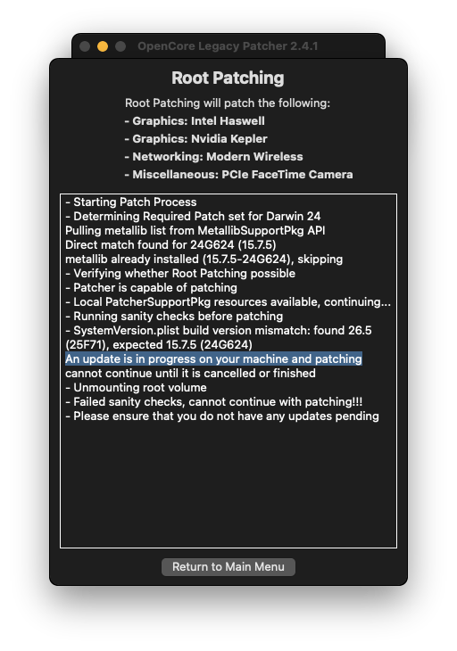

.. _oclp_macos_clear_silent_update:

=============================
OCLP安装macOS后清理静默更新
=============================

在使用了一段时间 :ref:`oclp_macos` 之后，我偶然发现macOS操作系统悄悄地下载了最新的macOS 26升级包，并提示我升级。考虑到OCLP只兼容macOS 15，升级到官方未声明支持的高版本macOS 26会导致驱动问题，所以我选择了忽略提示。

但是没有想到的是，偶然的一次重启，突然间OCLP加持下的macOS图形非常缓慢起来，明显地能够看到，当播放YouTube视频时， ``WindowServer`` 消耗了 150%的CPU资源，而此时GPU却显示0%。这表明OCLP驱动没有加载成功。

当我尝试重新执行OCLP ``Post-Install Root Patch`` :

却意外发现提示 ``An update is in progress on your machine and patching`` :

为何会提示有一个更新正在进行中呢？

突然想到之前没有进行macOS升级，但是实际上系统已经下载了一个更新软件包在本地，这或许也是导致启动时OCLP误判断环境导致无法加载驱动的原因。可以看到错误日志中有找到了 ``26.5(25F71)`` 版本不一致的错误:

.. literalinclude:: oclp_macos_clear_silent_update/oclp_post-install_root_patch_error.log
   :caption: 日志显示发现了 26.5 (25F71) 版本冲图

.. note::

   macOS 的更新分为两阶段:

   - 第一阶段是在系统后台下载并把新系统的核心文件写入临时挂载区（此时 SystemVersion.plist 已经被提前改写）
   - 第二阶段是重启进入黑屏进度条完成物理替换

清理macOS 的静默更新缓存
=========================

- 执行以下命令清除本地下载的缓存文件:

.. literalinclude:: oclp_macos_clear_silent_update/clear
   :caption: 清理本地更新标志

.. note::

   实际上我发现本地其实还没有完整下载macOS 26的更新包，但是在 ``/Library/Updates/`` 目录下已经默默下载了 ``ProductMetadata.plist`` 等文件，大约占用了200+ MB，这个占位使得OCLP误判了版本会导致驱动无法加载。

.. warning::

   时间比较巧，正好苹果后续又推出了 15.7.7 的更新包可以用来替代macOS 26，所以我最终采用了官方的更新通道，将系统更新到 macOS Sequoia 15.7.7

   更新完成后，重新执行一遍 OCLP ``Post-Install Root Patch``
