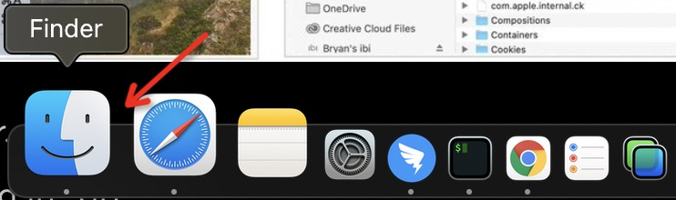
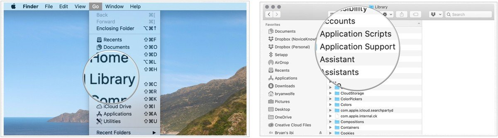

.. _restore_launchpad:

======================
修复Launchpad
======================

最近不知道为何，可能是多次切换扩展显示屏，意外发现Launchpad的图标不见了:

虽然依然可以通过Finder的applications目录中应用图标来启动程序，但是毕竟非常不便。

reset Launchpad
=================

修复方法:

- 启动 ``Finder``
- 按住 ``Option`` 键然后点击 ``Go`` 菜单
- 按住 ``Option`` 键不要放开，此时会看到下拉的 ``Go`` 菜单中多了一个 ``Library`` 项(放开 ``Option`` 键则该菜单项消失)，请选择 ``Library`` 
- 打开 ``Application Support`` 子目录

- 点击 ``Dock`` 目录
- 删除这个 ``Dock`` 目录下所有 ``.db`` 文件

在我的实践中，我发现 ``Dock`` 目录并不存在，这就是为何我的系统看不到 Launchpad 图标原因？

参考
======

- `How to reset Launchpad on your Mac <https://www.imore.com/how-reset-launchpad>`_
