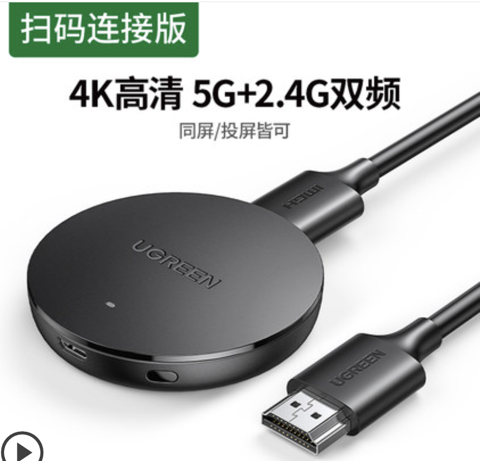

.. _airplay_ugreen:

====================
绿联无线投屏AirPlay
====================

为实现 :ref:`mobile_work` ，我考虑 :ref:`android_mobile_work_solutions` 相同，分别从有线和无线两种方式来扩展 :ref:`iphone` 的移动办公能力。

对于无线投屏功能，iOS从很久以前就实现了 :ref:`airplay` 功能，可以通过苹果系列硬件，如MacBook(macOS)或者Apple TV实现屏幕镜像功能，对于小屏幕手机可以提供需要文字交互能力的扩展。例如，可以使用 iOS 上一些生产力工具，实现远程服务器登陆，完成开发和维护工作。

第三方硬件也提供兼容 AirPlay 的能力，可以用比较低廉的价格实现 iPhone 投屏功能。例如， 我购买了 ``绿联无线投屏器`` 

使用体验
==========

- 将 ``绿联无线投屏器`` 的HDMI接口连接到显示器或者电视上，并将USB(micro USB或者type-c USB)口连接到5V接口(通常显示器或电视机上都有type-A插口)提供电力

- ``绿联无线投屏器`` 初始设置是通过蓝牙来完成的: 这点我倒是没有想到，在购买之前我还疑惑如何能够将投屏器连接到局域网

通过微信扫描显示屏上的二维码，就可以启动一个微信小程序来设置手机和投屏器的蓝牙配对，进而对投屏器设置连接无线局域网的参数配置。这个设置方法非常巧妙方便，是一个非常好的产品设计，值得借鉴。

- 完成无线连接之后，设备会自动在局域网按照 AirPlay 协议广播设备存在，这样通过iPhone手机端的 ``Screen Mirroring`` 就很容易找到 ``绿联无线投屏器`` 并完成镜像投屏

- 通过显示器放大之后的iPhone屏幕显示，可以清晰阅读，运行 AppStore 上提供的 SSH 客户端，就能够实现远程服务器运维

.. note::

   虽然 ``绿联无线投屏器`` 产品说明说兼容安卓手机，但是我尝试 :ref:`pixel_3` 原生Android 12系统，镜像投屏功能是无法找到设备的。这个问题尚未得到解决，后续再做探索

工作思路
==========

我个人构想通过外接蓝牙键盘，可以实现基础的运维开发工作，但软件体系需要再摸索。此外，我更看好 :ref:`android_mobile_work_solutions` ，因为Android底层提供了Linux更为开放，能够实现很多内置在Android系统的 :ref:`python` 或 :ref:`nodejs` 开发，可以作为一个移动工作站。

在 iPhone 上实现移动办公，限制较多，我可能仅仅作为后备选择。

参考
=======

- `绿联无线投屏器连接手机电视操作方法丨CM242 <https://www.lulian.cn/news/382-cn.html>`_
