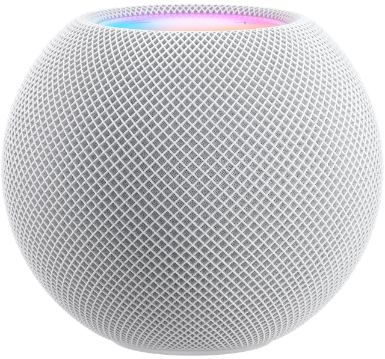

.. _homepod_mini:

=====================
HomePod mini
=====================

HomePod mini是苹果于2020年底推出的新品，被誉为年度最值得购买苹果产品:

- 小巧的智能音箱，融合在苹果iOS生态中，提供尚可的音质
- 价格低廉(只需749元)堪称苹果最实惠产品

由于是智能设备，能够升级系统，并且能够提供开发功能，后续应该有很多可玩之处。

.. figure:: ../../_static/apple/music/homepod_mini_overside.png
   :scale: 50

技术规格
==========

.. figure:: ../../_static/apple/music/homepod_mini_inside.jpg
   :scale: 40

- 全频驱动单元和双无源辐射器，可呈现浑厚低音和清澈高音
- 定制声波导，可呈现 360 度环绕声场
- 四麦克风设计 - 我理解这是为了能够在嘈杂环境中通过机器学习识别人声
- 能够结合Apple Music订阅播放
- 支持 隔空播放 iPhone、iPad、iPod touch 或 Mac 上音频内容

使用体验
==========

HomePod mini刚推出时我就购买了一个黑色织物版本，主要用来听Apple Music中的一些老歌和古典音乐，感觉在办公桌面上听感还可以。不过，刚开始使用时，经常困扰于 ``音频切换`` ，手机一靠近音箱就自动震动切换。不过，苹果确实是一家软硬件结合公司，通过软件不断迭代改进，升级到 15.2 之后，切换已经非常灵巧方便。

参考
=====

- `HomePod mini技术规格 <https://www.apple.com.cn/homepod-mini/specs/>`_
