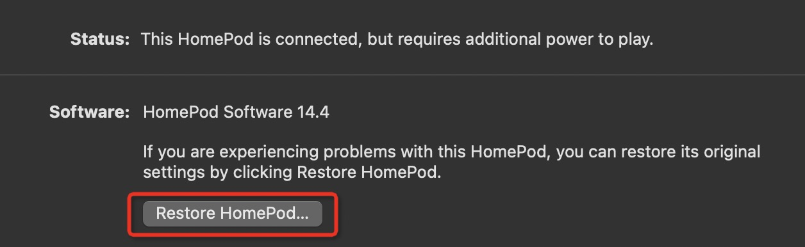
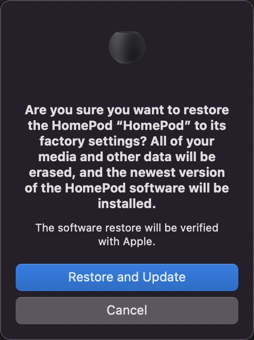

.. _reset_homepod_mini:

============================
重置HomePod mini
============================

长时间没有使用 HomePod mini，并且最近调整网络，采用了 :ref:`airport_express_with_dnsmasq_ics` 方式构建无线网络。所以，再次开启HomePod mini之后，发现手机无法连接设备，也不能设置。

参考Apple 官方帮助 `Reset HomePod <https://support.apple.com/en-us/HT208244>`_ 有3中方法reset HomePod:

- 如果 ``Home`` app能够连接和使用设备，则可以通过 ``Home`` app来reset设备:

  - 在 iPhone, iPad, iPod touch 的 ``Home`` app 中，按住 HomePod 图标保持不放，或者在 Mac主机的 ``Home`` app中，双击 HomePod 图标，然后滚动到底部，点击 ``Remove Accessory``
  - 点击 ``Reomve`` 删除设备

- 如果不能从 ``Home`` app 中完成remove HomePod设备，则采用直接按住 HomePod 顶部来reset回出厂设置:

  - 拔掉 HomePod 或 HomePod mini的电源，等待10秒钟，然后重新插回电源
  - 等待10秒钟，然后将手指放在 HomePod 的顶部并保持不动
  - 当设备的白色指示光转为红色，按下手指
  - Siri会提问是否将HomePod reset，当听到 ``3声哔`` 时，放开手指

- 使用Mac或PC reset HomePod (我采用这个方法):

  - 将HomePod的 USB-C 电缆插入电脑接口
  - 等待一会儿，此时HomePod mini顶部指示灯是橙黄色；我使用 macOS，可以在 Finder 窗口看到设备连接，然后点击 HomePod 设备
  - 此时可以看到可以 ``reset`` HomePod mini 提示, 然后确认 ``update and reset`` 设备:

完成reset之后，将HomePod mini重新连接到电源，就可以看到重启后手机再次提示Setup过程，就可以重新配置HomePod mini。
