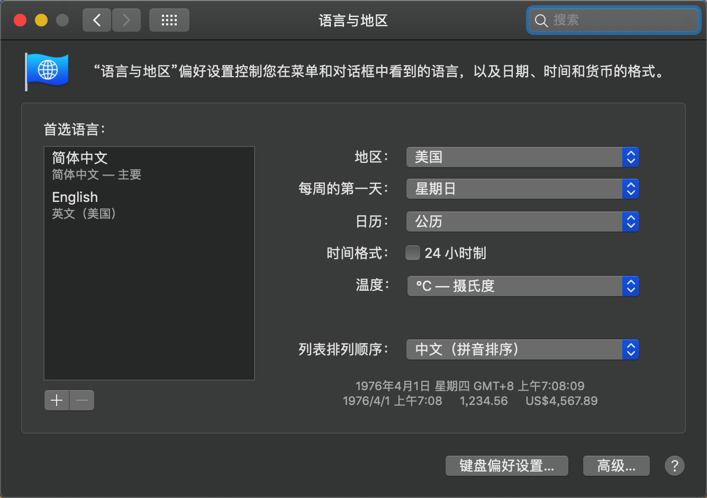

.. _apple_news_in_cn:

==========================
在中国大陆使用Apple News
==========================

.. note::

   通过 :ref:`apple_one` 订阅，可以同时获得苹果的6个服务，如果购买 Premier plan ，每月 29.95 美刀，可以家庭共享并且获得 2T icloud 存储。通过 Apple TV 和 Apple News ，可以打开英语世界的大门...

准备和加载Apple News
=====================

由于中国政府限制，Apple TV和Apple News都无法进入中国大陆，特别是Apple News，如果没有特定区域设置和VPN翻墙，甚至连应用程序都无法下载和打开。所以，你需要按照本文操作建议，进行一些准备工作:

- 一个支持 Apple News 服务区域的 Apple ID（如美国） - 请google申请美区账号教程，想办法注册一个美区Apple ID

  - 首先需要调整 系统的「设置」>「通用」>「语言与地区」的「地区」需设置成「美国」，否则下载Apple News后应用会消失
  - 使用美区Apple ID登陆Apple Store，此时 下载 Apple News

规避「Apple News isn’t supported in your current region.」
=============================================================

对于Apple TV，使用非常简单，只要你在美区购买了服务，只要不退出美区账号，你就可以随时随地观看Apple TV+ 视频。但是，Apple News涉及到各国(中国)新闻限制，苹果配合审查，做了较强的校验，导致在手机上，即使开了VPN也无法使用，会提示 「Apple News isn’t supported in your current region.」。

这个错误原因是因为Apple News 会检测运营商信息，所以只要你手机使用中国移动运营商网络(中国移动、中国联通、中国电信)，就会立即退出程序。

解决的方法是:

- 首先开启手机 「飞行模式」
- 然后打开 Wi-Fi ，是的，在飞行模式下虽然不能使用移动4G/5G，但是依然可以使用局域网
- 打开苹果内置的地图应用：这步非常关键，因为只有地图应用刷新或等待片刻使左下角「高德地图」字样消失(地图应用依然可以定位，但是此时会切换到美国的TomTom地图)，才能够打开Apple News应用
- 打开Apple News，此时该应用就检测不到本地运营商信息，就会根据VPN翻墙访问的美国IP地址来判断 ``current region`` ，就能够提供美国的 Apple News+ 服务

.. note::

   综上，由于必须开启飞行模式，所以手机使用 Apple News 并不是最佳选择。最好的方式是使用 iPad mini ，可以获得最佳的阅读体验，并且不会受到中国运营商屏蔽干扰。

当能够正常使用Apple News之后，可以尝试关闭 「飞行模式」，似乎在一定时间内Apple News仍然可以正常运行，不会持续检查region信息。

macOS版本News
==============

- 「系统偏好设置 > 语言与地区」中将「地区」修改至「美国」

- 开启VPN翻墙

- 打开系统自带地图，通过滚轮缩放等方式（甚至直接对其进行代理）使其切换到海外 TOMTOM 版（左下角不出现「高度地图」字样）方可正常使用 News 应用

- 如果在做了上述两步后或使用一段时间后出现「Feed Unavailable」、「No Stories」等错误

  - 需要到「系统偏好设置」>「安全性与隐私」>「定位服务」列表中的「系统服务」，点击「详细信息」
  - 点击「重要地点」右侧的「详细信息」
  - 此时如无意外会在左侧列表有一些地点，点击右下角的「清除历史记录」将其清除

参考
======

- `解锁 Apple News 区域限制 <https://divineengine.net/unlock-apple-news-regional-restrictions/>`_
- `在中国如何使用 Apple News？ <https://blog.shuziyimin.org/211>`_
