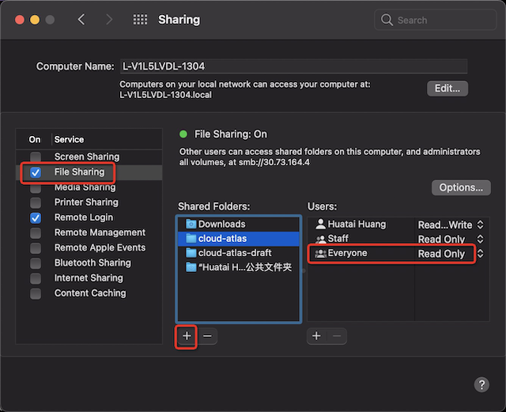

.. _macos_share_file:

=================
macOS共享文件
=================

我在日常工作中同时使用2台MacBook Pro笔记本，采用 :ref:`synergy` 来共享键盘和鼠标，这样可以在一台主机上同时操作2台主机。不过，为了能够统一数据(其实也可以通过rsync准实时同步)，我主要将日常文档存放在随身笔记本上，通过ssh方式远程登陆笔记本进行文档撰写和开发工作。

不过，通过 synergy 共享键盘鼠标，虽然也能够共享剪贴板中简单文字，但是无法共享图片和诸如word之类的文档，所以跨主机操作依然有些不便。我想到的就是在主文档MacBook Pro笔记本上开启共享文件，这样所有的文档、图片等都可以集中到一台主笔记本上，并被多个主机(使用synergy共用键盘鼠标)共用。

macOS的SMB
============

macOS的文件共享实际上就是实现了Unix/Linux上通用的SMB服务( :ref:`samba` )，也就是Windows的文件共享服务。

设置文件共享
---------------

- 在作为共享服务的macOS主机上，启动 ``System Preferences`` ，然后点击 ``Sharing``

- 勾选 ``File Sharing`` 

默认情况下 ``Shared Folders`` 已经添加了 ``Downloads`` 和 ``xxxx公共文件夹`` 目录作为共享，只要勾选了 ``File Sharing`` 功能立即生效

- 点击 ``Shared Folders`` 框下面的 ``+`` 按钮

需要注意，默认添加的 ``Shared Folders`` 会有一个 ``Everyone`` 的 ``Read Only`` 共享，如果不是你期望的配置，需要将这个 ``Everyone`` 的配置修改成 ``No Access`` (因为 ``Everyone`` 不能删除)。上图中的 ``Staff`` 用户组是本人账号 ``Huatai Huang`` 所在的用户组，默认是 ``Read Only`` 。

- 你添加的共享目录还可以配置 ``Advanced Options...`` (高级选项)，是通过 ``按住`` ``ctrl`` 键，然后点击共享目录，就会弹出 ``右键菜单`` ，提供了以下配置选项:

  - ``Allow guest users`` (也就是默认允许guest用户)
  - ``Only allow SMB encrypted connections`` (只允许SMB加密连接)
  - ``Share as a Time Machine bacckup destionation`` (可以将共享目录作为Time Machine备份用途)

客户端连接
------------

- 在客户端打开 ``Finder`` 文件管理器，然后点击 ``Network`` ，找到共享文件的主机图标并点击，此时就会尝试连接，连接以后就会看到共享目录

- 对于使用相同苹果账号登陆的用户，会直接通过认证，就可以直接使用。

参考
======

- `Set up file sharing on Mac <https://support.apple.com/guide/mac-help/set-up-file-sharing-on-mac-mh17131/mac>`_
- `Connect your Mac to shared computers and servers <https://support.apple.com/guide/mac-help/connect-mac-shared-computers-servers-mchlp1140/11.0/mac/11.0>`_
