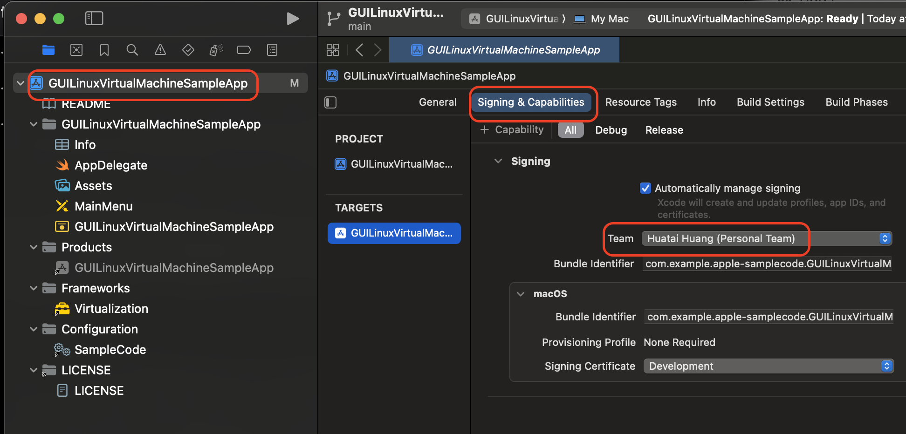
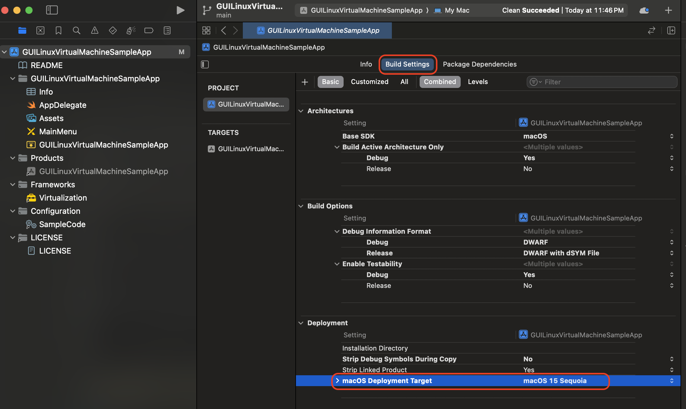
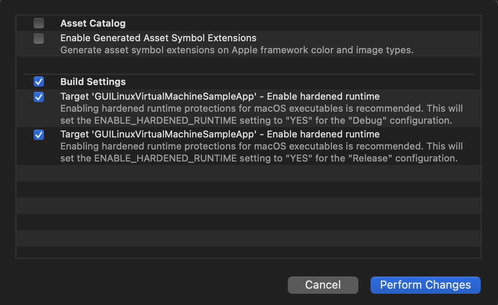
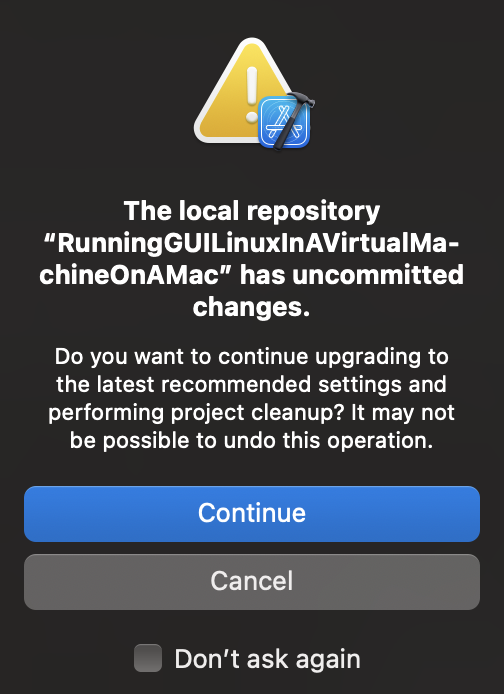

.. _run_linux_in_apple_virtualization:

===============================================
使用Apple Virtualization Framework运行Linux
===============================================

苹果macOS内建的 Virtualization Framework 可以运行原生硬件加速虚拟机，支持Apple Silicon和Intel架构，Guest操作系统可以是Linux或macOS。简单来说，通过苹果官方提供的样例代码，可以在 Xcode 中运行起Linux或macOS虚拟机，如果要更为方便的运行方式，则可以使用基于Virtualization Framework的 :ref:`tart` 虚拟机软件。

.. note::

   安装的Linux ISO镜像必须选择匹配自己主机CPU架构，对于Apple silicon，需要使用ARM架构Linux ISO镜像；对于Intel Mac，则下载amd64的Linux ISO镜像。

   如果在Apple silicon架构主机上的ARM Linux中运行Intel Linux二进制程序，Virtualization framework可以通过Rosetta translation环境来支持这个功能 - `Running Intel Binaries in Linux VMs with Rosetta <https://developer.apple.com/documentation/Virtualization/running-intel-binaries-in-linux-vms-with-rosetta>`_

准备工作
===========

- 操作系统必须是 macOS 13.0+ ，并安装好 Xcode 14.0+
- 按照 `Running GUI Linux in a virtual machine on a Mac <https://developer.apple.com/documentation/virtualization/running-gui-linux-in-a-virtual-machine-on-a-mac>`_ 下载 ``RunningGUILinuxInAVirtualMachineOnAMac.zip`` ，解压缩
- 按照Host主机macOS的架构，下载一个Linux安装ISO镜像，我在 :ref:`mbp15_2018` (Intel架构)上实践，下载的是 :ref:`debian` 最新发行的 ``debian-12.9.0-amd64-DVD-1.iso``

配置案例代码项目
=================

.. note::

   `Running GUI Linux in a virtual machine on a Mac <https://developer.apple.com/documentation/virtualization/running-gui-linux-in-a-virtual-machine-on-a-mac>`_ 苹果官方提供的样例代码是默认部署在 macOS 14上的，如果要在其他macOS版本上部署，需要调整对应的 ``deployment target`` 

   我的实践是在 macOS 15.2 上完成， Xcode 16.2

- 使用Xcode打开下载的源代码 ``GUILinuxVirtualMachineSampleApp.xcodeproj`` 项目
- 点击左方 ``Project Navigator`` 中项目名称 ``GUILinuxVirtualMachineSampleApp`` ，然后在 ``Signing & Capabilities`` 面板中，将 ``Team`` 修改为你的账号 ``Team`` ，例如我的设置是 ``Huatai Huang(Personal Team)``

   修订 ``Signing & Capabilities``

- 点击 ``Build Setting`` 面板，将 ``Deployment Target`` 修订成你实际需要运行的Host主机操作系统，例如我这里修订为 ``macOS 15``

- 另外，Xcode提示做修订 ``Enable hardened runtime``

- 点击 ``Build and run`` ，完成编译后运行，此时会在用户目录下创建一个 ``GUI Linux VM.bundle`` 目录存储虚拟机，并弹出一个对话框让你选择安装Linux的ISO镜像

待续...

参考
=======

- `Running GUI Linux in a virtual machine on a Mac <https://developer.apple.com/documentation/virtualization/running-gui-linux-in-a-virtual-machine-on-a-mac>`_ 苹果官方提供的样例代码，可以运行起Linux虚拟机
- `Install Linux On MacOS using Apple Virtualization Framework <https://medium.com/@yada4828/install-linux-on-macos-m1-using-apple-virtualization-framework-7b09958f386b>`_ 使用苹果官方样例代码运行Ubuntu安装过程的一步步指南
- `Create macOS or Linux virtual machines <https://developer.apple.com/videos/play/wwdc2022/10002/>`_ 苹果WWDC2022视频讲座，包含演示和代码片段
